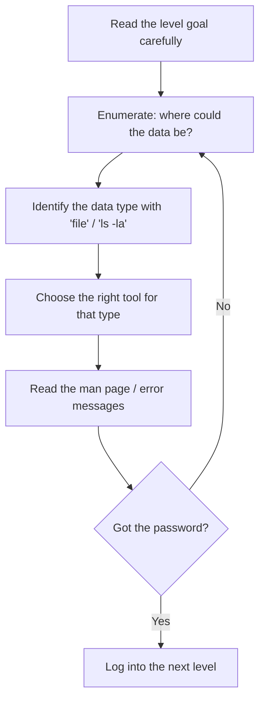

# OverTheWire Bandit — Introduction & Getting Started

> The first post in a complete, level-by-level Bandit series. This one sets the stage: what Bandit is, why it is the single best starting point for anyone serious about Linux and security, how to connect, and the *methodology* that will carry you through all 33 levels.

## Introduction

Almost everyone in offensive security passes through OverTheWire's **Bandit** at some point. It is the canonical "hello world" of security wargames — a set of 34 progressively harder challenges (Level 0 through Level 33) that quietly teach you the Linux command line while pretending to be a treasure hunt.

The premise is simple. Each level is a Linux user account. Somewhere in that account's world — a file, a process, a network port, a git repository — sits the password for the *next* account. Find it, log in as the next user, repeat. The difficulty ramps from "read a file" to "escape a restricted shell" and "abuse a cron job," so by the time you finish you have touched a surprising amount of real systems knowledge.

I played the whole series and kept notes the entire way. This blog series is those notes, rebuilt into a proper training course: every level explained from first principles, connected to real offensive security, with the spoilers stripped out.

## Why this game exists

Bandit exists because **you cannot learn security without learning the system you are attacking.** Web hacking, malware analysis, cloud pentesting, red teaming — all of it sits on top of an operating system, and most of the time that operating system is Linux. Before you can find a vulnerability you have to be able to *navigate*, *read*, *search*, and *reason* about a machine. Bandit drills exactly those primitives.

It also teaches the meta-skill that separates people who "know commands" from people who solve problems: **reading the manual and the error messages.** Bandit is deliberately designed so the hints you need are in `man` pages, in the error output, and in the level description itself.

## What you will learn

- **Linux fluency** — navigation, file inspection, text processing, permissions, redirection.
- **Encoding & data formats** — Base64, ROT13, hexdumps, compression.
- **Remote access** — SSH with passwords and keys, `scp`, key permissions.
- **Networking** — ports, services, `netcat`, TLS, port scanning.
- **Privilege escalation primitives** — SUID binaries, cron abuse, restricted-shell escapes.
- **Source control enumeration** — finding secrets in git history, branches, and tags.

## Game structure

- Users are named sequentially: `bandit0`, `bandit1`, `bandit2`, … `bandit33`.
- Each level holds the password needed to log into the **next** user.
- Login is over **SSH**, always to the same host and port.

```
Host:  bandit.labs.overthewire.org
Port:  2220
```

## Getting started

### 1. Log in to Level 0

The very first credentials are public — both username and password are `bandit0`:

```bash
ssh bandit0@bandit.labs.overthewire.org -p 2220
```

When prompted, the password is `bandit0`. (You will not see characters as you type a password in a terminal — that is normal.)

### 2. Save yourself typing with `~/.ssh/config`

Every single level uses the same host and port, so configure it once. Add this to `~/.ssh/config` on your **local** machine:

```ini
Host bandit
  HostName bandit.labs.overthewire.org
  Port 2220
  User bandit0
```

Now `ssh bandit` connects to Level 0. For later levels you simply override the user: `ssh bandit5@bandit` (or define one `Host` entry per level). Throughout this series I refer to the host as `bndt` / `bandit` as shorthand for the full hostname — wherever you see that, substitute your own configured host.

### 3. Find the next password, then move up

On each level you will explore the home directory and the wider system to locate the next password, then:

```bash
ssh bandit1@bandit.labs.overthewire.org -p 2220   # log in as the next user
```

…and the next level begins.

## The methodology that solves every level

Bandit rewards a repeatable process far more than memorized commands. Internalize this loop early — it is the same loop a penetration tester runs against a real target:



> [!IMPORTANT]
> **Enumeration is 80% of offensive security.** Almost every Bandit level — and almost every real engagement — is won by *finding* the thing, not by some clever exploit. Slow down and look before you act.

### Five habits to build now

1. **`ls -la` everything.** Hidden files, permissions, and ownership are constant clues.
2. **Run `file` before you `cat`.** Blindly `cat`-ing binary data garbles your terminal and tells you nothing.
3. **Read error messages literally.** "Permission denied," "Connection refused," and "no such file" each point to a different next step.
4. **Use `man`.** Bandit lists the commands you "may need" per level precisely so you go read their manuals.
5. **Work in `/tmp`.** When a level needs scratch space, create a private working directory with `mktemp -d` instead of cluttering (or being unable to write to) your home directory.

## A note on safety and ethics

Bandit is **explicitly authorized** practice — that is the entire point of a wargame server. The same techniques applied to systems you do not own are illegal. Everything in this series is for learning on OverTheWire's infrastructure or your own lab. OverTheWire also asks players not to post passwords or full spoilers, which is why this series redacts every password as `[REDACTED]` and focuses on concepts.

## How this series is structured

Each level gets its own article with a consistent layout: the official objective in plain English, the skills it covers, my approach, a step-by-step walkthrough explaining *why* each command was chosen, a deep dive into the underlying security concept, the offensive perspective, common beginner mistakes, key takeaways, and pointers for going deeper.

Ready? Start with [**Level 0 → 1**](./01-bandit-level-0-1.md).

## Additional reading

- [OverTheWire Bandit — official site](https://overthewire.org/wargames/bandit/)
- [The Linux Command Line (free book) by William Shotts](https://linuxcommand.org/tlcl.php)
- [`man` page primer — `man man`](https://man7.org/linux/man-pages/man1/man.1.html)
- [SSH config documentation — `man ssh_config`](https://man7.org/linux/man-pages/man5/ssh_config.5.html)


---

## Connect with the Author

Written by **Himangshu Pan** — offensive security researcher.

- **GitHub:** [@0xSh3ru](https://github.com/0xSh3ru)
- **LinkedIn:** [in/0xsh3ru](https://www.linkedin.com/in/0xsh3ru/)

*If this walkthrough helped, follow along on GitHub and connect on LinkedIn — questions and corrections are always welcome.*
