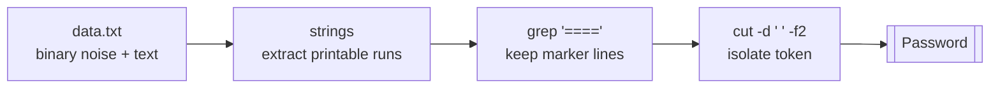

# OverTheWire Bandit Level 9 → Level 10

## Introduction

Up to now the passwords have lived in plain text files you could simply `cat`. This level changes the game: the password is buried inside a **binary file** stuffed with non-printable garbage, and a flat `cat` will spray your terminal with control characters (and may even scramble it). The skill you build here — pulling **human-readable strings out of binary data** — is one of the most-used reflexes in binary recon, malware analysis, and reverse engineering. It is the difference between staring at a wall of `^@^H?` bytes and instantly spotting `password is...` hiding among them.

The lesson underneath the puzzle: **binary does not mean unreadable**. Compiled programs, memory dumps, and packet captures are full of embedded text — file paths, error messages, URLs, and yes, secrets — and a single tool surfaces all of it.

## Official Challenge Objective

> **The password for the next level is stored in the file `data.txt` in one of the few human-readable strings, preceded by several '=' characters.**

**In plain English:** `data.txt` is mostly unreadable binary noise. Somewhere inside it is a short run of readable text, and the password sits right after a cluster of `=` signs. Your job is to filter the readable text out of the noise and find the line marked with `====`.

## Skills Covered

- Recognizing binary vs. text files (`file`)
- Extracting printable ASCII from binary data with `strings`
- Filtering output with `grep` (fixed strings and basic regex)
- Trimming fields with `cut`
- Piping (`|`) tools together into a small triage pipeline

## My Approach

My first instinct on any file I don't recognize is to *identify it* before I open it — `cat`-ing a binary blindly is how you end up with a garbled terminal. Once `file` confirmed it was binary data, I reached for `strings`, which is purpose-built for exactly this: it walks the bytes and prints any run of printable characters long enough to look like real text. That alone shrinks thousands of junk bytes down to a handful of candidate lines. From there the objective hands you the marker — "several `=` characters" — so I filtered for that pattern. I tightened my filter with a regex (`^={2,}\s.{32}`) to match a line that starts with two-or-more equals signs, a whitespace, then a 32-character token (Bandit passwords are 32 chars), and used `cut` to peel off just the password field. The simpler `grep '===='` works just as well; my version is just the habit of writing a filter precise enough to return only the answer.

## Step-by-Step Walkthrough

### Command

```bash
ssh bandit9@bandit.labs.overthewire.org -p 2220
```

### Explanation

Log in as `bandit9` on port 2220 with the password you recovered in the previous level. You land in `/home/bandit9`, where `data.txt` is waiting.

### Why It Matters

The game loop is also the real-world loop: every credential you recover is the key to the next account. This mirrors **lateral movement** — reusing found credentials to authenticate as the next principal.

---

### Command

```bash
file data.txt
```

### Explanation

`file` inspects the *contents* of `data.txt` — not its extension — and reports what kind of data it holds. Here it reports something like `data` or `... text, with very long lines` mixed with non-text bytes, signaling this is not a clean text file you want to `cat` directly.

### Why It Matters

`file` is your seatbelt. It tells you whether a file is text, an ELF executable, a gzip archive, an image, or raw binary, by reading its **magic bytes** rather than trusting the name. Running it first prevents the classic beginner mistake of dumping a binary to the terminal and corrupting your session.

---

### Command

```bash
strings data.txt | grep '===='
```

### Explanation

`strings` scans the file byte by byte and prints every sequence of printable characters at least 4 long (the default minimum), discarding the binary noise in between. Piping that into `grep '===='` keeps only the lines containing four-or-more equals signs — exactly the marker the objective described. The matching line looks like:

```
========== password
========== is
=========== The
========== [REDACTED]
```

The password is the 32-character token printed after the `=` run.

### Why It Matters

This two-stage pipeline — *extract readable text, then filter for what you want* — is the canonical triage move. You will run almost this exact command against a suspicious executable to fish out hard-coded URLs, IP addresses, or credentials.

---

### Command (my tighter variant)

```bash
strings data.txt | grep -E '^={2,}\s.{32}' | cut -d " " -f2
```

### Explanation

This does the same job with a precise regex: `^={2,}` anchors to a line starting with two or more `=`, `\s` matches the separating whitespace, and `.{32}` requires a 32-character token (the known length of a Bandit password). `cut -d " " -f2` then splits the line on spaces and prints only the second field — the password itself, with no surrounding noise.

### Why It Matters

Writing a filter tight enough to return *only* the answer is a real skill. In automation and scripting you rarely want "the line that contains it" — you want the value, cleanly extracted, ready to pipe into the next step.

> [!TIP]
> `strings -n 8 data.txt` raises the minimum match length to 8 characters, cutting out short junk like `=== `, `is`, and `the`. Tuning `-n` is how you separate signal from noise when a file is full of short accidental "words."

## Deep Dive: Cyber Security Concept

**String extraction and the "embedded text" property of binaries.**

Every compiled binary, memory image, and on-disk artifact is a sea of bytes. Most of those bytes are machine code, pointers, or structured data that means nothing to a human. But scattered throughout are runs of bytes that happen to fall in the printable ASCII range (0x20–0x7E) — and those runs are almost always *meaningful*: function names, file paths, format strings, error messages, registry keys, domains, and configuration values the program needs at runtime.

`strings` exploits this property mechanically. It does not parse the file format; it just reports any consecutive run of printable bytes longer than a threshold. That naïveté is its strength — it works on *any* file type, corrupted or not, without understanding the structure.



> [!IMPORTANT]
> `strings` shows you what text *exists* in a file, not what the program *does* with it. It is the first 30 seconds of analysis, not the last. Treat its output as leads to investigate, never as proof.

## Offensive Security Perspective

`strings` is one of the very first commands a reverse engineer or malware analyst runs against an unknown sample. From a single binary it can reveal:

- **Hard-coded credentials** and API keys left in by lazy developers.
- **Command-and-control (C2) infrastructure** — embedded domains, IPs, and URL paths.
- **Mutex and registry-key names** malware uses, which reveal its behaviour and how it persists.
- **Compiler artifacts and PDB paths** that leak the developer's machine and project layout.
- **Crypto constants and ransom notes** that fingerprint a malware family.

On the red-team side, operators grep extracted strings to triage captured binaries, loot files, and memory dumps fast. In CTFs, `strings <binary> | grep -i flag` is a reflexive first attempt that solves a surprising number of easy challenges.

## Common Beginner Mistakes

- **`cat`-ing the binary directly,** filling the terminal with control codes and sometimes leaving it in a broken state (fix with `reset`).
- **Forgetting the pipe** and running `strings` alone, then hunting by eye through hundreds of lines instead of `grep`-ing for `====`.
- **Using too loose a `grep`** (e.g., `grep =`) and matching dozens of irrelevant lines.
- **Assuming `strings` decrypts or decodes** — it does neither; it only filters printable bytes.
- **Copying the `=` characters or trailing spaces** along with the password.

## Key Takeaways

- Identify a file with `file` before you open it; never blindly `cat` binary.
- `strings` extracts human-readable text from any binary blob.
- Pipe `strings | grep` to filter for the exact marker you expect.
- Tune `strings -n` to suppress short junk matches.
- This `file → strings → grep` pipeline is the foundation of binary recon and malware analysis.

## How This Helps Build Cyber Security Expertise

- **Malware analysis / reverse engineering:** `strings` is lesson one of static analysis; everything from IDA to Ghidra builds on the leads it provides.
- **Privesc & post-exploitation:** grepping extracted strings from looted binaries, config blobs, and memory dumps surfaces hard-coded credentials, tokens, and paths that open the next step.
- **Exploit development:** pulling format strings, function names, and embedded constants out of a target binary is how you map attack surface before writing a payload.
- **CTF / bug bounty:** `strings | grep` is a fast, high-yield first probe against any binary you're handed.

## Additional Reading

- [`man strings`](https://man7.org/linux/man-pages/man1/strings.1.html), [`man grep`](https://man7.org/linux/man-pages/man1/grep.1.html), [`man cut`](https://man7.org/linux/man-pages/man1/cut.1.html)
- [`man file`](https://man7.org/linux/man-pages/man1/file.1.html) — identifying files by magic bytes
- [Practical Malware Analysis — Chapter 1 (static analysis & strings)](https://nostarch.com/malware)
- [MITRE ATT&CK — T1027: Obfuscated Files or Information](https://attack.mitre.org/techniques/T1027/)

---

*Next up: [Level 10 → 11](./11-bandit-level-10-11.md) — where the data only *looks* scrambled, because it's just Base64.*


---

## Connect with the Author

Written by **Himangshu Pan** — offensive security researcher.

- **GitHub:** [@0xSh3ru](https://github.com/0xSh3ru)
- **LinkedIn:** [in/0xsh3ru](https://www.linkedin.com/in/0xsh3ru/)

*If this walkthrough helped, follow along on GitHub and connect on LinkedIn — questions and corrections are always welcome.*
