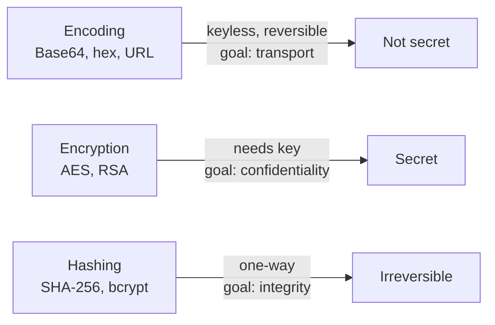

# OverTheWire Bandit Level 10 → Level 11

## Introduction

This level introduces one of the most misunderstood concepts in all of computing: **encoding versus encryption**. The password is stored in `data.txt` as Base64 — a wall of letters, digits, `+`, `/`, and trailing `=` that *looks* scrambled and secret. It is neither. Base64 is a fully reversible, keyless transformation anyone can undo in a single command. The entire point of this level is to burn that distinction into your brain: **Base64 hides nothing.**

You will meet Base64 constantly — in HTTP Basic authentication headers, JSON Web Tokens (JWTs), email attachments (MIME), `data:` URIs in HTML, TLS certificates (PEM), and the payloads of countless pieces of malware. Recognizing it on sight and decoding it instantly is a genuine working skill.

## Official Challenge Objective

> **The password for the next level is stored in the file `data.txt`, which contains base64 encoded data.**

**In plain English:** `data.txt` holds text that has been Base64-encoded. Decode it back to its original form and read the password.

## Skills Covered

- Distinguishing **encoding** from **encryption**
- Recognizing Base64 by its character set and `=` padding
- Decoding with the `base64` utility (`-d`)
- Understanding where Base64 appears in real protocols

## My Approach

The moment I saw a blob of mixed-case letters and digits ending in `=`, I recognized the Base64 fingerprint — and Base64 is *encoding*, not encryption, so there's no key to find and nothing to crack. It is meant to be decoded, by design. The whole solution is feeding the file to `base64 -d`. The mental note I made: in a real engagement, finding Base64 is not "I found something encrypted," it's "I found something the author *thought* was hidden." That assumption is where a lot of secrets leak.

## Step-by-Step Walkthrough

### Command

```bash
ssh bandit10@bandit.labs.overthewire.org -p 2220
```

### Explanation

Log in as `bandit10` on port 2220 with the password from the previous level. `data.txt` is in your home directory.

### Why It Matters

Same recover-and-reuse loop as every level — the model for credential-based lateral movement.

---

### Command

```bash
cat data.txt
```

### Explanation

Unlike the last level, this file is safe to `cat` — it is plain text, just encoded. You will see something like:

```
VGhlIHBhc3N3b3JkIGlzIC4uLg==
```

The mixed-case alphanumerics with `+`/`/` characters and a trailing `=` (or `==`) are the tell-tale signature of Base64.

### Why It Matters

Learning to *recognize* an encoding on sight is half the battle. The `=` padding at the end is the single most reliable visual giveaway of Base64 — it pads the output to a multiple of four characters.

---

### Command

```bash
base64 -d data.txt
```

### Explanation

`base64 -d` (`--decode`) reverses the encoding and prints the original bytes. The output is the cleartext line:

```
The password is [REDACTED]
```

No key, no password, no cracking — just a reversal of a public, standardized transformation.

### Why It Matters

This single command undoes what looked like an obfuscated secret. That is the entire lesson: Base64 provides **zero confidentiality**. Anyone can run the same command. If a developer relies on it to "hide" a value, the value is effectively public.

> [!TIP]
> No file? Pipe a string in: `echo 'SGVsbG8=' | base64 -d`. To encode, drop the `-d`: `echo -n 'Hello' | base64`. The `-n` avoids encoding a trailing newline.

## Deep Dive: Cyber Security Concept

**Encoding vs. Encryption (and why people confuse them).**

These are fundamentally different operations:

- **Encoding** (Base64, URL-encoding, hex) transforms data into another *representation* for safe transport or storage. It is **public, keyless, and trivially reversible**. Its goal is compatibility, never secrecy.
- **Encryption** (AES, RSA, ChaCha20) transforms data so that it can only be recovered with a **secret key**. Its goal *is* secrecy.
- **Hashing** (SHA-256, bcrypt) is a one-way transform with **no inverse** — used for integrity and password storage, not to be confused with either.

Base64 specifically maps every 3 bytes (24 bits) of input onto 4 printable characters (6 bits each) drawn from `A–Z`, `a–z`, `0–9`, `+`, `/`, padding with `=` so the length is a multiple of four. That 4-for-3 ratio is why Base64 output is ~33% larger than its input.



> [!IMPORTANT]
> Base64 is **encoding, not encryption**. It offers no confidentiality whatsoever. Treating Base64 as a security control is one of the most common and dangerous misconceptions in the field.

## Offensive Security Perspective

Base64 turns up everywhere an attacker looks:

- **HTTP Basic Auth** sends `username:password` as Base64 in the `Authorization` header — sniff it (or read it from a proxy log) and `base64 -d` it straight to plaintext credentials.
- **JWTs** are three Base64url segments; the header and payload decode to readable JSON, often leaking roles, user IDs, and claims you can probe.
- **Malware & C2** routinely Base64-encode PowerShell commands (`powershell -enc ...`), exfiltrated data, and config blobs to slip past naïve filters and eyeballs.
- **Bug bounty:** tokens, cookies, and "encrypted" parameters frequently turn out to be Base64 — always decode before assuming they're opaque.

A reflexive `base64 -d` on any suspicious blob is a high-yield, zero-cost probe.

## Defensive Perspective

- **Never use Base64 as a security control.** If a value must be secret, encrypt it with a real key. Base64 is for transport encoding only.
- **Assume Basic Auth credentials are plaintext on the wire** unless wrapped in TLS — and even then they sit decodable in proxy logs and browser history.
- **Detection engineering:** Base64-encoded PowerShell (`-enc`/`-EncodedCommand`) and long Base64 strings in process command lines, URLs, or DNS queries are strong hunting signals. Decode and inspect them; Sigma rules for encoded PowerShell are a staple.
- **Don't put secrets in JWT payloads** — they are readable by anyone who holds the token. Sign for integrity; encrypt (JWE) if confidentiality is required.

## Common Beginner Mistakes

- **Thinking Base64 is encryption** and hunting for a non-existent key.
- **Trying to "crack" it** with brute force or a wordlist — there is nothing to crack.
- **Forgetting the `-d` flag**, which *encodes* the already-encoded text instead of decoding it.
- **Mishandling padding/whitespace** when decoding a copied string (stray spaces or missing `=` cause errors).
- **Confusing Base64 with Base64url** (used in JWTs), where `+`/`/` become `-`/`_` and padding may be stripped.

## Key Takeaways

- Base64 is encoding, not encryption — keyless and reversible by anyone.
- The `=` padding and mixed alphanumeric set are its visual signature.
- `base64 -d` decodes; `base64` encodes.
- Base64 lives in Basic Auth, JWTs, MIME, data URIs, PEM, and malware.
- Never rely on encoding to keep a secret secret.

## How This Helps Build Cyber Security Expertise

- **Web application security:** decoding tokens, cookies, and JWTs is everyday work in app pentesting and bug bounty.
- **Malware analysis:** de-obfuscating Base64-encoded payloads and PowerShell is a core triage step.
- **Network forensics:** extracting and decoding Base64 from captured traffic (Basic Auth, email, exfil) reconstructs what crossed the wire.
- **Cryptography literacy:** internalizing encoding ≠ encryption ≠ hashing prevents a whole class of design and analysis errors.

## Additional Reading

- [`man base64`](https://man7.org/linux/man-pages/man1/base64.1.html)
- [RFC 4648 — The Base16, Base32, and Base64 Data Encodings](https://datatracker.ietf.org/doc/html/rfc4648)
- [OWASP — Encoding vs. Encryption clarification (Cryptographic Storage Cheat Sheet)](https://cheatsheetseries.owasp.org/cheatsheets/Cryptographic_Storage_Cheat_Sheet.html)
- [jwt.io — decode and inspect JSON Web Tokens](https://jwt.io/)

---

*Next up: [Level 11 → 12](./12-bandit-level-11-12.md) — where the text is shifted by 13 letters and ROT13 reminds you that obfuscation is not encryption either.*


---

## Connect with the Author

Written by **Himangshu Pan** — offensive security researcher.

- **GitHub:** [@0xSh3ru](https://github.com/0xSh3ru)
- **LinkedIn:** [in/0xsh3ru](https://www.linkedin.com/in/0xsh3ru/)

*If this walkthrough helped, follow along on GitHub and connect on LinkedIn — questions and corrections are always welcome.*
