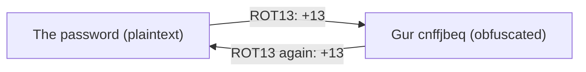

# OverTheWire Bandit Level 11 → Level 12

## Introduction

Having just learned that Base64 is encoding (not encryption), this level drives the point home with a different disguise: **ROT13**, a Caesar cipher that rotates every letter 13 positions through the alphabet. It looks like ciphertext — `Gur cnffjbeq vf...` — but it is pure obfuscation with no key and no security. The skill you build is **character-level translation** with the `tr` command, plus the deeper habit of recognizing when "encrypted-looking" text is just a fixed, reversible substitution.

ROT13 is the canonical example of "security by obscurity." It has exactly one use in the real world — hiding spoilers and punchlines from casual eyes — and zero uses for protecting anything. Knowing it on sight, and being able to undo it in one line, is the lesson.

## Official Challenge Objective

> **The password for the next level is stored in the file `data.txt`, where all lowercase (a-z) and uppercase (A-Z) letters have been rotated by 13 positions.**

**In plain English:** every letter in `data.txt` has been shifted 13 places in the alphabet (A↔N, B↔O, … m↔z). Shift them all back 13 places and read the password.

## Skills Covered

- Recognizing ROT13 / Caesar ciphers
- The difference between obfuscation and encryption
- Character translation with `tr` (defining matched sets)
- Why ROT13 is its own inverse

## My Approach

The shape of the text — readable-looking words that aren't quite words — screamed substitution cipher, and the objective confirming a 13-position rotation made it ROT13. ROT13 is symmetric: because 13 is exactly half of 26, applying it twice returns the original, so encoding and decoding are *the same operation*. That meant I could decode by simply mapping each half of the alphabet to the other half. `tr` is the perfect tool — it translates one set of characters to another, character for character. I built two ranges (uppercase and lowercase) and rotated each by 13: `A-Z` maps to `N-ZA-M`, and `a-z` maps to `n-za-m`. One command, password recovered.

## Step-by-Step Walkthrough

### Command

```bash
ssh bandit11@bandit.labs.overthewire.org -p 2220
```

### Explanation

Log in as `bandit11` on port 2220 with the previous level's password. `data.txt` sits in your home directory.

### Why It Matters

The recover-and-reuse credential loop again — the everyday model of credential-based lateral movement.

---

### Command

```bash
cat data.txt
```

### Explanation

Safe to `cat` — it is plain text, just rotated. You will see something like:

```
Gur cnffjbeq vf ...
```

`Gur` is ROT13 for `The`; once you spot that, the rotation is obvious.

### Why It Matters

Recognizing a Caesar cipher by eye is a useful party trick that turns into a real skill in CTFs and basic malware obfuscation. Common ROT13 fingerprints: `Gur` = `The`, `cnffjbeq` = `password`.

---

### Command

```bash
cat data.txt | tr 'A-Za-z' 'N-ZA-Mn-za-m'
```

### Explanation

`tr` (translate) reads characters from standard input and replaces each character in the **first** set with the character at the same position in the **second** set. Here:

- `A-Z` (the first 26 of the input set) maps to `N-ZA-M` — i.e. `A→N, B→O, … M→Z, N→A, … Z→M`.
- `a-z` maps to `n-za-m` — the same rotation for lowercase.

Every letter is shifted back 13 places; non-letters (spaces, digits) are untouched. The output is the cleartext:

```
The password is [REDACTED]
```

### Why It Matters

This shows the precise way `tr` pairs two character sets by position. The same technique deletes, squeezes, or remaps characters in any text stream — a building block for log parsing and quick data cleanup.

> [!TIP]
> Because ROT13 is its own inverse, you can also encode with the *exact same* command. And the lazy-but-classic shortcut is the standalone `rot13` filter, or `tr 'A-Za-z' 'N-ZA-Mn-za-m'` memorized as a one-liner. No file needed: `echo 'Gur' | tr 'A-Za-z' 'N-ZA-Mn-za-m'`.

## Deep Dive: Cyber Security Concept

**Caesar ciphers, ROT13, and "security by obscurity."**

A Caesar cipher shifts each letter by a fixed number of positions. ROT13 is the special case where the shift is 13. Because the Latin alphabet has 26 letters and 13 is half of 26, ROT13 has a unique property: **it is its own inverse**. Rotating twice (13 + 13 = 26) lands you exactly back where you started, so a single function both encodes and decodes.

Crucially, a Caesar cipher has **no key in any meaningful sense** — there are only 25 possible shifts, all breakable by inspection or brute force in microseconds. It provides *obfuscation*, not *confidentiality*. ROT13 specifically isn't even trying to be secret; its real-world job is to lightly veil text (spoilers, joke answers) so a reader doesn't see it *by accident*.



> [!NOTE]
> "Security by obscurity" means relying on secrecy of the *method* rather than secrecy of a *key*. It fails the moment the method is known — and methods always become known. ROT13 is the textbook anti-example.

> [!IMPORTANT]
> ROT13 and Base64 are both reversible without a key. Neither protects data. If something "looks encrypted" but you can decode it with a public, fixed rule, it was never encrypted.

## Offensive Security Perspective

ROT13 and simple substitution/XOR obfuscation show up in:

- **Lightweight malware obfuscation:** droppers ROT13 (or single-byte XOR) their config strings and URLs to dodge naïve string scanners. A quick `tr` undoes it.
- **CTF crypto warm-ups:** ROT13, ROTn, and Caesar variants are staple entry-level challenges; tools like CyberChef brute every rotation instantly.
- **Steganographic veils:** values "hidden" in cookies or parameters with ROT13 or trivial substitution, hoping no one looks.

The offensive lesson: when text resists Base64 decoding but still *looks* like shifted English, try ROT13 / Caesar brute force before assuming real crypto.

## Defensive Perspective

- **Never obfuscate when you mean to encrypt.** ROT13 or XOR'ing a secret buys nothing against an attacker and gives developers a false sense of safety.
- **Detection engineering:** ROT13/XOR-decoded indicators (the *deobfuscated* domains, paths, and commands) are what your signatures should match — analysts routinely decode obfuscated samples and pivot on the cleartext IOCs.
- **Code review red flag:** any homegrown "encryption" that's really a substitution or fixed-rotation scheme should fail review. Use vetted libraries (AES-GCM, libsodium) with proper key management.
- **Defense in depth:** obscurity can be a thin extra *layer* (e.g., to slow casual snooping) but must never be the *only* control.

## Common Beginner Mistakes

- **Trying to brute-force or "crack" ROT13** as if it had a key.
- **Getting the `tr` set ranges wrong** — forgetting to handle uppercase and lowercase separately, or mis-typing `N-ZA-M`.
- **Reversing the sets** unnecessarily (ROT13 is symmetric, so direction doesn't matter — but mixing up shift *amount* does).
- **Confusing ROT13 with Base64** because both look "encoded."
- **Including the wrong characters** in the `tr` sets so digits/punctuation get mangled.

## Key Takeaways

- ROT13 is a Caesar cipher with a 13-position shift — obfuscation, not encryption.
- It is its own inverse: one command both encodes and decodes.
- `tr 'A-Za-z' 'N-ZA-Mn-za-m'` performs ROT13 by mapping character sets.
- `Gur` = `The` is the classic ROT13 give-away.
- Reversible-without-a-key means no security; that's "security by obscurity."

## How This Helps Build Cyber Security Expertise

- **Cryptanalysis fundamentals:** classical ciphers are the on-ramp to understanding what real encryption must provide (keys, diffusion, confusion).
- **Malware analysis:** de-obfuscating ROT13/XOR config strings is a routine triage step.
- **Text processing for IR:** `tr`, with `sed`/`awk`, is core to munging logs and extracting indicators at scale.
- **Secure design judgment:** knowing obscurity ≠ security shapes every architecture and code review you'll do.

## Additional Reading

- [`man tr`](https://man7.org/linux/man-pages/man1/tr.1.html)
- [Wikipedia — ROT13](https://en.wikipedia.org/wiki/ROT13) and [Caesar cipher](https://en.wikipedia.org/wiki/Caesar_cipher)
- [CyberChef](https://gchq.github.io/CyberChef/) — try the "ROT13" and "ROT13 Brute Force" operations
- [OWASP — "Security by Obscurity" is not security](https://owasp.org/www-community/Security_by_Design_Principles)

---

*Next up: [Level 12 → 13](./13-bandit-level-12-13.md) — a hexdump of a file compressed over and over, where you'll peel nested archives layer by layer.*


---

## Connect with the Author

Written by **Himangshu Pan** — offensive security researcher.

- **GitHub:** [@0xSh3ru](https://github.com/0xSh3ru)
- **LinkedIn:** [in/0xsh3ru](https://www.linkedin.com/in/0xsh3ru/)

*If this walkthrough helped, follow along on GitHub and connect on LinkedIn — questions and corrections are always welcome.*
