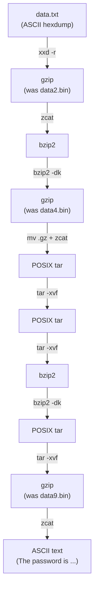

# OverTheWire Bandit Level 12 → Level 13

## Introduction

This is the level where Bandit stops holding your hand. The password is hidden inside a file that has been **compressed over and over**, in alternating formats, and then turned into a **hexdump** for good measure. There is no single magic command — you have to peel the onion one layer at a time, identifying each layer's true type and choosing the right tool to strip it. It is tedious, it is finicky, and it is one of the most *useful* levels in the entire game, because it teaches the single most important habit in file analysis: **never trust a file's name or extension — always ask `file` what it actually is.**

This is exactly what a malware analyst does with a packed, multi-layered dropper, and exactly what a forensic examiner does with a nested archive recovered from disk. You'll also learn to work safely in a scratch directory under `/tmp`, so your experiments never touch (or break) anything that matters.

## Official Challenge Objective

> **The password for the next level is stored in the file `data.txt`, which is a hexdump of a file that has been repeatedly compressed. It may be useful to create a working directory under /tmp using `mktemp -d`. Then copy the datafile using `cp`, and rename it using `mv` (read the manpages!).**

**In plain English:** `data.txt` isn't the real file — it's a *hexdump* (a text representation of raw bytes) of a file that was compressed many times in a row. First convert the hexdump back into the binary it represents, then repeatedly identify and decompress each layer until you reach plain text.

## Skills Covered

- Reverting a hexdump to binary with `xxd -r`
- Identifying file types by **magic bytes** with `file` at every step
- Decompressing gzip (`gzip`/`zcat`), bzip2 (`bzip2`), and extracting tar archives (`tar`)
- Recognizing that file **extensions lie**
- Working safely in a disposable `/tmp` directory (`mktemp -d`, `cp`, `mv`)

## My Approach

My discipline through this whole level was a tight loop: **`file` it → decompress it → `file` it again.** I never assumed what the next layer was; I let `file`'s reading of the magic bytes tell me, then picked the matching tool. First I set up a private scratch directory under `/tmp` with `mktemp -d` and copied `data.txt` in, so nothing I did could harm the original. Then I converted the hexdump back to binary with `xxd -r`, and from there it was layer after layer: gzip, bzip2, tar, tar again, bzip2, tar, gzip — the formats alternate to force you to actually *check* each time rather than memorize a sequence. The two things that tripped me up early and then became second nature: renaming files so the decompressors would accept them (`gzip` is picky about extensions), and remembering `bzip2 -dk` to *keep* the input file. After eight or so peels, `file` finally said "ASCII text," and the password was sitting in plain view.

## Step-by-Step Walkthrough

### Command

```bash
ssh bandit12@bandit.labs.overthewire.org -p 2220
```

### Explanation

Log in as `bandit12` on port 2220 with the previous password. `data.txt` is in your home directory — but **do not** work on it there.

### Why It Matters

You're about to create many intermediate files. Doing that in your home directory is messy and, on a shared box, rude. The next step gives you a clean sandbox.

---

### Command

```bash
TMPD=$(mktemp -d)
cp data.txt "$TMPD"
cd "$TMPD"
```

### Explanation

`mktemp -d` creates a fresh, uniquely-named directory under `/tmp` (e.g. `/tmp/tmp.x8Kf2A`) and prints its path, which we capture in the variable `TMPD`. We `cp` the data file into it and `cd` there. Now every file we generate lives in a throwaceable scratch space.

### Why It Matters

Working in a disposable directory is professional hygiene: experiments are isolated, the original is untouched, and cleanup is a single `rm -rf "$TMPD"`. The same pattern protects evidence integrity in forensics — you analyze a *copy*, never the original.

---

### Command

```bash
xxd -r data.txt > data
file data
```

### Explanation

`data.txt` is a **hexdump** — a human-readable text file where each line shows an offset, the hex values of the bytes, and an ASCII gutter. `xxd -r` ("reverse") converts that text representation back into the raw binary bytes it describes, which we save as `data`. Then `file data` reports the truth:

```
data: gzip compressed data, was "data2.bin", ...
```

So the binary is gzip-compressed, and gzip even helpfully recorded the *original* inner filename (`data2.bin`).

### Why It Matters

A hexdump is how binary data travels through text-only channels (logs, emails, chat). Knowing how to round-trip it — `xxd` to dump, `xxd -r` to restore — is a core forensics/CTF skill. And right away `file` proves the central lesson: the bytes, not the name, define the type.

> [!NOTE]
> A hexdump line looks like `00000000: 1f8b 0808 ... ........`. Those first bytes `1f 8b` are the **gzip magic number** — `file` reads them to identify the format regardless of extension.

---

### Command

```bash
zcat data > data2.bin
file data2.bin
```

### Explanation

`zcat` decompresses gzip data to standard output (like `cat` for gzip), which we redirect into `data2.bin`. We check it:

```
data2.bin: bzip2 compressed data, ...
```

Layer one peeled; the next layer is bzip2.

### Why It Matters

Using `zcat >` lets us decompress *without* worrying about gzip's strict `.gz` extension requirement (plain `gzip -d` would refuse a file not ending in `.gz`). Choosing the variant that fits the situation is the practical skill.

---

### Command

```bash
bzip2 -dk data2.bin
file data2.bin.out
```

### Explanation

`bzip2 -d` decompresses; `-k` **keeps** the original input file instead of deleting it (bzip2, like gzip, removes the source by default). Since `data2.bin` has no `.bz2` extension, bzip2 writes the output to `data2.bin.out`. `file` reports:

```
data2.bin.out: gzip compressed data, was "data4.bin", ...
```

Another gzip layer.

### Why It Matters

The `-k` flag is the difference between a smooth run and accidentally destroying an intermediate you wanted to re-examine. On real evidence, *never* let a tool consume your only copy — `-k` (or working on copies) is the safe default.

> [!IMPORTANT]
> Many compression tools **delete their input** after a successful operation. Always assume this, and either pass a "keep" flag (`bzip2 -dk`, `gzip -k`) or operate on copies. Destroying an intermediate on real evidence is unrecoverable.

---

### Command

```bash
mv data2.bin.out data3.gz
zcat data3.gz > data4.bin
file data4.bin
```

### Explanation

We *rename* the gzip data to `data3.gz` so the tooling is happy, then `zcat` it into `data4.bin` and check:

```
data4.bin: POSIX tar archive (GNU)
```

Now it's a tar archive, not a compressed stream.

### Why It Matters

This is the heart of the level: **the extension is whatever you make it** — renaming to `.gz` doesn't change the bytes, it just satisfies a tool's naming convention. The *type* is determined by `file` reading magic bytes. Tar archives are *containers*, not compressors, so the next tool changes.

---

### Command

```bash
tar -xvf data4.bin
file data5.bin
tar -xvf data5.bin
file data6.bin
```

### Explanation

`tar -xvf` e**x**tracts, **v**erbosely, from the **f**ile. Extracting `data4.bin` yields `data5.bin`; `file` shows that's *another* tar archive, so we extract again to get `data6.bin`:

```
data6.bin: bzip2 compressed data, ...
```

Two tar layers peeled; back to bzip2.

### Why It Matters

`tar` bundles files without compressing them, which is why archives nest like this. The `-x`/`-c`/`-t` (extract/create/list) flags of tar are everyday Linux fluency — and noticing tar-inside-tar is exactly the kind of layered packaging real droppers use.

---

### Command

```bash
bzip2 -dk data6.bin
file data6.bin.out
tar -xvf data6.bin.out
file data8.bin
```

### Explanation

Decompress the bzip2 (`-dk` to keep the source) → `data6.bin.out`, which `file` reveals is yet another tar. Extract it to get `data8.bin`:

```
data8.bin: gzip compressed data, was "data9.bin", ...
```

One more gzip layer to go.

### Why It Matters

By now the loop is muscle memory: identify, choose tool, peel, re-identify. That rhythm — not any single command — is the transferable skill.

---

### Command

```bash
zcat data8.bin > data9.bin
file data9.bin
cat data9.bin
```

### Explanation

Decompress the final gzip layer into `data9.bin`. This time `file` finally says:

```
data9.bin: ASCII text
```

Plain text at last — safe to `cat`:

```
The password is [REDACTED]
```

### Why It Matters

Reaching ASCII text is the signal that you've hit the bottom of the stack. The discipline of checking `file` after *every* step is what told you, unambiguously, when to stop.

## Deep Dive: Cyber Security Concept

**Magic bytes, nested archives, and why extensions are a lie.**

Every file format begins with a **magic number** — a fixed signature in its first few bytes that identifies the format:

| Format | Magic bytes (hex) | Typical extension |
|---|---|---|
| gzip | `1f 8b` | `.gz` |
| bzip2 | `42 5a 68` (`BZh`) | `.bz2` |
| tar (POSIX) | `ustar` at offset 257 | `.tar` |
| ZIP | `50 4b 03 04` (`PK..`) | `.zip` |
| ELF | `7f 45 4c 46` (`\x7fELF`) | (none) |

The `file` command reads these signatures (via its "magic" database) and reports the *real* type, completely ignoring the filename. This level weaponizes that fact: it strips extensions and forces you to identify each layer by content alone. The decompression chain looks like this:



> [!IMPORTANT]
> A file's extension is a *hint to humans and convenience for tools*, not a fact about its contents. Attackers rename `.exe` to `.jpg`, hide scripts as `.txt`, and double-extension files (`invoice.pdf.exe`). Trust `file` (and the bytes), never the name.

## Offensive Security Perspective

This level is a near-perfect model of **unpacking layered malware**:

- **Packers and droppers** wrap a real payload in multiple layers of compression and encoding to defeat signature scanners and to frustrate analysts. Each layer must be peeled, identified, and stripped — exactly what you just did.
- **Evasion via misnamed files:** malware ships as `.gif`, `.docx`, or extension-less blobs; `file` (and magic-byte checks) cut through the disguise.
- **Archive bombs / nesting** are also used offensively (e.g., zip bombs that explode on naïve extraction) — a reminder to unpack in a sandbox with limits.
- **CTF staple:** "decompress the thing N times" challenges test whether you can run this identify-and-peel loop methodically without giving up.

## Common Beginner Mistakes

- **Trusting the `file` output's extension hints** (e.g., "was data2.bin") as the real format instead of the type string itself.
- **Forgetting `bzip2 -k` / `gzip -k`** and losing an intermediate when the tool deletes its input.
- **Fighting gzip's extension requirement** — `gzip -d` refuses files without `.gz`; either `mv` to `.gz` first or use `zcat`.
- **Skipping `file` between steps** and applying the wrong decompressor (e.g., `tar` on a gzip stream), which errors out confusingly.
- **Working in the home directory** and drowning in `data2.bin … data9.bin` clutter.
- **Trying to `cat` an intermediate binary** and scrambling the terminal.

## Key Takeaways

- `xxd -r` reverses a hexdump back into binary.
- `file` identifies type by magic bytes — run it after **every** step.
- Extensions are hints, not facts; rename freely to satisfy tools.
- gzip→`zcat`, bzip2→`bzip2 -dk`, tar→`tar -xvf`; archives can nest.
- Always keep your inputs (`-k`) and work in a disposable `/tmp` dir.

## How This Helps Build Cyber Security Expertise

- **Malware analysis:** unpacking multi-layer droppers is exactly this loop, scaled up with packers and encryption.
- **Digital forensics:** recovering and carving nested archives from disk images, and never altering the original, is core practice.
- **File-format fluency:** recognizing magic bytes underpins file carving, anti-evasion filtering, and exploit research.
- **Operational discipline:** scratch directories, keeping inputs, and methodical step-by-step verification are habits that scale to every serious investigation.

## Additional Reading

- [`man xxd`](https://man7.org/linux/man-pages/man1/xxd.1.html), [`man file`](https://man7.org/linux/man-pages/man1/file.1.html), [`man tar`](https://man7.org/linux/man-pages/man1/tar.1.html), [`man gzip`](https://man7.org/linux/man-pages/man1/gzip.1.html), [`man bzip2`](https://man7.org/linux/man-pages/man1/bzip2.1.html)
- [`man mktemp`](https://man7.org/linux/man-pages/man1/mktemp.1.html)
- [Wikipedia — List of file signatures (magic numbers)](https://en.wikipedia.org/wiki/List_of_file_signatures)
- [MITRE ATT&CK — T1027.002: Software Packing](https://attack.mitre.org/techniques/T1027/002/)

---

*Next up: [Level 13 → 14](./14-bandit-level-13-14.md) — where there's no password at all, just a private SSH key, and you learn key-based authentication.*


---

## Connect with the Author

Written by **Himangshu Pan** — offensive security researcher.

- **GitHub:** [@0xSh3ru](https://github.com/0xSh3ru)
- **LinkedIn:** [in/0xsh3ru](https://www.linkedin.com/in/0xsh3ru/)

*If this walkthrough helped, follow along on GitHub and connect on LinkedIn — questions and corrections are always welcome.*
