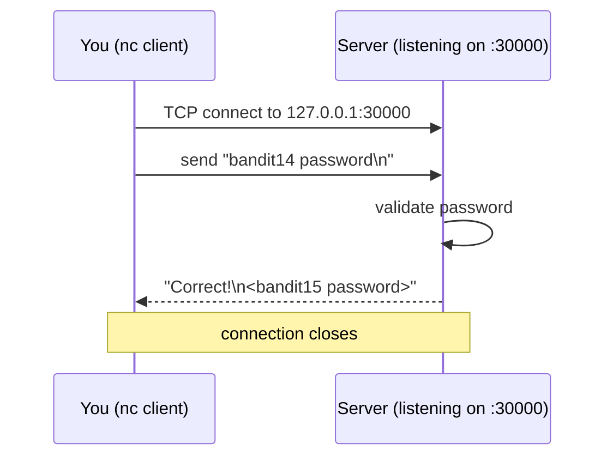

# OverTheWire Bandit Level 14 → Level 15

## Introduction

Every previous level has lived entirely inside the filesystem: find a file, read a file. Level 14 → 15 takes your first step onto the **network**. The password is no longer sitting in a file you can `cat` — instead you have to *speak to a service*. Specifically, you submit the **current** level's password to a program listening on **TCP port 30000 on localhost**, and it answers with the next password.

This is where you meet **netcat (`nc`)**, the "TCP/IP Swiss Army knife." Learning to open a raw socket, send some bytes, and read the reply is one of the most transferable skills in all of security work. Almost every protocol you will ever attack — HTTP, SMTP, Redis, custom backends — is, at bottom, "send text to a port and read text back," and `nc` lets you do that by hand.

## Official Challenge Objective

> **The password for the next level can be retrieved by submitting the password of the current level to port 30000 on localhost.**

**In plain English:** there is a small server running on the same machine, listening on port `30000`. Connect to it, send it the password you are currently logged in with (the `bandit14` password), and it will hand back the `bandit15` password.

## Skills Covered

- Reading your *own* password from `/etc/bandit_pass/`
- Connecting to a raw TCP service with **netcat (`nc`)**
- The meaning of **localhost / 127.0.0.1** and TCP ports
- Sending data over a socket and reading the response
- The `nc -N` flag (half-close the connection on EOF)

## My Approach

The objective wants me to submit "the password of the current level." Since I am logged in as `bandit14`, that password is *my own*, and conveniently `bandit14` is allowed to read it from `/etc/bandit_pass/bandit14`. So my plan was simple: read my own password, then pipe it into a netcat connection aimed at `127.0.0.1:30000`. The only subtlety was making sure the connection closed cleanly after I sent the password so the server's reply actually came back — which is what the `-N` flag handles.

## Step-by-Step Walkthrough

### Command

```bash
cat /etc/bandit_pass/bandit14
```

### Explanation

You are logged in as `bandit14`, and that account is permitted to read its own entry in the password store. This prints your current password — the value you must submit to the service:

```
[REDACTED]
```

### Why It Matters

`/etc/bandit_pass/` is the canonical store for these challenges, and a file is readable *only by the matching user*. This mirrors how real systems protect per-account secrets with file ownership and permissions — you can read yours, but not your neighbor's.

---

### Command

```bash
nc -N 127.0.0.1 30000
```

### Explanation

`nc` (netcat) opens a raw TCP connection to `127.0.0.1` (localhost) on port `30000`. Once connected, whatever you type is sent to the server. **Paste the `bandit14` password and press Enter.** The server validates it and responds:

```
Correct!
[REDACTED]
```

That second line is the `bandit15` password.

> [!TIP]
> You can do the whole thing in one line by piping the password in:
> ```bash
> cat /etc/bandit_pass/bandit14 | nc -N 127.0.0.1 30000
> ```

### Why It Matters

`nc` is the fundamental tool for hand-talking to network services. The ability to "connect to a port and send bytes" underlies banner grabbing, manual protocol testing, building reverse shells, and quick data transfers between hosts. This one command is a skill you will reach for constantly.

## Deep Dive: Cyber Security Concept

**Raw TCP sockets and netcat.**

Networked software almost always follows the same shape: a **server** binds to a port and waits; a **client** connects, the two exchange bytes over a TCP stream, and (for this kind of service) one side closes when done. `nc` lets *you* be the client — no purpose-built tool required.



The `-N` flag is the operationally important detail. By default, after netcat sends everything from its input (e.g. the piped password) and reaches end-of-file, it keeps the socket open in case more data arrives. Some servers won't reply — or you'll sit waiting — until the *client* signals it is done writing. `-N` tells netcat to **half-close (shutdown the write side) on EOF**, which nudges the server to process the input and send its response, then the connection tears down cleanly. Without `-N`, piped one-liners can appear to hang.

> [!NOTE]
> There are multiple netcat implementations (traditional `nc`, OpenBSD `nc`, `ncat` from Nmap). Flags differ. `-N` is OpenBSD-style; on `ncat` the equivalent is `--send-only`. If `-N` is unrecognized, try `nc -q 1` or just type the password interactively and wait.

## Offensive Security Perspective

Netcat is on every operator's mental shortlist:

- **Banner grabbing & manual protocol probing.** `nc <host> <port>` then typing `HEAD / HTTP/1.0` or `EHLO x` reveals software versions and behavior no scanner summary captures.
- **Reverse and bind shells.** The classic post-exploitation primitive — `nc -e /bin/sh` (or modern equivalents) — turns netcat into a remote shell channel.
- **Data exfiltration / transfer.** `nc` pipes files between hosts when nothing fancier is available.
- **Talking to weird internal services.** Many internal apps speak bespoke line-based protocols; `nc` is how you reverse-engineer and exploit them by hand.

This level is the gentlest possible introduction: submit a value, read a value. Real targets are messier, but the muscle is identical.

## Defensive Perspective

- **Limit what listens, and to whom.** A service that only ever needs local clients should bind to `127.0.0.1`, not `0.0.0.0`. Audit listeners with `ss -tlnp` / `netstat -tlnp`.
- **Firewall by default-deny.** Only intentionally exposed ports should be reachable; everything else dropped at the host and network firewall.
- **Authenticate and rate-limit services.** A service that hands out secrets to anyone who submits the right string is fragile — add real auth and throttle attempts to blunt brute force.
- **Detect anomalous local connections.** Outbound/loopback netcat usage and connections to unusual ports are classic signals; EDR and `auditd` (execve of `nc`/`ncat`) can flag them.
- **Egress filtering** stops the most common reverse-shell uses of netcat from ever phoning home.

## Common Beginner Mistakes

- **Submitting the wrong password** — the service wants the *current* (`bandit14`) password, not a guess at the next one.
- **Connecting interactively and seeing it "hang"** — without `-N` (or after sending) the socket stays open; type the password, hit Enter, and wait, or use the piped one-liner with `-N`.
- **Trailing whitespace / extra characters** when pasting the password, causing a rejection.
- **Targeting the wrong host** — it is `127.0.0.1` (this machine), not the public Bandit hostname.
- **Assuming all `nc` builds support `-N`** — know your implementation.

## Key Takeaways

- A network service is just "send bytes to a port, read bytes back," and `nc` lets you do it by hand.
- `nc -N 127.0.0.1 30000` connects to a local service and half-closes on EOF so you reliably get the reply.
- A user can read its own `/etc/bandit_pass/<user>` entry; permissions keep others out.
- `localhost`/`127.0.0.1` means "this same machine."
- Knowing your netcat flavor and its flags saves a lot of "why does this hang?" confusion.

## How This Helps Build Cyber Security Expertise

- **Network pentesting:** manual interaction with services is the foundation of enumeration and exploitation; scanners only get you so far.
- **Protocol analysis:** speaking a protocol by hand teaches you how it really works — invaluable when fuzzing or building exploits.
- **Red team tradecraft:** netcat-style shells and transfers are baseline post-exploitation tooling.
- **Blue team:** understanding how trivially a port can be talked to motivates least-exposure binding, firewalling, and detection of suspicious local connections.

## Additional Reading

- [`man nc`](https://man7.org/linux/man-pages/man1/ncat.1.html) (and `man ncat` for the Nmap variant)
- [Nmap Ncat User's Guide](https://nmap.org/ncat/guide/index.html)
- [`man ss`](https://man7.org/linux/man-pages/man8/ss.8.html) — list listening sockets
- [MITRE ATT&CK — T1095: Non-Application Layer Protocol](https://attack.mitre.org/techniques/T1095/)

---

*Next up: [Level 15 → 16](./16-bandit-level-15-16.md) — the same idea, but the port speaks SSL/TLS and plain netcat won't cut it.*


---

## Connect with the Author

Written by **Himangshu Pan** — offensive security researcher.

- **GitHub:** [@0xSh3ru](https://github.com/0xSh3ru)
- **LinkedIn:** [in/0xsh3ru](https://www.linkedin.com/in/0xsh3ru/)

*If this walkthrough helped, follow along on GitHub and connect on LinkedIn — questions and corrections are always welcome.*
