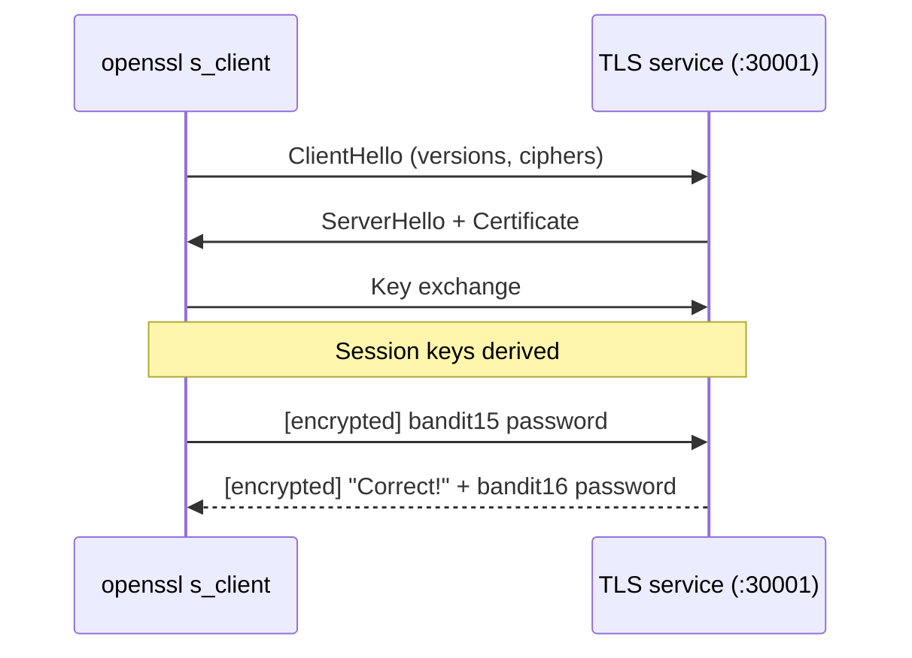

# OverTheWire Bandit Level 15 → Level 16

## Introduction

Level 14 → 15 taught you to talk to a plain TCP service with netcat. Level 15 → 16 is the same exercise with one crucial twist: the service on **port 30001** is wrapped in **SSL/TLS**. If you point plain `nc` at it, you'll connect at the TCP layer but never get a sensible reply — because before any application data flows, the server expects a **TLS handshake** that netcat doesn't perform.

This level introduces `openssl s_client`, the standard tool for hand-talking to TLS services, and forces you to internalize the difference between a raw TCP byte stream and an *encrypted* one. That distinction shows up constantly: HTTPS, secure SMTP, LDAPS, MQTT-over-TLS — all of them are "a normal protocol, but inside a TLS tunnel."

## Official Challenge Objective

> **The password for the next level can be retrieved by submitting the password of the current level to port 30001 on localhost using SSL/TLS encryption.**
>
> *Helpful note: getting "HEARTBEATING" and "Read R BLOCK"? Use `-ign_eof` and read the "CONNECTED COMMANDS" section in the manpage. Next to `R` and `Q`, the `B` command also works in this version of that command.*

**In plain English:** the same kind of submit-your-password-get-the-next-one service, now on port `30001` — but it only speaks **encrypted**. You must establish a TLS connection first, then send the `bandit15` password through that encrypted channel to receive the `bandit16` password.

## Skills Covered

- The difference between **plaintext TCP** and **TLS-encrypted** services
- Using **`openssl s_client`** to connect to a TLS port
- Reading a server's certificate / handshake output
- Handling the TLS **renegotiation / EOF** quirks (`-quiet`, `-ign_eof`)
- Recognizing when "the connection works but the protocol doesn't"

## My Approach

I already knew from the previous level how to submit a password to a port — but the objective explicitly says *using SSL/TLS encryption*, which is a flashing sign that plain netcat will fail. A raw `nc` connection to a TLS port either hangs or returns garbage, because the server is waiting for a `ClientHello` handshake that netcat never sends. The right tool is `openssl s_client`, which performs the TLS handshake and then gives me an interactive channel that behaves just like netcat — except encrypted. So I connected with `openssl s_client -connect localhost:30001`, sent my current password, and read the reply.

## Step-by-Step Walkthrough

### Command (the wrong way, to understand the lesson)

```bash
nc 127.0.0.1 30001
```

### Explanation

This opens a *plain* TCP connection. The TCP socket connects fine, but when you send the password the server cannot make sense of it — it expected an encrypted TLS handshake, not raw text. You'll get no useful response.

### Why It Matters

This is the teaching moment: **TCP connectivity is not the same as protocol compatibility.** Reaching a port tells you nothing about what language the service speaks. Recognizing "I can connect but the conversation is gibberish → maybe it's encrypted/binary" is a real diagnostic instinct.

---

### Command

```bash
openssl s_client -connect localhost:30001
```

### Explanation

`openssl s_client` is a generic TLS client. `-connect localhost:30001` performs the full TLS handshake with the service on port 30001, prints the certificate and connection details, and then drops you into an interactive session over the **encrypted** channel. Now **paste the `bandit15` password and press Enter**. The server replies:

```
Correct!
[REDACTED]
```

That is the `bandit16` password.

> [!TIP]
> If the session spews `RENEGOTIATING` / `KEYUPDATE` lines, or closes the moment your input ends, add flags to calm it down:
> ```bash
> openssl s_client -connect localhost:30001 -quiet -ign_eof
> ```
> `-quiet` suppresses the noisy handshake/session output, and `-ign_eof` keeps the connection open instead of sending a `Q` (quit) when it sees end-of-input — exactly the "CONNECTED COMMANDS" behavior the hint points you to.

### Why It Matters

`openssl s_client` is the de-facto tool for debugging and interacting with *any* TLS service. Security professionals use it daily to inspect certificates, test cipher suites, check protocol versions, and manually drive HTTPS/SMTPS/IMAPS. Mastering it means you can interrogate the encrypted half of the internet by hand.

## Deep Dive: Cyber Security Concept

**Transport Layer Security (TLS) and the handshake.**

TLS wraps an ordinary protocol in a tunnel that provides three things: **confidentiality** (eavesdroppers see only ciphertext), **integrity** (tampering is detected), and **authentication** (the certificate proves you're talking to the right server). Before any application byte moves, both sides run a handshake to agree on a protocol version and cipher suite and to derive session keys.



This is precisely why plain `nc` fails: it sends your password as cleartext into a socket that is waiting for a `ClientHello`. There's no handshake, no agreed keys, and nothing the server can decrypt.

The renegotiation/EOF quirks come from `s_client`'s interactive control characters. Historically, typing certain capital letters on a line by themselves triggers actions: **`R`** = renegotiate, **`Q`** = quit, **`B`** = send heartbeat (in this build). When piping input, an `R` in your data or a premature EOF can trigger these. `-ign_eof` (don't quit on EOF) and `-quiet` (which also implies `-ign_eof` in many builds) sidestep the noise — the fix the official hint nudges you toward.

> [!IMPORTANT]
> "It connected" and "it understood me" are different claims. A successful TCP connection to an encrypted port still requires you to *speak TLS*. When manual interaction returns garbage or silence, suspect an encryption or binary-protocol layer before assuming the service is broken.

## Offensive Security Perspective

- **Service interrogation:** operators use `openssl s_client` to grab certificates (revealing internal hostnames, SANs, and org details), enumerate supported TLS versions/ciphers, and manually issue HTTPS requests for testing.
- **Finding weak crypto:** spotting legacy SSLv3/TLS1.0, weak ciphers, or expired/self-signed certs is bread-and-butter for vuln assessment (and feeds tools like `testssl.sh` and `sslscan`).
- **Pivoting through TLS:** internal services often hide behind TLS; being able to hand-drive them is essential when automated tools choke on odd certificates.
- **Bypassing naive inspection:** because the payload is encrypted, plaintext IDS signatures can't see the password you're submitting — a reminder that encryption cuts both ways.

## Common Beginner Mistakes

- **Using plain `nc` on a TLS port** and concluding the service is down — it just needs a handshake.
- **Panicking at the certificate output** — the cert/handshake dump from `s_client` is normal; your input prompt is below it.
- **The session closing the instant you send input** — add `-ign_eof` (or `-quiet`).
- **Stray capital `R`/`Q`/`B` on their own line** triggering renegotiate/quit/heartbeat unexpectedly.
- **Submitting the next-level password instead of the current one.**
- **Trailing whitespace** corrupting the submitted password.

## Key Takeaways

- An encrypted service requires a TLS handshake before any data — plain netcat can't do that.
- `openssl s_client -connect host:port` is the standard way to hand-talk to TLS services.
- `-quiet` and `-ign_eof` tame the handshake noise and EOF/renegotiation quirks.
- TCP reachability ≠ protocol understanding; suspect encryption when replies are gibberish.
- The same skill lets you inspect certs, test ciphers, and drive HTTPS by hand.

## How This Helps Build Cyber Security Expertise

- **Web/app pentesting:** manually issuing HTTPS requests and inspecting TLS config is routine; `s_client` is the foundation.
- **Crypto assessment:** recognizing weak TLS versions/ciphers and cert problems is a standard finding category.
- **Network defense:** understanding what TLS hides (and exposes via metadata) shapes how you monitor encrypted traffic.
- **Tooling literacy:** `openssl` is everywhere — generating keys/CSRs, debugging certs, testing endpoints — and this level is your first real use of it.

## Additional Reading

- [`man openssl-s_client`](https://www.openssl.org/docs/man3.0/man1/openssl-s_client.html) — see the "CONNECTED COMMANDS" section
- [Cloudflare — What happens in a TLS handshake?](https://www.cloudflare.com/learning/ssl/what-happens-in-a-tls-handshake/)
- [testssl.sh](https://testssl.sh/) and [sslscan](https://github.com/rbsec/sslscan) — TLS posture testing
- [MITRE ATT&CK — T1573: Encrypted Channel](https://attack.mitre.org/techniques/T1573/)

---

*Next up: [Level 16 → 17](./17-bandit-level-16-17.md) — scan a range of ports, find the one that speaks TLS, and claim a private key as your reward.*


---

## Connect with the Author

Written by **Himangshu Pan** — offensive security researcher.

- **GitHub:** [@0xSh3ru](https://github.com/0xSh3ru)
- **LinkedIn:** [in/0xsh3ru](https://www.linkedin.com/in/0xsh3ru/)

*If this walkthrough helped, follow along on GitHub and connect on LinkedIn — questions and corrections are always welcome.*
