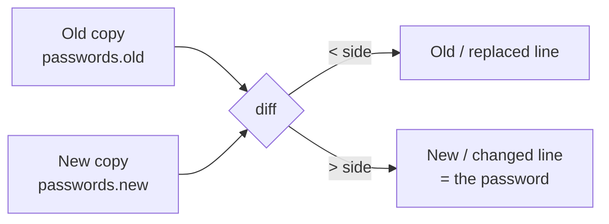

# OverTheWire Bandit Level 17 → Level 18

## Introduction

Up to now most Bandit levels have been "find the file, read the file." This one introduces a slightly different muscle: **comparing two things to find what changed.** You are handed two password files — an old one and a new one — and told the password you want is the single line that differs between them. Reading either file straight through is useless; both are full of plausible-looking 32-character strings. The skill is to ask the machine, "show me only the difference," and let `diff` do the work.

That instinct — *don't eyeball it, diff it* — is one of the most transferable habits in offensive security. Patch-diffing a vendor update to find the bug, comparing a leaked config against its default to spot weak settings, pulling a credential out of git history that was "deleted" but never really gone: all of them are "what changed between A and B?" problems, and `diff` (and its relatives) is how you answer them precisely.

## Official Challenge Objective

> **There are 2 files in the home directory: `passwords.old` and `passwords.new`. The password for the next level is in `passwords.new` and is the only line that has been changed between `passwords.old` and `passwords.new`.**

**In plain English:** two files sit in your home directory. They are almost identical — same number of lines, same content — except for exactly one line that was changed. That one changed line, as it appears in `passwords.new`, is the password for `bandit18`. Your job is to isolate that single differing line.

> [!NOTE]
> When you later log in as `bandit18` you may immediately see `Byebye!` and get kicked out. That is **not** a mistake on your part — it is the puzzle for the *next* level (18 → 19), where someone has booby-trapped `.bashrc`. Solve this level first; deal with `Byebye!` next.

## Skills Covered

- Comparing files with `diff`
- Reading and interpreting `diff` output (the `<` and `>` markers)
- Using "what changed?" as a recon and exploitation primitive
- Patch-diffing and spotting changed credentials

## My Approach

The naive move is to `cat` both files and try to spot the odd one out by eye — which is hopeless when every line is a random 32-character blob and there are dozens of them. So I skipped straight to the right tool for "what differs between these two files": `diff`. It compares the files line by line and prints only the lines that don't match, telling me exactly which line changed and what it became. The password I needed was the changed line on the `passwords.new` side of the output.

## Step-by-Step Walkthrough

### Command

```bash
ssh bandit17@bandit.labs.overthewire.org -p 2220
```

### Explanation

Log in as `bandit17` on port `2220` using the password you recovered in the previous level. You land in `/home/bandit17`.

### Why It Matters

The login loop is unchanged, but get in the habit of running `ls -la` immediately on arrival — it confirms the two files the level promised are actually there and shows their permissions and sizes.

---

### Command

```bash
ls -la
```

### Explanation

Confirms the home directory contains `passwords.old` and `passwords.new`. Glancing at their sizes is a quick sanity check: they should be nearly identical in size, consistent with "only one line changed."

### Why It Matters

Before comparing files you want to know they exist, you have read access, and they are plain text (not, say, a symlink or a binary). One `ls -la` answers all of that.

---

### Command

```bash
diff passwords.old passwords.new
```

### Explanation

`diff` performs a **line-by-line comparison** of the two files and prints only the differences. Because exactly one line was changed, the output is a single "change" hunk that looks like this:

```
42c42
< OldStringThatWasReplaced...
---
> [REDACTED]
```

Reading that output:

- `42c42` means "line 42 **c**hanged to line 42." (`c` = change; you may also see `a` for added or `d` for deleted lines in other scenarios.)
- Lines prefixed with `<` come from the **first** file you named — here `passwords.old`.
- The `---` is just a separator.
- Lines prefixed with `>` come from the **second** file — here `passwords.new`.

Since the password lives in `passwords.new`, the line on the **`>` side** is your answer: `[REDACTED]`.

### Why It Matters

`diff` is the canonical Unix tool for change detection, and reading its output fluently — knowing that `<` is "theirs/old" and `>` is "yours/new" — is a small but constantly useful skill. The same `< / >` convention shows up in Git merge conflicts, code review tools, and patch files.

---

### Command (optional, isolates just the password)

```bash
diff passwords.old passwords.new | grep '>' | cut -d' ' -f2
```

### Explanation

A one-liner that pipes the `diff` output into `grep '>'` (keep only the new-file line) and `cut` (strip the leading `> ` so you are left with just the raw password string). Handy when the changed line is the only thing you want to copy.

### Why It Matters

Chaining `diff | grep | cut` is a tiny example of the Unix philosophy — small tools, composed with pipes, to extract exactly one value. You will build far more elaborate pipelines in later levels.

## Deep Dive: Cyber Security Concept

**Diffing as a recon and exploitation primitive.**

At its core this level is about answering a deceptively important question: *"What changed between A and B?"* That question is the engine behind several powerful offensive techniques:

- **Patch-diffing for 1-days.** When a vendor releases a security patch, researchers "diff the patch" — comparing the vulnerable and fixed binaries or source — to learn precisely which lines changed, which often reveals the exact bug being fixed. This is the basis of *patch-diffing* and 1-day exploit development.
- **Spotting changed credentials.** Exactly what you just did: when an old and a new copy of a secret store exist, the diff hands you the value that was rotated in. The same trick surfaces rotated keys, tokens, and configs left side-by-side on a target.
- **Secret hunting in version history.** `git diff` and `git log -p` compare commits and frequently reveal a credential that was committed and later "removed" but still lives in history — a secret a developer thought they had deleted.

> [!IMPORTANT]
> A single changed line can be the entire story. Whether it is the one password you need, a misconfigured directive you can abuse, or the one source line that introduces a vulnerability, the value is in the *difference*, not the bulk. Tooling that surfaces differences cheaply is worth its weight in gold.



## Offensive Security Perspective

Attackers and researchers use diffing offensively all the time:

- **Patch-diffing for 1-days.** Microsoft Patch Tuesday and similar release cycles are followed by researchers diffing the patched binaries against the previous version. The changed functions point straight at the vulnerability, enabling an exploit against unpatched targets — the classic "1-day" race.
- **Finding what an attacker (or you) changed.** During a red-team engagement you might diff a captured config against a default template to spot weak settings, or diff two snapshots to confirm your persistence change took effect without touching anything else.
- **Source/secret hunting in repos.** `git diff` and `git log -p` let you compare commits — and frequently reveal a secret that was committed and later "removed" but still lives in history. The changed-line mindset finds credentials developers thought they had deleted.

## Common Beginner Mistakes

- **Trying to spot the difference by eye** after `cat`-ing both files — slow, error-prone, and impossible at scale.
- **Confusing the `<` and `>` sides.** Remember: the side matches the *order you typed the filenames*. `diff old new` → `<` is `old`, `>` is `new`. Naming them in the wrong order makes you grab the old (wrong) password.
- **Copying the `> ` prefix** along with the password. The actual secret starts after `> `.
- **Panicking at `Byebye!`** when logging into `bandit18` and assuming this level was wrong — it is the next level's puzzle.
- **Reaching for a heavier tool** (a script, a Python loop) when one `diff` call does it.

## Key Takeaways

- `diff A B` shows only the lines that differ — the fastest way to compare two text files.
- In `diff` output, `<` is the first file, `>` is the second; the change marker `42c42` tells you which lines and that it was a **c**hange.
- The password lives in `passwords.new`, so it is the line on the `>` side.
- "What changed?" is a foundational question behind patch-diffing, secret hunting, and credential rotation discovery.
- Let tools surface differences; never trust your eyes against random strings.

## How This Helps Build Cyber Security Expertise

- **Vulnerability research:** patch-diffing is a core skill for finding bugs and writing 1-day exploits.
- **Bug bounty & secret hunting:** diffing commit history and config snapshots surfaces credentials and tokens that were "removed" but never really gone.
- **Red teaming:** diffing a captured config against a default template, or two snapshots before and after a change, confirms exactly what you altered on a target.
- **Exploit dev tradecraft:** reading a `diff` fluently — `<` old, `>` new — is the same fluency you need across patch files, Git history, and reverse-engineering output.

## Additional Reading

- [`man diff`](https://man7.org/linux/man-pages/man1/diff.1.html), [`man cmp`](https://man7.org/linux/man-pages/man1/cmp.1.html)
- [GNU `diffutils` manual](https://www.gnu.org/software/diffutils/manual/)
- [`git diff`](https://git-scm.com/docs/git-diff) and [`git log -p`](https://git-scm.com/docs/git-log) for hunting secrets in history
- [MITRE ATT&CK — T1078: Valid Accounts](https://attack.mitre.org/techniques/T1078/) and [T1552.001: Credentials In Files](https://attack.mitre.org/techniques/T1552/001/)

---

*Next up: [Level 18 → 19](./19-bandit-level-18-19.md) — a booby-trapped `.bashrc` kicks you out the instant you log in, and you'll learn to run a command over SSH without ever getting an interactive shell.*


---

## Connect with the Author

Written by **Himangshu Pan** — offensive security researcher.

- **GitHub:** [@0xSh3ru](https://github.com/0xSh3ru)
- **LinkedIn:** [in/0xsh3ru](https://www.linkedin.com/in/0xsh3ru/)

*If this walkthrough helped, follow along on GitHub and connect on LinkedIn — questions and corrections are always welcome.*
