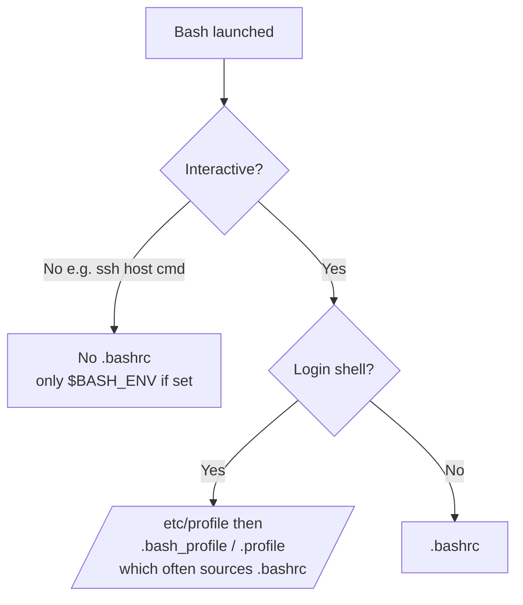

# OverTheWire Bandit Level 18 → Level 19

## Introduction

This is the level where many players first feel like the game is *fighting back*. You have the password for `bandit18`, you SSH in correctly — and you are instantly thrown out with a cheerful `Byebye!`. Try again, same result. Nothing you type seems to matter, because you never get a usable prompt.

The trick is to stop thinking of SSH as "a thing that gives me a shell" and start thinking of it as "a thing that runs a command on a remote machine." Someone has sabotaged the account's shell-startup file (`.bashrc`) so that any **interactive login shell** immediately logs you out. The escape hatch is to skip the interactive shell entirely: tell SSH to run one specific command — `cat readme` — and exit. The hostile startup logic never gets the chance to kick you, because you are not asking for the interactive experience it sabotages.

Underneath the puzzle is a genuinely important topic: **how shells decide which startup files to run**, and the difference between *login vs non-login* and *interactive vs non-interactive* shells. Understanding that distinction is what lets you reason about why the same account behaves differently depending on *how* you connect.

## Official Challenge Objective

> **The password for the next level is stored in a file `readme` in the home directory. Unfortunately, someone has modified `.bashrc` to log you out when you log in with SSH.**

**In plain English:** the password you want is sitting in `~/readme`, easy to read — *if* you could stay logged in. But the `.bashrc` for `bandit18` has been rigged to print `Byebye!` and exit the moment an interactive shell starts. You need a way to read `readme` without ever entering that interactive shell.

## Skills Covered

- Running a **non-interactive** command over SSH (`ssh user@host <command>`)
- Understanding shell startup files (`.bashrc`, `.bash_profile`, `.profile`)
- The difference between **login/non-login** and **interactive/non-interactive** shells
- Reasoning about *how* you connect, not just *that* you connect
- Abusing user-controlled startup scripts as a persistence/sabotage vector

## My Approach

The instant I saw `Byebye!`, I recognized that the interactive shell was the problem, not my credentials. The login itself was succeeding — SSH authenticated me fine; it was the *shell* that bailed. So instead of fighting for an interactive prompt I would never get, I told SSH exactly what to do in one breath: connect, run `cat /home/bandit18/readme`, and disconnect. Because a command supplied directly to SSH runs as a **non-interactive** shell, the interactive-only sabotage in `.bashrc` either never fires or never matters — and the file contents print right to my terminal.

## Step-by-Step Walkthrough

### Command (the failing attempt — for understanding)

```bash
ssh bandit18@bandit.labs.overthewire.org -p 2220
```

### Explanation

This is the "normal" login. Authentication **succeeds** — you really are logged in — but the moment Bash starts your interactive shell it sources `~/.bashrc`, which has been edited to do something like `echo "Byebye!"; exit`. You see `Byebye!` and the connection closes instantly.

### Why It Matters

It is crucial to understand that this is *not* an authentication failure. Your password is correct. The hostile code runs **after** login, during shell startup. Diagnosing "is it auth, or is it the shell?" is the whole insight of this level.

---

### Command (the solution)

```bash
ssh bandit18@bandit.labs.overthewire.org -p 2220 cat /home/bandit18/readme
```

### Explanation

By appending a command (`cat /home/bandit18/readme`) to the SSH invocation, you tell SSH: *do not give me an interactive login shell — run this one command and exit.* SSH executes the command in a **non-interactive** shell, so the interactive-only logout logic in `.bashrc` does not derail you. You will typically see the OverTheWire welcome banner (printed by the SSH server's banner, independent of `.bashrc`) followed by the file's contents:

```
The password you are looking for is: [REDACTED]
```

> [!TIP]
> Use the absolute path `/home/bandit18/readme`. When you run a command this way you never `cd` anywhere, but your working directory will be the home directory anyway — still, the absolute path removes all doubt. (`ssh ... cat readme` also works.)

### Why It Matters

This is the canonical demonstration that **`ssh user@host <command>` runs that command remotely and returns its output** — no interactive session required. It is the foundation of automation (cron jobs, deployment scripts, Ansible's raw module, `scp`/`rsync` over SSH all rely on non-interactive remote execution) and a clean way to sidestep a hostile interactive shell.

---

### Command (alternative — force a different shell)

```bash
ssh bandit18@bandit.labs.overthewire.org -p 2220 -t "/bin/sh"
```

### Explanation

An alternative trick: request a different shell (`/bin/sh`) that does not source `bandit18`'s `~/.bashrc` (which is a Bash file). The `-t` forces a pseudo-terminal so you get an interactive prompt in that other shell, from which you can `cat readme` at your leisure.

### Why It Matters

It reinforces the same lesson from another angle: the sabotage targets *Bash's* interactive startup specifically. Change the shell or change how you connect, and the trap no longer applies. There is usually more than one way around a control that is narrowly scoped.

## Deep Dive: Cyber Security Concept

**Shell startup files and the interactive/non-interactive, login/non-login matrix.**

When you start a shell, Bash decides which startup files to read based on *how* it was launched. This is the heart of the level:

- A **login shell** (e.g., logging in at a console or via SSH to an interactive session) reads `/etc/profile`, then the first it finds of `~/.bash_profile`, `~/.bash_login`, `~/.profile`. On many distros `~/.bash_profile` in turn sources `~/.bashrc`.
- A **non-login interactive shell** (e.g., opening a new terminal tab inside a desktop) reads `~/.bashrc`.
- A **non-interactive shell** (e.g., `ssh host "command"`, or running a script) reads *neither* by default — it consults the file named in the `$BASH_ENV` variable, if any, and otherwise runs no startup files.



The attacker put `Byebye!; exit` in `.bashrc`, which fires for interactive shells. By sending a **non-interactive** command over SSH, you take the left branch of the tree — no `.bashrc`, no trap.

> [!IMPORTANT]
> Knowing *which* startup file runs *when* is not trivia. It governs where environment variables live, where persistence mechanisms hide, and why "it works in my terminal but not in cron" — a question every sysadmin and attacker eventually has to answer.

## Offensive Security Perspective

User-writable shell startup files are a classic and quiet place for attackers to live:

- **Persistence via dotfiles.** Appending a payload to a victim's `~/.bashrc`, `~/.bash_profile`, or `~/.profile` means it re-executes every time they open a shell — a low-privilege, no-special-tooling persistence technique (MITRE ATT&CK T1546.004, *Unix Shell Configuration Modification*).
- **Trojaned aliases / functions.** An attacker can alias `sudo`, `ssh`, or `ls` to a wrapper that harvests credentials or hides files, all from a startup file.
- **Sabotage and access denial.** As this level shows, startup files can also *deny* or disrupt an interactive session for whoever logs in next. And the counter-move — non-interactive execution — is itself an offensive technique for working on a host whose interactive shell is hostile, broken, or rigged against you.

## Common Beginner Mistakes

- **Assuming the password is wrong** because of `Byebye!`. Authentication succeeded; the *shell* logged you out.
- **Repeatedly retrying the interactive login**, expecting a different outcome.
- **Trying to edit `.bashrc`** before logging in — you cannot, because you cannot stay logged in. (And you do not need to.)
- **Forgetting to quote a multi-word remote command.** `cat readme` is one word + one arg so it is fine, but anything with spaces/special chars should be quoted: `ssh ... "grep -i pass readme"`.
- **Expecting no banner.** The OverTheWire welcome text printed by the SSH server's configured banner is normal and appears before your command's output.

## Key Takeaways

- `ssh user@host <command>` runs a single command **non-interactively** and prints its output — no shell session needed.
- A sabotaged `.bashrc` only affects **interactive** shells; non-interactive execution sidesteps it.
- Bash chooses startup files based on login/non-login and interactive/non-interactive status.
- Authentication success ≠ usable shell; learn to tell the two apart.
- Shell startup files are a real-world persistence and sabotage vector — know where they are.

## How This Helps Build Cyber Security Expertise

- **Automation & ops:** non-interactive SSH execution is the backbone of deployment, configuration management, and remote administration — and of scripting actions across compromised hosts.
- **Persistence:** dotfile modification is a quiet, low-privilege way to keep code re-executing every time a victim opens a shell.
- **Linux internals:** understanding the shell-startup matrix demystifies a class of "works here but not there" bugs and environment problems.
- **Red teaming:** both sides of this level (planting startup sabotage, and bypassing it) are techniques you will use.

## Additional Reading

- [`man ssh`](https://man7.org/linux/man-pages/man1/ssh.1.html) — see the section on executing a command on the remote host
- [Bash manual — Startup Files](https://www.gnu.org/software/bash/manual/html_node/Bash-Startup-Files.html)
- [MITRE ATT&CK — T1546.004: Unix Shell Configuration Modification](https://attack.mitre.org/techniques/T1546/004/)
- [MITRE ATT&CK — T1059.004: Unix Shell](https://attack.mitre.org/techniques/T1059/004/)

---

*Next up: [Level 19 → 20](./20-bandit-level-19-20.md) — a setuid binary lets you read a file you normally couldn't, and you'll learn how the `s` permission bit grants borrowed privileges.*


---

## Connect with the Author

Written by **Himangshu Pan** — offensive security researcher.

- **GitHub:** [@0xSh3ru](https://github.com/0xSh3ru)
- **LinkedIn:** [in/0xsh3ru](https://www.linkedin.com/in/0xsh3ru/)

*If this walkthrough helped, follow along on GitHub and connect on LinkedIn — questions and corrections are always welcome.*
