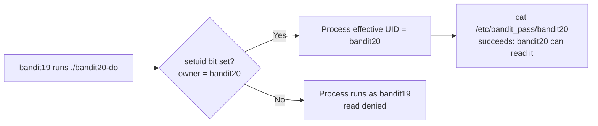

# OverTheWire Bandit Level 19 → Level 20

## Introduction

This level introduces one of the most important — and most dangerous — features in the Unix permission model: the **setuid bit**. You log in as `bandit19`, but the password you need lives in `/etc/bandit_pass/bandit20`, a file that only `bandit20` is allowed to read. As `bandit19` you have no business reading it. And yet the level hands you a small program, `bandit20-do`, that *can* read it on your behalf — because that program is owned by `bandit20` and carries the setuid bit, so it runs with `bandit20`'s privileges no matter who launches it.

That single idea — *a program can run as a user other than the one who executed it* — is the foundation of how `sudo`, `passwd`, `ping`, and countless system utilities work. It is also one of the most common Linux privilege-escalation avenues, because a setuid program that does too much, or trusts its input too readily, becomes a ladder from a low-privilege account straight to root. This level shows you the *intended, well-behaved* version of setuid; later levels and real engagements show you the abusable kind.

## Official Challenge Objective

> **To gain access to the next level, you should use the setuid binary in the home directory. Execute it without arguments to find out how to use it. The password for this level can be found in the usual place (`/etc/bandit_pass`), after you have used the setuid binary.**

**In plain English:** there is a special program, `bandit20-do`, in your home directory. Run it with no arguments to see its usage message. It lets you execute a command *as the `bandit20` user*. Use it to run a command that reads `/etc/bandit_pass/bandit20` — which only `bandit20` may read — and out comes the next password.

## Skills Covered

- Recognizing the setuid (`SUID`) permission bit in `ls -l` output (the `s`)
- Understanding **effective vs real user ID** and borrowed privileges
- Using a deliberately-scoped privileged helper safely
- The location of Bandit passwords (`/etc/bandit_pass/<user>`)
- The principle of least privilege as it applies to setuid programs

## My Approach

The objective practically narrates itself: there is a setuid binary, run it with no args to learn its usage, then use it. So I listed the home directory, confirmed `bandit20-do` was there, and ran `ls -l` on it specifically to *see* the setuid bit — an `s` where the owner's execute bit would normally be, and ownership by `bandit20`. That `s` is the whole point: it means "execute as the file's owner." Then I ran the binary bare to read its usage, which told me it runs a command of my choosing as `bandit20`. From there it was simply: have it `cat` the protected password file.

## Step-by-Step Walkthrough

### Command

```bash
ls -l
```

### Explanation

Lists the home directory in long format. You will see the helper binary and its permission string. The key thing to read is the permissions and owner:

```
-rwsr-x--- 1 bandit20 bandit19 ... bandit20-do
```

Note the **`s`** in the owner's execute position (`rws`), and that the file is **owned by `bandit20`**. That `s` is the setuid bit.

### Why It Matters

Being able to *spot* a setuid binary in `ls -l` output is a core enumeration skill. The owner-execute slot tells you everything: `x` = normal executable; `s` = setuid (runs as the file's owner); `S` = setuid set but not executable (a misconfiguration worth flagging). Whose name is in the owner column tells you *whose* privileges you would borrow.

> [!TIP]
> To hunt for *all* setuid binaries on a system — a standard privilege-escalation enumeration step — run:
> ```bash
> find / -perm -4000 -type f 2>/dev/null
> ```
> The `-4000` matches the setuid bit; `2>/dev/null` hides the permission-denied noise.

---

### Command

```bash
./bandit20-do
```

### Explanation

Running the binary with no arguments prints its usage message, which is essentially: *"run a command as another user," e.g.* `./bandit20-do id`. It tells you the program will execute whatever command you hand it, but **as `bandit20`** rather than as you.

### Why It Matters

Reading a program's own usage/help before driving it is good discipline — and the objective explicitly tells you to. Confirming what the tool does (and as whom) before pointing it at a sensitive file is exactly the caution you want when handling anything privileged.

---

### Command

```bash
./bandit20-do id
```

### Explanation

A quick proof-of-concept: run `id` through the helper. You will see that while your *real* UID is still `bandit19`, the *effective* UID is `bandit20` (`euid=...(bandit20)`). This is the setuid mechanism working — the command executes with `bandit20`'s identity.

### Why It Matters

Seeing `euid=bandit20` makes the abstract concrete: the setuid bit changed *who the process is allowed to act as*. That effective-UID elevation is precisely what lets the next command succeed.

---

### Command

```bash
./bandit20-do cat /etc/bandit_pass/bandit20
```

### Explanation

Now use the borrowed `bandit20` privileges to read the password file that only `bandit20` can read. The helper runs `cat /etc/bandit_pass/bandit20` as `bandit20`, the read succeeds, and the password prints:

```
[REDACTED]
```

That is the password for `bandit20`.

### Why It Matters

This is the controlled, intended use of a setuid program: a narrow, owner-defined action performed with elevated privilege on behalf of a less-privileged user. It mirrors how `sudo` (itself a setuid-root program) lets you run *specific* commands as root — the legitimate face of privilege delegation.

## Deep Dive: Cyber Security Concept

**The setuid bit, real vs effective UID, and least privilege.**

Every Linux process has (among others) a **real UID** — who actually launched it — and an **effective UID** — whose privileges it currently acts with. Normally they are the same. The **setuid bit** breaks that symmetry: when you execute a file that has the setuid bit set, the kernel sets the process's *effective* UID to the **file owner's** UID. So a `bandit19` user running a `bandit20`-owned setuid binary gets `euid=bandit20` for the life of that process.

This exists for a good reason. Some legitimate operations genuinely require elevated rights even when an ordinary user requests them:

- `passwd` must write to `/etc/shadow` (root-only) so you can change your own password — it is setuid root.
- `ping` historically needed raw-socket privileges — setuid root.
- `sudo` and `su` are setuid root and exist precisely to delegate elevated execution under policy.



> [!IMPORTANT]
> Setuid is a deliberate, scoped grant of *the owner's* privileges. It is safe only when the program does exactly one well-defined thing and never lets the caller redirect that privilege toward something else. The danger is in setuid programs that are too powerful or too trusting of their input.

## Offensive Security Perspective

Enumerating setuid binaries is a textbook Linux privilege-escalation step:

- **Find them all:** `find / -perm -4000 -type f 2>/dev/null`. Tools like `linpeas` and `GTFOBins` automate this and tell you which setuid binaries are abusable.
- **Abuse over-powerful binaries.** A setuid-root binary that lets you spawn a shell, read arbitrary files, or write to arbitrary paths is an instant root. `bandit20-do` is benign because it only does what its owner intended — but swap it for a setuid binary that calls a shell, or one vulnerable to command/argument injection, and the same mechanism becomes full compromise. (Later Bandit levels lean directly into this.)
- **GTFOBins.** This catalog lists exactly how common binaries (`vim`, `find`, `awk`, `less`, `cp`, etc.) can be abused *when setuid* to read files, write files, or pop a shell as the owner. It is the first thing an operator checks after `find -perm -4000`.

## Defensive Perspective

- **Minimize the setuid surface.** Audit `find / -perm -4000` regularly; every setuid binary is attack surface. Remove the bit (`chmod u-s`) from anything that does not strictly need it.
- **Prefer capabilities over setuid root.** Modern Linux lets you grant a binary only the narrow capability it needs (e.g., `cap_net_raw` for `ping`) instead of full root via setuid — far smaller blast radius.
- **Watch for new setuid files.** A *newly created* setuid-root binary is a high-fidelity compromise indicator; attackers drop them for persistence/escalation. FIM and `auditd` rules on `chmod`/`setuid` syscalls catch this.
- **Mount with `nosuid`** where appropriate (e.g., `/tmp`, removable media, user-writable mounts) so setuid bits there are ignored entirely.
- **Detection idea:** alert on execve of setuid-root binaries by unusual users, and on any process that changes its UID 0 shortly after running a non-standard setuid file.

## Common Beginner Mistakes

- **Trying to `cat /etc/bandit_pass/bandit20` directly** as `bandit19` and getting "Permission denied" — you must go *through* the setuid helper.
- **Missing the `s` in `ls -l`** and not realizing the binary is privileged at all.
- **Running the binary with no idea what it does** instead of reading its usage first.
- **Confusing real and effective UID** — `id` *without* the helper still shows `bandit19`; you must run `./bandit20-do id` to see the elevation.
- **Forgetting the `./`** — the current directory is usually not in `$PATH`, so `bandit20-do` alone returns "command not found."

## Key Takeaways

- The setuid bit (`s` in the owner-execute slot of `ls -l`) makes a program run with its **owner's** privileges.
- Real UID = who launched it; effective UID = whose privileges it acts with. Setuid raises the effective UID.
- `./bandit20-do cat /etc/bandit_pass/bandit20` borrows `bandit20`'s rights to read the protected file.
- `find / -perm -4000 -type f 2>/dev/null` enumerates every setuid binary — a core privesc step.
- Setuid is powerful and legitimate, but over-broad or input-trusting setuid programs are a classic root path.

## How This Helps Build Cyber Security Expertise

- **Linux privilege escalation:** setuid enumeration and abuse (via GTFOBins) is one of the most common ways pentesters go from user to root.
- **Secure system administration:** knowing how to audit and minimize setuid binaries hardens real servers.
- **Exploit development:** many local privilege-escalation exploits target bugs in setuid programs.
- **Detection engineering:** new/anomalous setuid binaries are high-value telemetry to alert on.

## Additional Reading

- [`man chmod`](https://man7.org/linux/man-pages/man1/chmod.1.html), [`man find`](https://man7.org/linux/man-pages/man1/find.1.html)
- [Linux `credentials(7)` — real vs effective UID](https://man7.org/linux/man-pages/man7/credentials.7.html)
- [GTFOBins](https://gtfobins.github.io/) — abusing setuid (and other) binaries
- [MITRE ATT&CK — T1548.001: Setuid and Setgid](https://attack.mitre.org/techniques/T1548/001/)

---

*Next up: [Level 20 → 21](./21-bandit-level-20-21.md) — a setuid binary talks to a network port you control, and you'll run your own listener (with the help of tmux) to feed it the right answer.*


---

## Connect with the Author

Written by **Himangshu Pan** — offensive security researcher.

- **GitHub:** [@0xSh3ru](https://github.com/0xSh3ru)
- **LinkedIn:** [in/0xsh3ru](https://www.linkedin.com/in/0xsh3ru/)

*If this walkthrough helped, follow along on GitHub and connect on LinkedIn — questions and corrections are always welcome.*
