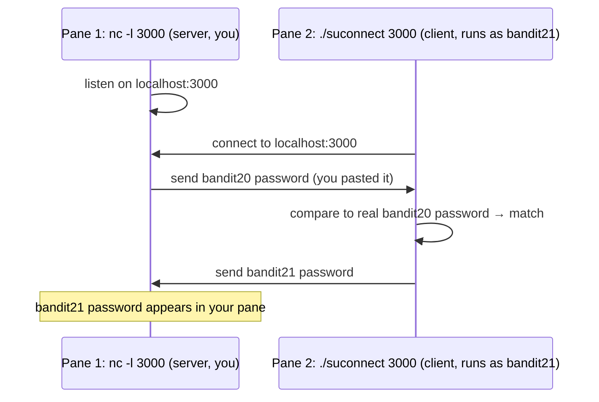

# OverTheWire Bandit Level 20 → Level 21

## Introduction

This is the level that turns a lot of beginners' brains inside out — in the best way. Up to now every challenge was something you could do with one command at a time. Here you genuinely need **two programs running at the same moment**, talking to each other over the network: a server you set up, and a client the level gives you. The setuid binary `suconnect` connects to a port *you choose* on `localhost`, reads one line, and checks whether that line equals the **bandit20** password. If it matches, it hands back the **bandit21** password. The catch is that `suconnect` is a *client* — it needs something on the other end of that port to talk to. So you have to *become the server*: open a listener that serves the bandit20 password, then point `suconnect` at it.

The conceptual leap is the **client–server model** and the practical skill is **running two things at once**. There are several ways to do that — job control (`&`, `Ctrl-Z`, `bg`/`fg`), two SSH sessions, or a terminal multiplexer. I used **tmux**, splitting one terminal into two panes so I could watch both halves of the conversation live. That turned an abstract networking idea into something I could literally see happening side by side.

## Official Challenge Objective

> **There is a setuid binary in the home directory that does the following: it makes a connection to localhost on the port you specify as a command-line argument. It then reads a line of text from the connection and compares it to the password in the previous level (bandit20). If the password is correct, it will transmit the password for the next level (bandit21).**
>
> **NOTE: Try connecting to your own network daemon to see if it works as you think.**

**In plain English:** `suconnect <port>` dials `localhost:<port>`, reads one line, and if that line is the **bandit20** password it sends back the **bandit21** password. You must run your *own* server on some port that, when something connects, hands over the bandit20 password — then run `suconnect` against that same port so it reads the password, validates it, and replies with the prize.

## Skills Covered

- The **client–server / network daemon** model
- Setting up an ad-hoc listener with `nc` (netcat)
- Running two interdependent processes simultaneously
- **Job control** (`&`, `Ctrl-Z`, `bg`, `fg`) and terminal multiplexing with **tmux**
- Reasoning about loopback (`localhost`) connections and ports
- Reusing a known credential (the bandit20 password) as data fed to a service

## My Approach

The first thing I had to internalize is that `suconnect` is the *client*, not the server. It reaches out to a port and expects someone to be listening. So the burden is on me to *be* that someone: stand up a listener that, the moment `suconnect` connects, sends it the bandit20 password. The validation then happens inside `suconnect`, which replies on the same connection with the bandit21 password — which my listener receives.

The practical problem is timing: the listener has to be running *before and during* the moment I run `suconnect`. One pane can't do both. My answer was tmux. I split a single terminal into two panes with `Ctrl-b %`: in the left pane I started `nc -l 3000` (a listener on port 3000) and pasted the bandit20 password so it was ready to send; in the right pane I ran `./suconnect 3000`. Watching both panes at once, I saw `suconnect` read the password, print that it matched, and send the next one straight back into my netcat pane. Seeing both sides of the handshake simultaneously is exactly why the split-pane approach made this level *click*.

## Step-by-Step Walkthrough

### Command (recover the bandit20 password you'll serve)

```bash
cat /etc/bandit_pass/bandit20
```

### Explanation

You are logged in as `bandit20`, so you can read your own password file. This is the value your listener must serve to `suconnect`. Keep it handy (copy it). It is `[REDACTED]`.

### Why It Matters

The whole level hinges on feeding `suconnect` the *correct previous-level password*. Confirming it from the authoritative source (`/etc/bandit_pass/bandit20`) avoids the classic failure of pasting a slightly wrong string.

---

### Command (inspect the binary)

```bash
ls -l suconnect
./suconnect
```

### Explanation

`ls -l` shows `suconnect` is a setuid binary owned by `bandit21` (the `s` bit — same concept as the previous level). Running it with no arguments prints its usage: it expects a single port number as an argument, connects to `localhost` on that port, reads a line, and compares it to the bandit20 password.

### Why It Matters

Confirming it is setuid-`bandit21` explains *why* it can hand you the bandit21 password: it runs with `bandit21`'s privileges, so it is allowed to read `/etc/bandit_pass/bandit21` and transmit it. Reading the usage tells you the one argument it needs.

---

### Command (split the terminal with tmux)

```bash
tmux
# then, inside tmux, split into two panes:
#   Ctrl-b  %        (vertical split)
#   Ctrl-b  <arrow>  (move between panes)
```

### Explanation

`tmux` starts a terminal multiplexer. The prefix key is `Ctrl-b`; pressing `Ctrl-b` then `%` splits the current pane into two side-by-side panes. `Ctrl-b` followed by an arrow key (or `o`) moves focus between them. Now you have two independent shells on screen at once — one for the listener, one for the client.

> [!TIP]
> No tmux? You can get the same "two things at once" effect with **job control** in a single shell — start the listener in the background with `nc -l 3000 &` (or start it, press `Ctrl-Z`, then `bg`), then run `./suconnect 3000` in the foreground. Or simply open a **second SSH session** to `bandit20`. tmux/screen just make it visual.

### Why It Matters

Running concurrent processes is a fundamental operational skill — servers, monitors, packet captures, and exploits routinely need to run *alongside* the command that triggers them. tmux/screen and job control are the everyday tools for that, on local boxes and (especially) on remote servers where a dropped SSH session would otherwise kill your work.

---

### Command (Pane 1 — start the listener and serve the password)

```bash
nc -l 3000
```

### Explanation

`nc` (netcat) with `-l` **listens** on port 3000, becoming a tiny server. It will block, waiting for a connection. Once `suconnect` connects (from the other pane), anything you type/paste here is sent down the connection. Paste the bandit20 password — `[REDACTED]` — and press Enter so a full line is transmitted. After `suconnect` validates it, the **bandit21 password it sends back appears right here in this pane**.

### Why It Matters

This is you *being the server*. netcat is the classic "Swiss-army knife" for ad-hoc networking — listening, connecting, transferring data, and (offensively) shells. Understanding that a listener simply waits and then exchanges bytes on the socket is foundational to all network work.

---

### Command (Pane 2 — run the client against your listener)

```bash
./suconnect 3000
```

### Explanation

In the second pane, point `suconnect` at the same port your listener is on. It connects to `localhost:3000`, reads the line your netcat pane sent (the bandit20 password), compares it, and — on a match — transmits the bandit21 password back over the connection. You will see output like:

```
Read: [REDACTED]
Password matches, sending next password
```

### Why It Matters

This completes the handshake. The validation logic lives in `suconnect` (running as `bandit21`); your job was only to feed it the right input on a socket it could reach. It is a clean, minimal illustration of a request/response protocol.

---

### Result (back in Pane 1)

### Explanation

The moment `suconnect` prints "Password matches," your **netcat pane** receives and displays the bandit21 password:

```
[REDACTED]
```

That is the password for `bandit21`.

> [!NOTE]
> Order matters: the listener (`nc -l 3000`) must be running **before** you launch `./suconnect 3000`, or the client will connect to nothing and fail. Start the server first, then the client.

### Why It Matters

The two panes together show a complete client–server exchange: server listens → client connects → client reads server's data → client validates → client responds → server receives the response. That round trip is the shape of nearly every networked protocol you will ever analyze.

## Deep Dive: Cyber Security Concept

**The client–server model, network daemons, and concurrency.**

Almost everything on a network is a conversation between a **server** (a daemon that binds a port and waits) and a **client** (which initiates a connection to that port). A *port* is just a numbered endpoint on a host; `localhost` (the loopback interface, `127.0.0.1`) is the host talking to itself, never touching the physical network. In this level you operated **both roles**: your `nc` listener was the server, and the level's `suconnect` was the client.



The second, easy-to-miss concept is **concurrency**: the server and client must be alive *at the same time*. A single sequential shell can't do that, which is why you reach for job control, multiple sessions, or a multiplexer. Learning to keep multiple processes running and communicating is a daily reality in operations and offense alike.

> [!IMPORTANT]
> A "service" is just a program listening on a port, exchanging bytes by some protocol. Once you can stand up your own listener with one `nc` command, network services stop being magic — you can probe, emulate, and reason about them.

## Offensive Security Perspective

netcat and the listener/client mindset are bread-and-butter offense:

- **Reverse and bind shells.** The exact pattern here — one side listens, the other connects — is how reverse shells work: the attacker runs `nc -lvnp 4444` and the victim connects back, handing the attacker a shell. This level is that primitive, sanitized.
- **Emulating a service to capture or feed data.** Standing up a fake listener to receive exfiltrated data, capture credentials, or satisfy a client's expectations (as you did with `suconnect`) is a common technique.
- **Port testing and banner grabbing.** `nc <host> <port>` connects to and interrogates services during recon.
- **Pivoting and relays.** netcat (and `socat`) build ad-hoc relays and tunnels to move through a network.

## Defensive Perspective

- **Restrict who can bind/listen and what can reach loopback services.** Even `localhost`-only services are reachable by any local user — never assume "it's only on localhost" means "it's safe." This level *relies* on that fact.
- **Egress filtering & connection monitoring.** Reverse shells depend on outbound connections; restricting and logging egress, and alerting on unexpected long-lived outbound TCP from servers, catches them.
- **Flag suspicious tooling.** `nc`/`ncat`/`socat` listeners on non-standard ports, especially spawned by web/service accounts, are high-value detections. EDR rules on `nc -l`/`-e` and on processes binding listening sockets are common.
- **Least-privilege on local daemons.** A service that validates a secret and dispenses another (like `suconnect`) should run with the *minimum* rights to do exactly that — here, just enough to read `/etc/bandit_pass/bandit21`.
- **Detection idea:** alert when a process opens a listening socket and another local process connects to it within seconds, followed by the listener emitting a credential-shaped string — an exfil/relay signature.

## Common Beginner Mistakes

- **Starting `suconnect` before the listener** — the client connects to a closed port and fails. Server first, always.
- **Pasting the wrong or whitespace-mangled password.** Re-read it from `/etc/bandit_pass/bandit20`; a trailing space or missing character breaks the match.
- **Forgetting to press Enter** in the netcat pane — `suconnect` reads a *line*, so the password needs a newline to be sent.
- **Using mismatched ports** — the number after `nc -l` and after `./suconnect` must be identical.
- **Trying to do it in one pane** and getting stuck because the listener blocks the shell. Use tmux, `&`, or a second session.
- **Picking a privileged/low port** (under 1024) you can't bind as a normal user — pick something high like 3000.

## Key Takeaways

- `suconnect` is a **client**; you must run the **server** (`nc -l <port>`) it connects to.
- A network service = a program listening on a port, exchanging bytes; `localhost` is the host talking to itself.
- The bandit20 password is the *input* you serve; `suconnect` validates it and returns the bandit21 password.
- You need two processes alive at once — tmux (`Ctrl-b %`), job control (`&`/`bg`/`fg`), or two sessions all work.
- Start the listener **before** the client, on **matching** ports, and send a full **line** (press Enter).

## How This Helps Build Cyber Security Expertise

- **Networking fundamentals:** the client–server handshake here is the basis for understanding every protocol, scan, and exploit you'll touch.
- **Offensive tooling:** netcat listeners are the foundation of reverse/bind shells, exfil channels, and relays.
- **Operational fluency:** tmux/screen and job control let you run captures, listeners, and exploits concurrently on remote hosts without losing work.
- **Detection engineering:** understanding how listeners and reverse shells behave tells you exactly what to hunt for defensively.

## Additional Reading

- [`man nc` / `man ncat`](https://man.openbsd.org/nc.1)
- [`man tmux`](https://man7.org/linux/man-pages/man1/tmux.1.html) and the [tmux wiki/cheatsheet](https://github.com/tmux/tmux/wiki)
- [Bash manual — Job Control](https://www.gnu.org/software/bash/manual/html_node/Job-Control.html)
- [MITRE ATT&CK — T1059: Command and Scripting Interpreter](https://attack.mitre.org/techniques/T1059/) and [T1571: Non-Standard Port](https://attack.mitre.org/techniques/T1571/)

## Personal Reflection

This is honestly the level where Bandit stopped feeling like "type the command, get the flag" and started feeling like real work. My note to myself at the time was blunt: *this is really the next challenging one where we need to use tmux — read the tmux docs and split the terminal in two.* And that was exactly the unlock. The moment I stopped trying to cram everything into one shell and instead split the terminal into two panes with `Ctrl-b %`, the whole problem rearranged itself in my head: one pane is the server, one pane is the client, and I get to watch them talk.

Reading the tmux docs felt like a detour at first, but it paid off immediately — and it's a tool I now reach for constantly, because running a listener in one pane while driving an exploit in another is a pattern that shows up everywhere. More than the password, the lasting takeaway was *seeing* the client–server handshake happen live, side by side. Networking concepts I'd only read about suddenly had a shape. That's the level where it clicked that I wasn't just solving puzzles — I was learning to operate.

---

*Next up: [Level 21 → 22](./22-bandit-level-21-22.md) — a cron job runs on a schedule, and you'll trace what it does to find where it leaves the next password.*


---

## Connect with the Author

Written by **Himangshu Pan** — offensive security researcher.

- **GitHub:** [@0xSh3ru](https://github.com/0xSh3ru)
- **LinkedIn:** [in/0xsh3ru](https://www.linkedin.com/in/0xsh3ru/)

*If this walkthrough helped, follow along on GitHub and connect on LinkedIn — questions and corrections are always welcome.*
