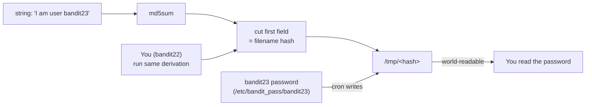

# OverTheWire Bandit Level 22 → Level 23

## Introduction

This level is the natural sequel to the last one. The same machinery is in play — a `cron` job running as a more privileged user, dumping a password into `/tmp` — but the designers have added a thin layer of "obfuscation": the temp file no longer has a fixed, obvious name. Instead the filename is **derived** by hashing a fixed string. The whole point of the level is to teach you that a secret you can *recompute* is not a secret at all. This is **security through obscurity**, and it is one of the most persistently misunderstood ideas in the field.

The skill being taught is reading a shell script carefully enough to *reproduce its logic by hand*. The lesson underneath it is that hiding something behind a derivation — an md5sum, a "random-looking" path, an encoded value — provides no real protection when an attacker can run the exact same derivation.

## Official Challenge Objective

> **A program is running automatically at regular intervals from `cron`, the time-based job scheduler. Look in `/etc/cron.d/` for the configuration and see what command is being executed.**
>
> *NOTE: Looking at shell scripts written by other people is a very useful skill. The script for this level is intentionally made easy to read. If you are having problems understanding what it does, try executing it to see the debug information it prints.*

**In plain English:** as before, a scheduled job runs a script. Read the cron config, then read the script. This time the script computes the temp-file name by hashing the string `"I am user <name>"`. To find `bandit23`'s password, you simply run that same hash computation yourself for the name `bandit23`, then read the resulting file.

## Skills Covered

- Reading and reasoning about an unfamiliar shell script
- Understanding command substitution (`$(...)`) and pipelines
- Using `md5sum` and `cut` to derive a value
- Recognizing **security through obscurity** as a non-control
- Re-deriving a "hidden" filename to read another user's file

## My Approach

I started exactly as in the previous level: read the cron file in `/etc/cron.d/`, then read the script it points to. The script defines `myname=$(whoami)` and builds a target filename as the md5sum of the literal string `I am user $myname`, then copies that user's password into `/tmp/<that-hash>`. The trap for a beginner is to run the script as yourself — it would dump *your* password (`bandit22`'s), which you already have. The insight is that the filename is a pure function of the username, so I just computed the hash for `bandit23` myself, then read the file at that path. No privilege needed, no waiting on the job to run *for me* — I'm reading a file the job already created for `bandit23`.

## Step-by-Step Walkthrough

### Command

```bash
cat /etc/cron.d/cronjob_bandit23
```

### Explanation

Same as last level: this file in `/etc/cron.d/` defines the scheduled job. It runs as `bandit23` and executes `/usr/bin/cronjob_bandit23.sh` every minute:

```
* * * * * bandit23 /usr/bin/cronjob_bandit23.sh &> /dev/null
```

### Why It Matters

Confirming the **run-as user** (`bandit23`) is what tells you whose password the script will be able to read. The job runs with `bandit23`'s privileges, so it can read `/etc/bandit_pass/bandit23`.

---

### Command

```bash
cat /usr/bin/cronjob_bandit23.sh
```

### Explanation

The script reads, in essence:

```bash
#!/bin/bash
myname=$(whoami)
mytarget=$(echo I am user $myname | md5sum | cut -d ' ' -f 1)

echo "Copying passwordfile /etc/bandit_pass/$myname to /tmp/$mytarget"

cat /etc/bandit_pass/$myname > /tmp/$mytarget
```

Walking it line by line:

- `myname=$(whoami)` — when the cron job runs, `whoami` returns `bandit23` (the run-as user).
- `echo I am user $myname` — produces the string `I am user bandit23`.
- `... | md5sum | cut -d ' ' -f 1` — hashes that string and keeps only the hash (`cut -d ' ' -f 1` strips off the `  -` that `md5sum` appends after the hash).
- `cat /etc/bandit_pass/$myname > /tmp/$mytarget` — copies `bandit23`'s password into a `/tmp` file whose name is that hash.

### Why It Matters

The "secret" filename is **entirely determined by the username**. There is no randomness, no per-run salt, nothing you can't reproduce. Reading other people's shell scripts and predicting their behaviour exactly is a core security skill — and here it directly hands you the path to the password.

> [!TIP]
> The official note suggests *executing* the script if you can't follow it. That's a great debugging habit: a script you don't understand by reading, you can often understand by running and watching what it prints (note the `echo "Copying ..."` line — that's the "debug output" the hint mentions).

---

### Command

```bash
mytarget=$(echo I am user bandit23 | md5sum | cut -d ' ' -f 1)
echo "$mytarget"
```

### Explanation

This reproduces the script's derivation, but for `bandit23` explicitly rather than `whoami`. We compute the md5sum of the exact string `I am user bandit23` and store the resulting hash in `mytarget`. The `echo` just lets you see the path you're about to read.

### Why It Matters

You are *replaying the privileged process's logic as an unprivileged user* to predict where it put its output. This is the heart of the level: the obscurity (a hashed filename) collapses the instant you run the same algorithm.

---

### Command

```bash
cat /tmp/$mytarget
```

### Explanation

Read the file at the derived path. It contains the password for `bandit23`:

```
[REDACTED]
```

### Why It Matters

The hashed filename bought the system *nothing*. You recomputed it in one line and read the secret. That is the definition of security through obscurity failing.

---

### Command

```bash
ssh bandit23@bandit.labs.overthewire.org -p 2220
```

### Explanation

Log out and reconnect as `bandit23` with the recovered password. You're now in Level 23.

### Why It Matters

Another credential obtained purely by reading and reasoning about code.

## Deep Dive: Cyber Security Concept

**Security through obscurity.**

"Security through obscurity" is the practice of relying on *secrecy of design or implementation* — rather than on a genuine access control — to protect something. A hidden URL, an encoded parameter, a "random-looking" filename, a custom binary protocol "nobody will reverse-engineer": all are obscurity. Obscurity is not worthless as a *layer* (it can slow an attacker down, and defence-in-depth welcomes friction), but it is catastrophic as your *only* control.

This level is a crisp demonstration. The protection on `bandit23`'s leaked password is: "the temp file has a non-obvious name." But the name is `md5sum("I am user bandit23")` — a deterministic function of public information. Anyone who reads the script (and the script is, by design, readable) can compute it. The "secret" is not secret; it's just *encoded*.



Contrast obscurity with real controls: a **secret key** is high-entropy and *not derivable* from public data; a **permission** is enforced by the kernel regardless of whether you know the path. Kerckhoffs's principle — a system should be secure even if everything about it except the key is public — is the formal statement of why obscurity-as-sole-defence fails. Here there is no key at all, only a public derivation.

> [!IMPORTANT]
> If an attacker can recompute, guess, or enumerate the thing you're relying on, it is not protecting you. Hashing a *known input* yields a *known output* — a hash is not a secret unless its input is.

## Offensive Security Perspective

Re-deriving "hidden" values is everyday offensive work:

- **Predictable resource names:** backup files at `site.com/backup_$(date).zip`, S3 keys built from a known scheme, JWT `kid` values, "unguessable" reset tokens that are actually `md5(email)` or a timestamp.
- **Reading scripts to find the secret:** during post-exploitation, attackers read every script a privileged cron/systemd unit invokes, because those scripts routinely *reveal* exactly where credentials and outputs live.
- **Recomputing tokens:** if a token is derived from user-controllable or knowable inputs (username, sequential ID, weak timestamp), you generate valid ones at will — a frequent bug-bounty finding (IDOR / predictable-token vulnerabilities).

The mental move is identical every time: *find the derivation, then run it yourself.*

## Common Beginner Mistakes

- **Running the script as yourself.** That computes the hash for `bandit22` and dumps *your* password — useless. The username must be `bandit23`.
- **Including a trailing newline / extra spaces** in the hashed string. The input must be exactly `I am user bandit23` (note: `echo` adds the newline the script's `echo` also adds, so reproducing it with `echo` is correct — using `echo -n` would produce a *different* hash and a wrong filename).
- **Forgetting `cut -d ' ' -f 1`** and trying to use the whole `md5sum` output (`hash  -`) as the filename.
- **Quoting the variable wrong** so the shell mangles it. `cat /tmp/$mytarget` works because the hash has no spaces.
- **Assuming you must escalate to `bandit23`.** You only read a file the cron job already wrote.

## Key Takeaways

- A filename, token, or path *derived from known inputs* is not a secret — recompute it.
- Read other people's scripts closely enough to reproduce their behaviour by hand.
- Command substitution `$(...)`, `md5sum`, and `cut` let you replay a derivation in one line.
- Security through obscurity is a speed bump, never a wall.
- The previous level's flaws (cron leaking to `/tmp`) persist — obscuring the name fixed nothing real.

## How This Helps Build Cyber Security Expertise

- **Web/app security:** predictable-token and IDOR bugs are exactly "the secret is derivable from known data."
- **Cryptography literacy:** understanding *why* a hash of a known input isn't secret is foundational; it leads to nonces, salts, and CSPRNGs.
- **Code review & reversing:** the muscle of reading code to predict runtime behaviour underpins source-code review, malware analysis, and exploit development.
- **Privilege escalation:** privileged scripts that reveal where they write outputs are a recurring privesc lead on real hosts.

## Additional Reading

- [`man md5sum`](https://man7.org/linux/man-pages/man1/md5sum.1.html), [`man cut`](https://man7.org/linux/man-pages/man1/cut.1.html)
- [Kerckhoffs's principle (Wikipedia)](https://en.wikipedia.org/wiki/Kerckhoffs%27s_principle)
- [OWASP — Security by Obscurity is not Security](https://owasp.org/www-community/controls/Security_by_Design_Principles)
- [CWE-656: Reliance on Security Through Obscurity](https://cwe.mitre.org/data/definitions/656.html)
- [CWE-330: Use of Insufficiently Random Values](https://cwe.mitre.org/data/definitions/330.html)

---

*Next up: [Level 23 → 24](./24-bandit-level-23-24.md) — you'll write your first shell script and drop it into a cron-watched directory to execute code as another user. A real privilege-escalation primitive.*


---

## Connect with the Author

Written by **Himangshu Pan** — offensive security researcher.

- **GitHub:** [@0xSh3ru](https://github.com/0xSh3ru)
- **LinkedIn:** [in/0xsh3ru](https://www.linkedin.com/in/0xsh3ru/)

*If this walkthrough helped, follow along on GitHub and connect on LinkedIn — questions and corrections are always welcome.*
