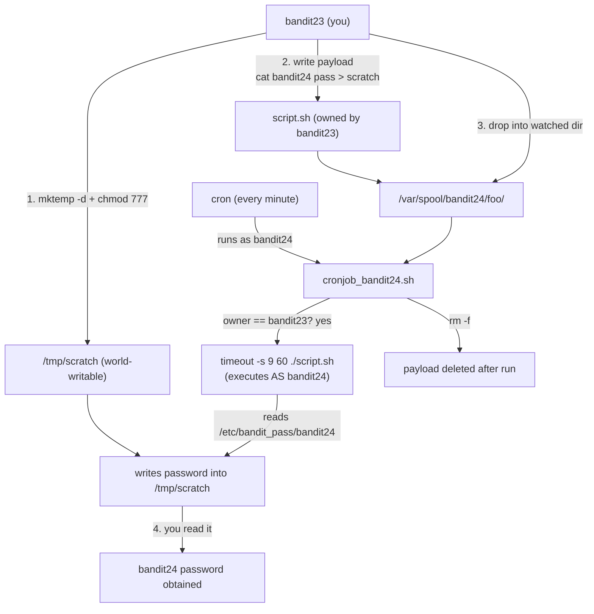

# OverTheWire Bandit Level 23 → Level 24

## Introduction

This is the level where the cron trilogy graduates from *reading* to *writing* — from passively harvesting what a scheduled job leaks, to actively making a scheduled job run **your** code as someone else. It's the first level that asks you to author your own shell script, and it's a genuine privilege-escalation exercise: a cron job running as `bandit24` will execute any script you place in a directory it watches, so you drop a script there that reads `bandit24`'s password for you. This is not a toy. "Writable directory invoked by a privileged scheduled task" is a real, recurring privesc primitive on production Linux systems.

The skill being taught is exploiting a **writable, cron-invoked path** to achieve code execution as another user. The lesson underneath it is about the security boundary between *who can write to a location* and *who runs what's written there* — and what happens when those two principals differ.

## Official Challenge Objective

> **A program is running automatically at regular intervals from `cron`. Look in `/etc/cron.d/` for the configuration and see what command is being executed.**
>
> *NOTE: This level requires you to create your own first shell script. This is a very big step and you should be proud of yourself when you beat this level!*
>
> *NOTE 2: Keep in mind that your shell script is removed once executed, so you may want to keep a copy around.*

**In plain English:** a cron job running as `bandit24` looks in a particular directory every minute, runs every script it finds there that is owned by `bandit23` (you), and then deletes it. So: write a script that copies `bandit24`'s password somewhere you can read it, drop that script into the watched directory, and wait for the job to run it *as `bandit24`*.

## Skills Covered

- Reading cron configuration and the script it invokes
- Writing your first executable shell script
- Understanding ownership, the execute bit, and `chmod`
- Using `mktemp -d` for a scratch workspace and reasoning about permissions across users
- Exploiting a writable, scheduled-task-invoked directory for privilege escalation
- Timing an attack against a per-minute scheduler

## My Approach (and why each piece is necessary)

I read the cron config and then the script it runs — and this script is more involved than the previous two. Instead of dumping a password, it `cd`s into `/var/spool/$(whoami)/foo` (i.e. `/var/spool/bandit24/foo`), loops over every entry in that directory, and for each one checks two conditions: that it is **owned by `bandit23`** and that it is a **regular file**. If both hold, it executes the file with `timeout -s 9 60 ./$i` and then `rm -rf`s it.

That tells me the exploit precisely: I need to put a file *owned by me* (`bandit23`) into `/var/spool/bandit24/foo`, and that file will be run **as `bandit24`**. Since it runs as `bandit24`, it can read `/etc/bandit_pass/bandit24`. The one subtlety — and the part beginners get wrong — is *where* the script writes its output. The script runs as `bandit24`, not as me, so if I tell it to write the password into a directory only `bandit23` can write to, `bandit24` won't have permission and the copy fails. So I create a scratch directory with `mktemp -d` and `chmod -R 777` it, guaranteeing `bandit24` can write the password there. Then I keep a copy of my script (Note 2: it gets deleted after it runs), drop it into the watched directory, wait out the next minute, and read the result.

## Step-by-Step Walkthrough

### Command

```bash
cat /etc/cron.d/cronjob_bandit24
```

### Explanation

As in the prior levels, this defines the scheduled job. It runs as `bandit24` and invokes `/usr/bin/cronjob_bandit24.sh` every minute:

```
* * * * * bandit24 /usr/bin/cronjob_bandit24.sh &> /dev/null
```

### Why It Matters

Confirms the job runs **as `bandit24`** — the user whose privileges your dropped script will inherit. The entire escalation hinges on that.

---

### Command

```bash
cat /usr/bin/cronjob_bandit24.sh
```

### Explanation

The script reads, in essence:

```bash
#!/bin/bash
myname=$(whoami)

cd /var/spool/$myname/foo
echo "Executing and deleting all scripts in /var/spool/$myname/foo:"
for i in * .*;
do
    if [ "$i" != "." -a "$i" != ".." ];
    then
        echo "Handling $i"
        owner="$(stat --format "%U" ./$i)"
        if [ "${owner}" = "bandit23" ];
        then
            timeout -s 9 60 ./$i
        fi
        rm -f ./$i
    fi
done
```

Key behaviours:

- It works inside `/var/spool/bandit24/foo` (because `whoami` is `bandit24` when cron runs it).
- For every entry, it reads the **owner** with `stat --format "%U"` and only executes it if the owner is `bandit23`.
- It runs the file with `timeout -s 9 60 ./$i` — kill it after 60 seconds, sending SIGKILL.
- It deletes the file afterward (`rm -f`) — which is why Note 2 warns you to keep a copy.

### Why It Matters

This is the vulnerable design laid bare: a directory that **you can write to** (`/var/spool/bandit24/foo` is writable by others) is **executed by a more privileged user** (`bandit24`), with the only gate being "is it owned by `bandit23`?" — a condition *you trivially satisfy* by virtue of being `bandit23`. That ownership check is meant to be a control; in practice it's an invitation.

> [!NOTE]
> The `timeout 60` and per-minute schedule mean your script must do its work quickly and you only wait about a minute for results.

---

### Command

```bash
TMPD=$(mktemp -d)
chmod -R 777 "$TMPD"
echo "$TMPD"
```

### Explanation

`mktemp -d` creates a fresh, uniquely-named directory under `/tmp` (e.g. `/tmp/tmp.<random>`) that you own. By default it's `700` — readable/writable only by you, `bandit23`. We then `chmod -R 777` it so that **any** user, including `bandit24`, can write into it.

### Why It Matters

This is the crux that trips people up. **The script will run as `bandit24`, not as you.** When it executes your payload, `bandit24` must be able to create/write the output file. A directory only `bandit23` can write to would cause the password copy to fail silently. Making the scratch dir world-writable guarantees `bandit24` can drop the password there for you to read.

> [!IMPORTANT]
> Always reason about *which identity performs each action*. The script you write is authored by `bandit23` but **executed by `bandit24`**. Every file it touches is touched with `bandit24`'s permissions, not yours.

---

### Command

```bash
cat > "$TMPD/script.sh" <<EOF
#!/bin/bash
cat /etc/bandit_pass/bandit24 > $TMPD/bandit24.pass
EOF
chmod +x "$TMPD/script.sh"
```

### Explanation

We write the payload. It does one thing: when run **as `bandit24`**, it reads `/etc/bandit_pass/bandit24` (which only `bandit24` and root can read) and writes the contents into `bandit24.pass` inside our world-writable scratch dir. `chmod +x` makes it executable so the cron loop's `./$i` invocation works.

Note the heredoc uses `$TMPD` *unquoted* (`<<EOF`, not `<<'EOF'`) so the path is expanded **now**, baking the absolute path into the script — important, because when the cron job runs it, the working directory is `/var/spool/bandit24/foo`, not our scratch dir.

### Why It Matters

This is your first weaponized shell script: small, single-purpose, and written with a clear understanding of *whose* privileges will execute it and *where* its output can land. That mindset — minimal payload, correct identity, reachable output — is exactly how real privesc payloads are constructed.

---

### Command

```bash
cp "$TMPD/script.sh" /var/spool/bandit24/foo/
```

### Explanation

Drop the script into the directory the cron job watches. It's owned by `bandit23` (you copied it), so the script's `owner == bandit23` check passes, and it's a regular executable file, so it qualifies to be run.

### Why It Matters

This is the actual exploitation step: planting code in a privileged, scheduled execution path. Keep the original in `$TMPD` — the cron job `rm -f`s the copy after running it (Note 2).

---

### Command

```bash
sleep $((65 - $(date +%S))); cat "$TMPD/bandit24.pass"
```

### Explanation

`date +%S` is the current seconds-past-the-minute; `65 - that` sleeps until just past the top of the next minute, ensuring the per-minute cron job has fired and finished. Then we read `bandit24.pass`, which now contains:

```
[REDACTED]
```

### Why It Matters

You've achieved **code execution as another user** and exfiltrated their secret to a place you control. The timing trick is a small but real operational detail — scheduled-task exploits are inherently "plant and wait."

---

### Command

```bash
ssh bandit24@bandit.labs.overthewire.org -p 2220
```

### Explanation

Log out and reconnect as `bandit24` with the recovered password. You're in Level 24.

### Why It Matters

You escalated not by reading a leak, but by *making a privileged process do your bidding* — a qualitatively bigger step.

## Deep Dive: Cyber Security Concept

**Privilege escalation via a writable, scheduled-task-invoked path.**

The vulnerability class here is one of the most common roads to root on real Linux systems: a process running as a privileged identity executes content from a location that a *less* privileged identity can modify. The privileged context can be a cron job, a systemd timer/service, a setuid wrapper, or a sudo-allowed script. The "writable thing" can be the script file itself, a directory it scans, a `PATH` entry it relies on, a config it sources, or — as here — a drop folder it executes.

The security failure is a mismatch between **two distinct principals**:

1. **The writer** — who can place or modify the executed content (here, `bandit23`).
2. **The executor** — whose privileges actually run it (here, `bandit24`).

When the writer is less trusted than the executor, the writer effectively gains the executor's privileges. The ownership check (`owner == bandit23`) was intended to restrict *which* files run, but because the attacker *is* `bandit23`, it restricts nothing.



Notice the flow crosses the privilege boundary exactly once — at step where cron executes your file as `bandit24` — and you've engineered everything around that single crossing: a payload that needs only `bandit24`'s read privilege, and an output location `bandit24` can write to.

> [!IMPORTANT]
> The kernel boundary here is sound (you genuinely cannot read `/etc/bandit_pass/bandit24` yourself). The *misconfiguration* is letting a less-trusted user supply code to a more-trusted execution context. That is the whole game in writable-path privesc.

## Offensive Security Perspective

This is a textbook real-world privesc, and it generalizes far beyond Bandit:

- **Writable cron scripts:** if a `root` cron job runs `/opt/app/backup.sh` and that file (or its directory) is writable by your user, you append a reverse shell or a `cp /bin/bash /tmp/rootbash; chmod +s` and wait — instant root. `linpeas` flags world-writable files referenced by cron in red.
- **Writable `PATH` / relative-command tricks:** if a privileged script calls `tar` (no absolute path) and you control an early `PATH` entry, you plant a malicious `tar`.
- **Writable drop directories:** exactly this level — a privileged consumer that executes whatever lands in a folder you can write to.
- **`pspy` for discovery:** since these jobs are short-lived, `pspy` reveals the exact commands a privileged scheduler runs, which is how you find the script and the directory it watches without read access to the cron config on a real box.

The methodology is constant: enumerate scheduled/privileged execution, find a writable input to it, supply a minimal payload, ensure the output is reachable, wait.

## Defensive Perspective

- **Never execute content from attacker-writable locations as a privileged user.** A privileged scheduled task should run scripts that are owned by and writable *only* by that privileged user (or root), from directories with the same restriction.
- **Lock down drop directories.** If a workflow genuinely needs a drop folder, it should not be world-writable, and the consumer should validate far more than ownership before executing (ideally, don't execute submitted content at all — process it as data).
- **Pin absolute paths and a sane `PATH`** in privileged scripts to avoid `PATH`-hijack variants.
- **Least privilege + separation:** run scheduled jobs as the least-privileged identity that suffices.
- **Monitoring opportunity:** alert on a privileged service account executing files from world-writable directories, on new executables appearing in spool/drop paths, and on reads of credential stores:
  ```bash
  auditctl -w /var/spool/ -p wa -k spool_write
  auditctl -w /etc/bandit_pass/ -p r -k secret_read
  ```
  `pspy`-style telemetry (or auditd `execve` logging) catches the cron-spawned execution of an unexpected script.
- **Detection idea:** a service account process whose parent is `cron` executing a binary under `/tmp`, `/var/spool`, or another world-writable path is high-signal for this exact technique.

## Common Beginner Mistakes

- **Forgetting the output dir must be writable by `bandit24`.** Writing the password into a `bandit23`-only directory makes the copy silently fail. `chmod 777` (or `+t`-aware equivalents) on the scratch dir fixes it. *This is the #1 mistake on this level.*
- **Not making the script executable** (`chmod +x`) — the cron loop runs `./$i`, which needs the execute bit.
- **Not keeping a copy** of the script — it's `rm -f`'d after execution (Note 2). Author it in `$TMPD`, then `cp` into the watched dir.
- **Using a relative output path.** When cron runs your script the CWD is `/var/spool/bandit24/foo`, so a relative `> bandit24.pass` lands somewhere you can't predict (and probably can't read). Use the absolute `$TMPD` path.
- **Reading the result too early.** Wait until the next minute boundary has passed.
- **Wrong shebang / CRLF line endings** if you author the script elsewhere and paste it — keep it Unix-clean.

## Key Takeaways

- A privileged scheduled task that executes content from a writable location is a privilege-escalation hole.
- The decisive question is always *who writes* vs *who executes* — when the executor is more privileged than the writer, the writer wins.
- Your payload runs **as the executor**, so engineer its output to land where the executor can write and you can read (hence world-writable `mktemp -d`).
- Scheduled-task exploits are "plant and wait"; mind the timing and the auto-deletion.
- This is your first authored payload — minimal, single-purpose, identity-aware.

## How This Helps Build Cyber Security Expertise

- **Linux privilege escalation:** this is one of the canonical privesc patterns you'll meet in OSCP, HTB, and real engagements; recognizing "writable + scheduled/privileged execution" becomes instinct.
- **Secure systems design:** you internalize the writer-vs-executor boundary, which informs how you'd safely design any job runner, CI worker, or upload pipeline.
- **Detection engineering:** knowing the on-disk and process-tree signature of this attack tells you exactly what to log and alert on.
- **Red-team craft:** authoring tight, purpose-built payloads with correct identity/output reasoning is a foundational operator skill.

## Additional Reading

- [`man mktemp`](https://man7.org/linux/man-pages/man1/mktemp.1.html), [`man stat`](https://man7.org/linux/man-pages/man1/stat.1.html), [`man timeout`](https://man7.org/linux/man-pages/man1/timeout.1.html)
- [GTFOBins](https://gtfobins.github.io/) — abusing legitimate binaries during privesc
- [CWE-732: Incorrect Permission Assignment for Critical Resource](https://cwe.mitre.org/data/definitions/732.html)
- [MITRE ATT&CK — T1053.003: Scheduled Task/Job: Cron](https://attack.mitre.org/techniques/T1053/003/)
- [HackTricks — Linux Privilege Escalation (cron jobs)](https://book.hacktricks.xyz/linux-hardening/privilege-escalation)
- [pspy — unprivileged process snooping](https://github.com/DominicBreuker/pspy)

## Personal Reflection

This one is, hands down, my favourite of the cron trilogy — I genuinely enjoyed it. The previous two levels were satisfying in a "spot the leak" way, but they were ultimately about *reading* something someone else left behind. This level flipped that: for the first time I wasn't harvesting a mistake, I was *causing* a privileged process to run my own code. Writing that first little script, dropping it into the watched directory, and then sitting through that nervous ~60-second wait before `cat`-ing the output — and seeing the password actually appear — was a real "oh, this is what privilege escalation *feels* like" moment.

The detail that made it click for me was the world-writable output directory. My first instinct was to have the script write into a normal folder of mine, and reasoning through *why* that fails — because `bandit24`, not me, is the one doing the writing — is what finally made the writer-vs-executor distinction concrete instead of abstract. That single insight has paid off in every privesc box I've touched since. If you're working through Bandit and you hit this level, slow down and savour it; it's the one where you stop being a reader of other people's bugs and start being an operator.

---

*Next up: [Level 24 → 25](./25-bandit-level-24-25.md) — a network daemon wants a 4-digit PIN and the only way through is brute force. You'll script all 10,000 attempts down a single connection.*


---

## Connect with the Author

Written by **Himangshu Pan** — offensive security researcher.

- **GitHub:** [@0xSh3ru](https://github.com/0xSh3ru)
- **LinkedIn:** [in/0xsh3ru](https://www.linkedin.com/in/0xsh3ru/)

*If this walkthrough helped, follow along on GitHub and connect on LinkedIn — questions and corrections are always welcome.*
