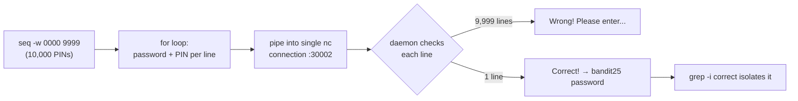

# OverTheWire Bandit Level 24 → Level 25

## Introduction

After three levels of cron, this one swings back to the network — and to a technique everyone has heard of but few have actually *implemented* by hand: **brute forcing**. A daemon on port 30002 will trade you the `bandit25` password, but only if you send it the `bandit24` password *plus* a secret 4-digit PIN. There's no clever shortcut, no leak, no derivation — the challenge tells you outright that the only way through is to try all 10,000 possible PINs. The art of the level is doing that *efficiently*: generating every candidate and feeding them all down a **single** connection rather than reconnecting ten thousand times.

The skill being taught is constructing and delivering a brute-force attack against a network service. The lesson underneath it is about **keyspace and the absence of throttling** — why a small keyspace with no rate limiting is trivially defeated, and how to exploit that gap.

## Official Challenge Objective

> **A daemon is listening on port 30002 and will give you the password for `bandit25` if given the password for `bandit24` and a secret numeric 4-digit pincode. There is no way to retrieve the pincode except by going through all 10000 combinations, called brute-forcing. You do not need to create new connections each time.**

**In plain English:** connect to the local service on port 30002. Each line you send should be your `bandit24` password followed by a 4-digit PIN. The PIN is unknown and unguessable by reasoning, so you must try every value from `0000` to `9999`. Critically, the service accepts many guesses over one connection — so build all 10,000 lines and pipe them in at once.

## Skills Covered

- Connecting to a TCP service with `netcat` (`nc`)
- Generating a numeric sequence with `seq` (and zero-padding with `-w`)
- Building input with a shell `for` loop / pipeline
- Brute-forcing a small keyspace efficiently over a single connection
- Filtering output with `grep` to find the success line
- Understanding keyspace size and how the absence of rate limiting opens the door to brute force

## My Approach

The objective removes all ambiguity: brute force is the intended path, and the daemon helpfully doesn't require a fresh connection per attempt. So the efficient solution is to generate all 10,000 lines — each being `<bandit24-password> <pin>` — and stream them into a single `nc` session. The key correctness detail is **zero-padding**: the PIN is four digits, so I must send `0000`, `0001`, …, not `0`, `1`, …; `seq -w` handles that automatically by padding to equal width. I pipe the whole batch in, let the daemon answer each line, and then sift the output for the one line that isn't a "Wrong!" message — the line containing the `bandit25` password.

## Step-by-Step Walkthrough

### Command

```bash
cat /etc/bandit_pass/bandit24
```

### Explanation

You need your *own* current password (`bandit24`'s) to authenticate to the daemon, since each guess is `<password> <pin>`. As `bandit24`, you can read it directly from `/etc/bandit_pass/bandit24`. (It will be redacted here as `[REDACTED]`.)

### Why It Matters

The daemon authenticates the *known* half (your password) and brute-forces only the *unknown* half (the PIN). Recognizing which part you already hold and which part you must search is the first step of any credential attack.

---

### Command

```bash
cd /tmp
mkdir -p mywork && cd mywork
```

### Explanation

Work in a scratch directory under `/tmp` (you have write access there). This keeps any files you generate tidy and avoids cluttering your home directory.

### Why It Matters

Brute-force workflows often produce a wordlist/attempt file; having a clean workspace is good operational hygiene, especially on shared boxes.

---

### Command

```bash
for i in $(seq -w 0000 9999); do echo "[REDACTED] $i"; done | nc 127.0.0.1 30002
```

### Explanation

This is the whole attack in one line:

- `seq -w 0000 9999` produces every integer from 0 to 9999, **width-padded** so they all have four digits (`0000`, `0001`, …, `9999`). The `-w` ("equal width") flag pads with leading zeros to the width of the largest value — essential, because the PIN is specifically *four* digits.
- The `for` loop wraps each PIN with your `bandit24` password and a space (`echo "[REDACTED] $i"`), producing 10,000 lines of `<password> <pin>`.
- The pipe `|` feeds all of those lines into `nc 127.0.0.1 30002` — **one** TCP connection to the local daemon. The daemon reads each line and replies (mostly "Wrong! Please enter the correct pincode."), and for the correct PIN replies with the success line and the password.

### Why It Matters

This demonstrates the practical mechanics of brute forcing: enumerate the full keyspace, format each candidate exactly as the service expects, and deliver them as fast as the protocol allows. Doing it over a single connection (as the level permits) is dramatically faster than a TCP handshake per attempt — the difference between seconds and a long, painful wait, and a real consideration when you tune attacks against rate limits.

> [!TIP]
> If the daemon's banner or per-guess replies clutter your screen, pipe the result into `grep -v Wrong` to keep only the interesting line, or save it: `... | nc 127.0.0.1 30002 > out.txt` then `grep -iv wrong out.txt`.

---

### Command

```bash
for i in $(seq -w 0000 9999); do echo "[REDACTED] $i"; done | nc 127.0.0.1 30002 | grep -i correct
```

### Explanation

Same attack, but we filter the daemon's replies with `grep -i correct` so only the success line survives. The daemon answers a correct guess with a line like `Correct!` followed by the password for `bandit25`:

```
Correct!
The password of user bandit25 is [REDACTED]
```

### Why It Matters

When an attack produces thousands of lines of output, knowing how to isolate the signal (`grep`) is as important as launching the attack itself. The success-vs-failure response difference is exactly what you key on in any brute-force or fuzzing campaign.

---

### Command

```bash
ssh bandit25@bandit.labs.overthewire.org -p 2220
```

### Explanation

Log out and reconnect as `bandit25` with the recovered password. You're in Level 25.

### Why It Matters

You obtained a credential by exhaustively searching a small keyspace — the most brute-force technique there is, applied where it's actually the optimal choice.

## Deep Dive: Cyber Security Concept

**Brute forcing, keyspace, and the absence of rate limiting.**

Brute forcing means trying every possible value until one works. Whether it's feasible depends almost entirely on the **keyspace** — the number of possibilities. Here the secret is a 4-digit decimal PIN, so the keyspace is:

```
10 × 10 × 10 × 10 = 10^4 = 10,000 possibilities
```

Ten thousand is *tiny*. A computer can send and check that many guesses in seconds. Contrast that with even a modest password: an 8-character password drawn from 95 printable ASCII characters has a keyspace of 95^8 ≈ 6.6 × 10^15 — fifteen orders of magnitude larger, and infeasible to exhaust naïvely. **Keyspace size is the single biggest factor in whether brute force is viable.** Short, low-entropy secrets (PINs, 4-digit OTPs, default passwords) live in the "trivially brute-forceable" zone.

The second factor is whether the target *lets* you try fast — and this one does. The daemon has **no rate limiting, no lockout, and even invites you to reuse one connection**, so every obstacle to brute force is absent by design. That is the attacker's opening: when a service caps neither attempts per second nor guesses per connection, a 10,000-value keyspace collapses in seconds. The presence of any of those barriers — throttling, lockout, per-attempt cost, or one-guess-per-connection — is exactly what would have forced you to slow down or rethink the approach. Here, none of them stand in the way.



> [!IMPORTANT]
> A secret's resistance to brute force is a product of *keyspace* and *the rate the target allows*. A 4-digit PIN is weak on the first count; a service with no throttling is weak on the second. This level deliberately fails both — which is exactly why it's solvable in seconds.

## Offensive Security Perspective

Brute forcing (and its smarter cousins) is a staple of offensive work, and the mechanics here scale up to real tooling:

- **Credential attacks:** `hydra`, `medusa`, and `ncrack` brute-force SSH, FTP, RDP, HTTP forms, etc. — the same "enumerate candidates, format per protocol, fire" loop you just hand-rolled.
- **PINs and OTPs:** 4–6 digit PINs and one-time codes are prime targets; many real breaches came from brute-forcing 2FA codes on endpoints that lacked rate limiting.
- **Wordlists vs pure brute force:** against human-chosen passwords, a dictionary attack (`rockyou.txt`) plus rules is far more efficient than exhaustive search — you spend guesses where humans actually cluster.
- **Web fuzzing:** `ffuf`/`gobuster` brute-force directories, parameters, and values; `Burp Intruder` does the same against forms — identical concept, HTTP transport.
- **Efficiency matters:** reusing connections, parallelizing, and tuning to just under the rate limit are real operator skills; this level's "one connection, all guesses" is the simplest version.

## Common Beginner Mistakes

- **Forgetting `-w` zero-padding.** `seq 0 9999` emits `0`, `1`, `2`, … (no leading zeros), so guesses like `7` instead of `0007` won't match a 4-digit PIN. `seq -w 0000 9999` fixes it.
- **Opening a new connection per guess** (e.g. a loop that runs `nc` inside the body) — 10,000 TCP handshakes is needlessly slow; the level explicitly says you don't need to.
- **Wrong line format.** The daemon expects `<password><space><pin>`; a missing space, extra characters, or wrong password makes *every* guess fail.
- **Drowning in output** and missing the win — pipe through `grep` (or save to a file) to surface the `Correct!` line.
- **Using `localhost` resolution issues** — `127.0.0.1` is reliable; if `nc` variants differ, `nc localhost 30002` usually works too.

## Key Takeaways

- Brute force is viable when the keyspace is small and the target doesn't throttle — a 4-digit PIN is the textbook small keyspace (10,000).
- Generate the full candidate set, format each exactly as the service expects, and deliver efficiently — one connection here.
- `seq -w` zero-pads to equal width, which is essential for fixed-length numeric secrets.
- `grep` turns a flood of failures into the one success line.
- The barriers that would stop brute force (rate limiting, lockout, cost-per-attempt, a large keyspace) are exactly what this target lacks — which is the whole opening.

## How This Helps Build Cyber Security Expertise

- **Password attacks:** you now understand from the ground up what `hydra`/`medusa`/Burp Intruder automate, which makes you far more effective with them.
- **Target assessment:** "what's the keyspace and is there throttling?" becomes a reflex when you size up any authentication mechanism for a brute-force attack.
- **Web/API pentesting:** the same enumerate-format-fire loop drives credential stuffing, OTP/2FA brute forcing, and parameter fuzzing against endpoints that forgot to rate-limit.
- **Tooling fluency:** hand-rolling the attack first makes you sharper at tuning `hydra`/`ffuf` threads, connection reuse, and request rates on real engagements.

## Additional Reading

- [`man seq`](https://man7.org/linux/man-pages/man1/seq.1.html), [`man nc`](https://man.openbsd.org/nc.1), [`man grep`](https://man7.org/linux/man-pages/man1/grep.1.html)
- [MITRE ATT&CK — T1110: Brute Force](https://attack.mitre.org/techniques/T1110/)
- [Hydra — network logon cracker](https://github.com/vanhauser-thc/thc-hydra)
- [ffuf — fast web fuzzer](https://github.com/ffuf/ffuf)
- [SecLists — wordlists for brute forcing](https://github.com/danielmiessler/SecLists)

---

*Next up: [Level 25 → 26](./26-bandit-level-25-26.md) — a login shell that isn't `bash`, and a pager you can break out of. Time to escape a restricted shell.*


---

## Connect with the Author

Written by **Himangshu Pan** — offensive security researcher.

- **GitHub:** [@0xSh3ru](https://github.com/0xSh3ru)
- **LinkedIn:** [in/0xsh3ru](https://www.linkedin.com/in/0xsh3ru/)

*If this walkthrough helped, follow along on GitHub and connect on LinkedIn — questions and corrections are always welcome.*
