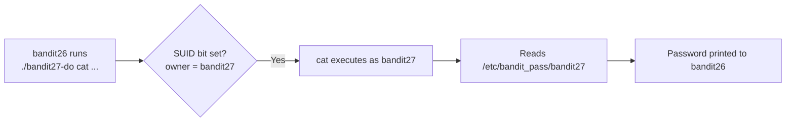

# OverTheWire Bandit Level 26 → Level 27

## Introduction

After the hard-won shell escape of Level 25 → 26, this level is a breather — and a deliberate callback. Sitting in `bandit26`'s home directory is a familiar friend: a `bandit27-do` binary. If that name rings a bell, it should: it is the same **SUID-helper** pattern you met back in Level 19 → 20 with `bandit20-do`. The lesson is reinforcement, not novelty — a setuid program lets you run a single command *as another user*, and that is exactly enough to read the next password.

The concept under the hood — **SUID (Set User ID) binaries** — is one of the most important privilege primitives in Linux security, so it is worth seeing it twice and understanding precisely why it works.

## Official Challenge Objective

> **Good job getting a shell! Now grab the password for bandit27.**

**In plain English:** you fought your way out of the restricted shell in the previous level and now have a real bash prompt as `bandit26`. Your only task now is to find and read the password for `bandit27`. The tool to do it is sitting right in your home directory.

## Skills Covered

- Recognising a SUID helper binary (`*-do`)
- Running a command *as another user* via a setuid program
- Reading a permission-protected password file through that helper
- Connecting this level back to the SUID lesson from Level 19 → 20

## My Approach

The hard part of this challenge was the last level — getting a shell as `bandit26` at all. Once I had that bash prompt (via the `more → vi → :shell` escape), I listed the home directory and immediately spotted `bandit27-do`. I had seen this exact pattern before with `bandit20-do`: a setuid binary that runs whatever command you give it *as the next user*. So I didn't overthink it. I pointed it at the password file for `bandit27` and let the binary's elevated privileges do the reading for me.

> [!NOTE]
> If you logged out after escaping the restricted shell, you'll have to redo the Level 25 → 26 breakout to get back to a `bandit26` shell — the SSH login alone still drops you into `showtext`. Stay in the shell you escaped to.

## Step-by-Step Walkthrough

### Command

```bash
ls -la
file ./bandit27-do
```

### Explanation

From your `bandit26` shell, list the home directory. You'll see `bandit27-do`. The long listing shows an `s` in the owner's execute position — the **SUID bit**:

```
-rwsr-x--- 1 bandit27 bandit26 ... bandit27-do
```

`file ./bandit27-do` confirms it is a `setuid ELF executable`. The owner is `bandit27`, and the SUID bit means it runs *with bandit27's identity* even though *you* (bandit26) launch it.

### Why It Matters

That `s` in `-rwsr-x---` is the whole game. SUID is how an unprivileged user is allowed to perform a privileged action through a tightly-scoped program — and it is also one of the most common Linux privilege-escalation vectors when the program is too generous about what it will run.

---

### Command

```bash
./bandit27-do cat /etc/bandit_pass/bandit27
```

### Explanation

`bandit27-do` takes a command as its arguments and executes it as the user `bandit27`. Here we tell it to `cat` the password file for `bandit27` — a file that *you* (as `bandit26`) cannot read directly, but `bandit27` can. The binary runs the `cat` with `bandit27`'s effective UID and prints the result:

```
[REDACTED]
```

### Why It Matters

This is the textbook *intended* use of a SUID helper — and also exactly what makes overly-permissive ones dangerous. `bandit27-do` will run **any** command as `bandit27`, so it hands you that user's full read access. A real-world `*-do` that ran arbitrary commands as root would be a complete privilege-escalation hole.

## Deep Dive: Cyber Security Concept

**SUID (Set User ID) binaries — revisited.**

A normal program runs with the privileges of the user who launched it. A **SUID** program is special: when executed, its *effective* user ID becomes the file's **owner**, not the caller. That `s` bit (`chmod u+s`, octal `4000`) is what lets ordinary users run actions that require someone else's privileges — the classic example being `/usr/bin/passwd`, which is SUID-root so users can update the root-owned `/etc/shadow`.

Here, `bandit27-do` is SUID-`bandit27`. When `bandit26` runs it, the `cat` it spawns executes as `bandit27` and can read `bandit27`'s otherwise-protected password file.

The danger is generality. A SUID program *should* do exactly one tightly-scoped privileged thing. The instant it will run an *arbitrary* command (as `bandit27-do` does, for teaching purposes), it stops being a helper and becomes a privilege handoff: whoever can execute it inherits the owner's access.

> [!IMPORTANT]
> SUID elevates to the file's **owner**. A SUID-root binary that runs arbitrary commands is an instant root shell for anyone who can execute it. Enumerating SUID binaries (`find / -perm -4000`) is one of the very first privesc checks.



## Offensive Security Perspective

SUID enumeration is a reflex on every Linux engagement:

```bash
find / -perm -4000 -type f 2>/dev/null
```

Each result is a candidate. The attacker then asks: *is this binary on [GTFOBins](https://gtfobins.github.io/)?* and *can I make it run a command of my choosing?* A SUID-root `find`, `vim`, `bash`, `nmap` (old), `cp`, or any custom `*-do`-style wrapper is a fast path to root. Tools like `linpeas` and `linenum` automate exactly this hunt. The `bandit27-do` here is the friendly, scoped version of a vulnerability that, pointed at root, ends engagements early.

## Common Beginner Mistakes

- **Logging out after the Level 25 → 26 escape**, then logging back in and landing in `showtext` again — you lose your shell and must redo the breakout.
- **Trying to `cat` the password file directly** as `bandit26` (permission denied) instead of going through the helper.
- **Forgetting the `./`** when running a binary in the current directory.
- **Passing the command in quotes oddly** — `bandit27-do` takes the command and its args as normal arguments; `./bandit27-do cat /etc/bandit_pass/bandit27` is all you need.

## Key Takeaways

- A `*-do` binary is a SUID helper that runs commands as another user.
- The `s` in `-rwsr-x---` is the SUID bit; effective UID becomes the file owner.
- SUID is the same primitive from Level 19 → 20 — patterns recur, so learn them once.
- A SUID program that runs *arbitrary* commands is a privilege handoff.
- `find / -perm -4000` is a first-line privesc enumeration command.

## How This Helps Build Cyber Security Expertise

- **Privilege escalation:** SUID abuse is a core Linux privesc technique; recognising the bit and reasoning about its owner is foundational.
- **Red-team craft:** chaining a SUID GTFOBins binary into a shell as its owner (often root) is a fast, reliable escalation you'll reach for on real engagements.
- **Exploit development:** understanding how effective UID transitions on `execve` underpins crafting and abusing setuid-based privilege handoffs.

## Additional Reading

- [GTFOBins — SUID](https://gtfobins.github.io/#+suid)
- [`man chmod`](https://man7.org/linux/man-pages/man1/chmod.1.html), [Linux `setuid` semantics](https://man7.org/linux/man-pages/man2/setuid.2.html)
- [`man capabilities`](https://man7.org/linux/man-pages/man7/capabilities.7.html)
- [MITRE ATT&CK — T1548.001: Setuid and Setgid](https://attack.mitre.org/techniques/T1548/001/)

---

*Next up: [Level 27 → 28](./28-bandit-level-27-28.md) — you leave the game server behind to clone a Git repository over SSH and find a secret someone committed straight into the code.*


---

## Connect with the Author

Written by **Himangshu Pan** — offensive security researcher.

- **GitHub:** [@0xSh3ru](https://github.com/0xSh3ru)
- **LinkedIn:** [in/0xsh3ru](https://www.linkedin.com/in/0xsh3ru/)

*If this walkthrough helped, follow along on GitHub and connect on LinkedIn — questions and corrections are always welcome.*
