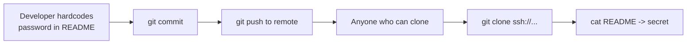

# OverTheWire Bandit Level 27 → Level 28

## Introduction

The Bandit series now pivots from filesystem and shell tricks to **version control** — specifically Git, the tool that holds the source code of nearly every modern project. The next four levels are a guided tour of how secrets leak through Git, and this one is the gentle on-ramp: clone a repository over SSH and read a password that someone committed straight into the repo's files.

It sounds almost too easy, and it is — by design. The point is to internalise a sobering real-world truth: **source-control repositories are full of secrets**, because developers commit credentials, API keys, and tokens into them all the time. Learning to clone and read a repo is the first move in a discipline that bug-bounty hunters and red teamers practise constantly.

## Official Challenge Objective

> **There is a git repository at `ssh://bandit27-git@bandit.labs.overthewire.org/home/bandit27-git/repo` via the port 2220. The password for the user `bandit27-git` is the same as for the user `bandit27`. Clone the repository and find the password for the next level.**

**In plain English:** there's a Git repo you can reach over SSH. Log in to it (using the `bandit27` password) by *cloning* it to your own machine. Somewhere in the cloned files is the `bandit28` password. Note the wording: clone it **from your local machine**, not from inside the Bandit game server.

## Skills Covered

- Cloning a Git repository over SSH (`git clone ssh://...`)
- Specifying a non-default SSH port for Git (`-p 2220` / `ssh://host:2220`)
- Working in a temporary directory
- Inspecting a repository's working tree (`ls`, `cat`)
- Recognising secrets committed into source control

## My Approach

The objective is explicit about cloning from my *local* machine, so I didn't even try to do this inside the Bandit SSH session — I opened a terminal on my own box, made a throwaway directory to keep things tidy, and ran a `git clone` against the SSH URL the level gave me. Git prompted for a password, which is just the `bandit27` password again (the `bandit27-git` account shares it). Once the repo landed, the working tree had a single `README` file, and the password was sitting right there in plaintext. No history spelunking needed yet — that's the *next* level's lesson.

> [!TIP]
> Make a scratch directory first (e.g. `mktemp -d` or `cd /tmp && mkdir myrepo`). Cloning into a clean folder keeps repos from colliding and makes cleanup trivial.

## Step-by-Step Walkthrough

### Command

```bash
mkdir -p /tmp/bandit27 && cd /tmp/bandit27
```

### Explanation

Create and enter a temporary working directory **on your local machine**. Git will drop the cloned repo here. Using `/tmp` (or any scratch path) keeps your home directory clean and makes it easy to delete everything afterward.

### Why It Matters

Cloning untrusted repositories into a disposable directory is good hygiene — it isolates the files and lets you wipe them in one `rm -rf` without worrying about what you pulled down. The same discipline matters when triaging suspicious code in DFIR work.

---

### Command

```bash
git clone ssh://bandit27-git@bandit.labs.overthewire.org:2220/home/bandit27-git/repo
```

### Explanation

`git clone` copies a remote repository — its files *and* its full history — to your machine. The `ssh://` URL tells Git to transport over SSH; `:2220` specifies Bandit's non-standard SSH port; `bandit27-git@...` is the user; and `/home/bandit27-git/repo` is the repo path on the server. Git will prompt for a password — enter the **`bandit27`** password (shared by `bandit27-git`).

```
Cloning into 'repo'...
The authenticity of host '[bandit...]:2220' can't be established...
bandit27-git@bandit.labs.overthewire.org's password:
remote: Enumerating objects...
Receiving objects: 100% ...
```

### Why It Matters

Knowing how to clone over SSH — and how to wedge a non-default port into the URL — is a practical skill. In real assessments you constantly clone internal repos (often over SSH) to read their contents and history. The port-in-URL syntax (`ssh://host:port/path`) trips people up, so it's worth memorising.

> [!NOTE]
> If you SSH into Bandit on port 2220 you must use `-p 2220`. For Git's `ssh://` URLs the port goes *inside* the URL as `:2220`. Both are saying the same thing in different syntaxes.

---

### Command

```bash
cd repo
ls -la
cat README
```

### Explanation

Enter the cloned repo, list its contents, and read the `README`. The working tree contains the secret in plaintext:

```
The password to the next level is: [REDACTED]
```

### Why It Matters

This is the entire payoff: a credential committed directly into a tracked file. There was no need to look at the commit history — the secret is live in the current working tree. In the real world this is an exposed `.env`, a `config.yml` with a database password, or an AWS key pasted into a script and pushed to a repo.

## Deep Dive: Cyber Security Concept

**Secrets in source control.**

Git repositories are one of the richest sources of leaked credentials on the planet. Every time a developer hardcodes a password, API key, private key, or token and commits it, that secret becomes part of the repo — readable by anyone who can clone it. And "anyone who can clone it" is often far more people than intended: teammates, CI systems, contractors, and — if the repo is public or the host is compromised — attackers.

There are two distinct flavours of this problem, and Bandit teaches them in sequence:

1. **Secret in the current working tree** (this level): the credential is in a tracked file *right now*. Clone, `ls`, `cat`, done.
2. **Secret in the history only** (the *next* level): the credential was committed, then "removed" in a later commit — but Git never forgets, so it survives in history.



> [!IMPORTANT]
> A secret in a repo is exposed to *everyone with clone access*, which is almost always a larger set than the author imagines. Treat any credential that has ever touched a repo as compromised.

## Offensive Security Perspective

Hunting for secrets in repositories is a high-yield activity:

- **Bug bounty & recon:** tools like `trufflehog`, `gitleaks`, and `git-secrets` scan repos (and their history) for high-entropy strings and known key formats. A single leaked AWS key can be a critical finding.
- **Public exposure:** GitHub, GitLab, and Bitbucket are constantly scraped by attackers (and by the platforms themselves) for accidentally-public secrets. Leaked keys are often abused within *minutes* of being pushed.
- **Internal pivoting:** once on an internal network, cloning internal Git servers and CI configs frequently yields database passwords, service tokens, and deploy keys that unlock further systems.

The instinct this level builds — *if there's a repo, clone it and read it* — is exactly what an operator does after finding any Git access.

## Defensive Perspective

- **Never commit secrets.** Use environment variables, a secrets manager (Vault, AWS Secrets Manager), or encrypted secret files that are git-ignored.
- **Add a `.gitignore`** for `.env`, key files, and credential paths *before* the first commit, so they never enter the repo.
- **Scan in CI and pre-commit.** Run `gitleaks`/`trufflehog`/`git-secrets` as a pre-commit hook and a CI gate to block secrets from ever being pushed.
- **Lock down repo access.** Treat read access to a repo as access to everything in it; apply least privilege to who can clone.
- **Monitoring:** on self-hosted Git, log and alert on clone/fetch activity from unexpected accounts or IPs — a mass-clone is a recon signal.

## Common Beginner Mistakes

- **Trying to clone from inside the Bandit server** instead of from your local machine, as the objective explicitly instructs.
- **Putting the port in the wrong place** — for `ssh://` URLs it must be `:2220` *inside* the URL, not `-p 2220`.
- **Forgetting the password is `bandit27`'s**, not a new one (the `bandit27-git` account shares it).
- **Reading only the file name** and not its contents, or missing that `README` (no extension) holds the secret.
- **Cloning into a cluttered directory** and losing track of the repo.

## Key Takeaways

- `git clone ssh://user@host:port/path` clones a repo over SSH on a non-default port.
- Repos commonly contain secrets committed straight into tracked files.
- Clone untrusted repos into a disposable directory.
- A secret in a repo is exposed to everyone with clone access.
- This level covers secrets in the *working tree*; the next covers secrets in *history*.

## How This Helps Build Cyber Security Expertise

- **Recon & bug bounty:** secret-scanning repos is a core, high-impact reconnaissance skill.
- **DevSecOps:** understanding how secrets leak drives the controls you build (pre-commit hooks, CI scanning, secrets managers).
- **Incident response:** when a key leaks, the first question is "where did it touch?" — Git knowledge is central to the answer.

## Additional Reading

- [Pro Git — `git clone`](https://git-scm.com/docs/git-clone)
- [gitleaks](https://github.com/gitleaks/gitleaks) and [trufflehog](https://github.com/trufflesecurity/trufflehog)
- [GitHub — Removing sensitive data from a repository](https://docs.github.com/en/authentication/keeping-your-account-and-data-secure/removing-sensitive-data-from-a-repository)
- [MITRE ATT&CK — T1552.001: Credentials In Files](https://attack.mitre.org/techniques/T1552/001/)

---

*Next up: [Level 28 → 29](./29-bandit-level-28-29.md) — the README looks clean this time, but Git never forgets: the password is hiding in an earlier commit.*


---

## Connect with the Author

Written by **Himangshu Pan** — offensive security researcher.

- **GitHub:** [@0xSh3ru](https://github.com/0xSh3ru)
- **LinkedIn:** [in/0xsh3ru](https://www.linkedin.com/in/0xsh3ru/)

*If this walkthrough helped, follow along on GitHub and connect on LinkedIn — questions and corrections are always welcome.*
