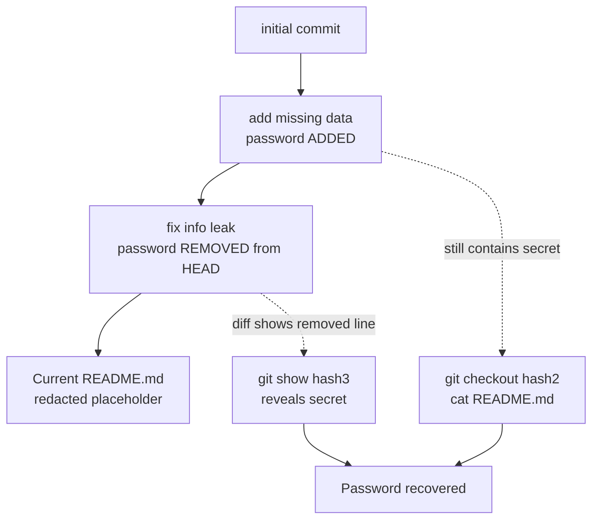

# OverTheWire Bandit Level 28 → Level 29

## Introduction

The previous level put a password in plain sight inside a Git repo's `README`. This level patches that mistake — and teaches you why the patch *doesn't actually work*. You clone the repo, open the `README`, and the password has been redacted or replaced. Frustrating, until you remember the single most important fact about Git: **it never forgets.** Every version of every file is preserved in the commit history. A secret "removed" in a later commit is still sitting, fully intact, in an earlier one.

This is one of the most important real-world lessons in the entire series. Countless production breaches trace back to a developer committing a key, realising the mistake, committing a "fix" that deletes it, and assuming the problem is solved. It isn't. The key lives forever in history — and unless the developer thinks to *rotate* it, that buried credential is yours for the taking.

## Official Challenge Objective

> **There is a git repository at `ssh://bandit28-git@bandit.labs.overthewire.org/home/bandit28-git/repo` via the port 2220. The password for the user `bandit28-git` is the same as for the user `bandit28`. Clone the repository and find the password for the next level.**

**In plain English:** clone another Git repo over SSH from your local machine (password = `bandit28`'s). This time the current `README.md` won't simply hand you the password — it's been changed. You'll have to dig through the commit *history* to find the version that still contains the real credential.

## Skills Covered

- Cloning a Git repo over SSH (recap of Level 27 → 28)
- Reading commit history (`git log`)
- Inspecting historical file versions (`git show`, `git checkout`)
- Understanding that deleting a secret in a new commit does **not** remove it
- Real-world git-history secret recovery

## My Approach

I cloned the repo exactly as in the last level, expecting another freebie — but `README.md` showed the password field blanked out, with what looked like a placeholder where the credential used to be. That's the tell: the secret *was* there and got "cleaned up." So I ran `git log` to see the commit history and found a telling sequence of messages — an `initial commit`, an `add missing data` commit, and a final `fix info leak` commit. "fix info leak" is the commit that *removed* the password; "add missing data" is the commit that *added* it. So I checked out the `add missing data` commit and read `README.md` there — the full credential was intact.

> [!TIP]
> Commit *messages* are a roadmap. Words like "fix leak", "remove secret", "oops", or "revert" are flashing signposts that the *previous* state of the file contains something interesting.

## Step-by-Step Walkthrough

### Command

```bash
mkdir -p /tmp/bandit28 && cd /tmp/bandit28
git clone ssh://bandit28-git@bandit.labs.overthewire.org:2220/home/bandit28-git/repo
cd repo
cat README.md
```

### Explanation

Same clone procedure as the previous level, run **from your local machine** (password is `bandit28`'s). This time, reading the current `README.md` is a dead end — the password has been redacted:

```
## credentials
- username: bandit29
- password: xxxxxxxxxx
```

The placeholder where a real password should be is the signal that this is a *history* problem, not a working-tree one.

### Why It Matters

Recognising a "scrubbed" file is a skill in itself. When a config or doc has an obvious placeholder, blank, or `REDACTED` where a value belongs, an attacker's next instinct is to ask "what was here before?" — and in a Git repo, that question always has an answer.

---

### Command

```bash
git log
```

### Explanation

`git log` prints the commit history newest-first. Each entry has a commit hash, author, date, and message. You'll see something like:

```
commit <hash3>  fix info leak
commit <hash2>  add missing data
commit <hash1>  initial commit
```

The messages tell the whole story: data (the password) was *added* in "add missing data", then *removed* in "fix info leak". The version you want lives at the "add missing data" commit, before the leak was "fixed".

### Why It Matters

`git log` is the entry point to the time machine. Reading commit messages to locate *when* a secret entered and left the codebase is exactly how an attacker pinpoints the commit that still holds a live credential.

---

### Command

```bash
# View the diff that "fixed" the leak (shows the removed secret directly):
git show <hash3>
```

### Explanation

`git show` on the "fix info leak" commit displays its diff — and because that commit *removed* the password, the diff shows the deleted line, prefixed with `-`, containing the real credential. This is often the fastest route: the very commit that hid the secret reveals it.

```diff
-- password: [REDACTED]
+- password: xxxxxxxxxx
```

### Why It Matters

A diff that *deletes* a secret displays that secret in full. This is the crux of the lesson: "removing" a secret in Git is the act that most cleanly *documents* it. The commit meant to fix the leak is the easiest place to read it.

---

### Command

```bash
# Alternative: travel to the commit that still HAS the password and read the file
git checkout <hash2>      # the "add missing data" commit
cat README.md
```

### Explanation

`git checkout <commit>` rewinds your working tree to that point in history (a "detached HEAD" — a temporary look-back, harmless here). At the "add missing data" commit, `README.md` still contains the live credential:

```
## credentials
- username: bandit29
- password: [REDACTED]
```

Run `git checkout main` (or `master`) afterward to return to the latest commit if you want to.

### Why It Matters

`git checkout <commit>` and `git show` are two ways to reach the same buried data. Knowing both — diff-reading and time-travel — makes you fluent at extracting whatever a repository's history is holding onto.

## Deep Dive: Cyber Security Concept

**You cannot un-leak a secret by deleting it in a new commit.**

Git is a content-addressed, append-only history. When someone "deletes" a line and commits, they don't erase the old content — they add a *new* commit that no longer contains it, while the old commit (and the blob holding the secret) remains fully intact and retrievable by anyone who can clone the repo. As an attacker, the secret is recoverable via `git log`, `git show`, `git checkout`, `git reflog`, or `git cat-file` essentially forever.

This is why a committed secret is so valuable to you:

1. **The deletion doesn't erase it** — unless the credential was *rotated*, the exposed value still works.
2. **Even a "scrubbed" repo leaks** — `git filter-repo` or BFG only rewrite the upstream copy; clones, forks, mirrors, and CI caches may still carry the original history.



> [!IMPORTANT]
> Deleting a secret in a follow-up commit does **not** make it go away. The instant a secret is pushed, it is exposed forever in history — so whenever you find a "removed" credential, assume it still works until proven otherwise.

## Offensive Security Perspective

History mining is where Git secret-hunting gets serious:

- **Automated history scanning:** `trufflehog`, `gitleaks`, and `git log -p`/`git log -S<string>` (the "pickaxe", which finds commits that added or removed a given string) sweep *all* history, not just HEAD. They routinely surface keys that developers "removed" months earlier.
- **Forks and mirrors:** even after a repo's history is scrubbed, forks, clones, CI caches, and platform forks may retain the old commits — an attacker only needs one copy.
- **Reflog and dangling commits:** locally, `git reflog` and dangling objects can resurrect "deleted" branches and rebased-away commits, including secrets thought to be gone.

This level's `git show <leak-fix>` trick — reading the secret straight out of the commit that "removed" it — is a real technique used constantly in source-code reviews.

## Common Beginner Mistakes

- **Giving up at the redacted `README.md`**, not realising the secret lives in history.
- **Ignoring commit messages** — "fix info leak" is the loudest possible hint.
- **Only checking the latest commit** and never running `git log`.
- **Panicking over "detached HEAD"** after `git checkout <hash>` — it's a harmless read-only look-back; `git checkout main` returns you.
- **Assuming a deleted secret is gone** — the entire point of the level is that it isn't.

## Key Takeaways

- Git history is permanent; deleting a secret in a new commit does not remove it.
- `git log` reads the history; commit messages map where secrets entered and left.
- `git show <commit>` reveals a removed secret directly from its deletion diff.
- `git checkout <commit>` time-travels the working tree to read old file versions.
- A leaked secret stays valid until it is rotated — so a "deleted" credential is usually still usable.

## How This Helps Build Cyber Security Expertise

- **Source-code review & bug bounty:** history mining surfaces credentials that surface-level scans miss.
- **Red team & post-exploitation:** a buried, un-rotated credential in an internal repo is a direct pivot to the next system.
- **Cloud pentest:** API keys and tokens "deleted" from a repo but still valid open the target's cloud and CI infrastructure.

## Additional Reading

- [Pro Git — Viewing Commit History (`git log`)](https://git-scm.com/book/en/v2/Git-Basics-Viewing-the-Commit-History)
- [`git log -S` (the pickaxe)](https://git-scm.com/docs/git-log#Documentation/git-log.txt--Sltstringgt)
- [BFG Repo-Cleaner](https://rtyley.github.io/bfg-repo-cleaner/) and [`git filter-repo`](https://github.com/newren/git-filter-repo)
- [GitHub — Removing sensitive data from a repository](https://docs.github.com/en/authentication/keeping-your-account-and-data-secure/removing-sensitive-data-from-a-repository)
- [MITRE ATT&CK — T1552.001: Credentials In Files](https://attack.mitre.org/techniques/T1552/001/)

---

*Next up: [Level 29 → 30](./30-bandit-level-29-30.md) — the secret isn't in the history this time; it's hiding on a different branch.*


---

## Connect with the Author

Written by **Himangshu Pan** — offensive security researcher.

- **GitHub:** [@0xSh3ru](https://github.com/0xSh3ru)
- **LinkedIn:** [in/0xsh3ru](https://www.linkedin.com/in/0xsh3ru/)

*If this walkthrough helped, follow along on GitHub and connect on LinkedIn — questions and corrections are always welcome.*
