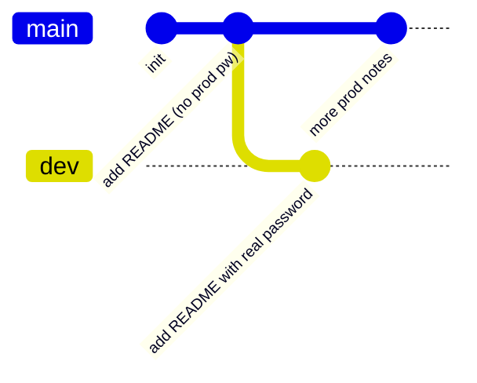

# OverTheWire Bandit Level 29 → Level 30

## Introduction

By now you have cloned a Git repository, dug through its commit history, and learned that a repo is a time machine that remembers everything you ever committed. Level 29 → 30 sharpens that lesson with a single, easy-to-miss detail: **the thing you are looking for is not on the branch you cloned.**

When you `git clone` a repository, the working tree you land in shows you exactly one branch — usually `master` or `main`. That is the "production" view. But a Git repository is not one timeline; it is a *tree* of timelines. Feature work, experiments, half-finished ideas, and — very often — secrets that someone "didn't want in production" live on other branches that are invisible until you go looking for them.

The skill being taught is **branch enumeration**: listing *every* ref a repository carries, not just the one checked out for you, and reading the contents of the ones the default view hides.

## Official Challenge Objective

> **There is a git repository at `ssh://bandit29-git@localhost/home/bandit29-git/repo` via the port `2220`. The password for the user `bandit29-git` is the same as for the user `bandit29`. Clone the repository and find the password for the next level.**

**In plain English:** SSH in as `bandit29`, then from a working directory you can write to, clone the Git repo over SSH. The `master` branch will look like a dead end — its README politely tells you there are "no passwords in production." Your job is to find the *other* branch where a developer stashed the credentials and read it there.

## Skills Covered

- Cloning a Git repository over SSH on a non-standard port
- Listing **all** branches, local and remote (`git branch -a`)
- Switching branches (`git checkout` / `git switch`)
- Reading commit history per branch (`git log`)
- Understanding Git refs, remotes, and the difference between "default branch" and "the repository"

## My Approach

I treated this exactly like the previous Git level: clone first, *then* enumerate before assuming the obvious file holds the answer. I cloned into a scratch directory under `/tmp` (the only place I'm reliably allowed to write as a Bandit user), read the README on the default branch, and saw the "no passwords in production!" note. That note is a hint, not a wall — it tells you the password exists *somewhere else in the repo*. The natural next move is to ask the repository what branches it actually has, switch to the development branch, and read its README.

## Step-by-Step Walkthrough

### Command

```bash
ssh bandit29@bandit.labs.overthewire.org -p 2220
```

### Explanation

Log in as `bandit29` using the Level 29 password. You need a real shell here because you'll run `git` from it.

### Why It Matters

Cloning over SSH means the Git transport rides on top of an SSH session — the same authentication and port quirks apply. Recognizing that `ssh://...:2220` is just SSH under the hood demystifies the whole operation.

---

### Command

```bash
mkdir -p /tmp/b29 && cd /tmp/b29
git clone ssh://bandit29-git@localhost/home/bandit29-git/repo
cd repo
```

### Explanation

We make a writable scratch directory in `/tmp`, then clone the repo. The URL uses the `ssh://` scheme pointing at `localhost` and the `bandit29-git` account; when prompted, the password is the **same** as `bandit29`'s. Git copies the full repository — *including all branches and history* — into a local `repo/` folder.

> [!NOTE]
> The clone happens over the default SSH port for the `localhost` connection inside the game. If you clone from your own machine instead, you must pass the port: `git clone ssh://bandit29-git@bandit.labs.overthewire.org:2220/home/bandit29-git/repo`.

### Why It Matters

A clone is a *complete* copy of the repository's object database, not just the visible files. Everything you need is already on your disk after the clone — the rest of the level is learning to look at it.

---

### Command

```bash
ls -la
cat README.md
```

### Explanation

The checked-out branch (`master`) contains a `README.md`. Reading it shows something like:

```
# Bandit Notes
Some notes for bandit30 of bandit.

## credentials

- username: bandit30
- password: <no passwords in production!>
```

No usable secret here — that's the point.

### Why It Matters

A negative result is still information. "No passwords in production!" is a developer's own admission that the real value lives on a non-production branch. Read every clue literally.

---

### Command

```bash
git branch -a
```

### Explanation

`git branch` lists local branches; the `-a` flag adds **all** remote-tracking branches too. The output reveals a second branch:

```
* master
  remotes/origin/HEAD -> origin/master
  remotes/origin/dev
  remotes/origin/master
```

There it is: `remotes/origin/dev`.

### Why It Matters

This single command is the heart of the level. The default checkout hid `dev` from you completely. In real Git forensics, `git branch -a` (alongside `git tag` and `git log --all`) is how you make the *entire* repository visible instead of just the slice someone chose to show.

---

### Command

```bash
git checkout dev
cat README.md
```

### Explanation

`git checkout dev` switches your working tree to the development branch (Git automatically creates a local `dev` tracking `origin/dev`). The README on this branch is different and contains the real credentials:

```
# Bandit Notes
Some notes for bandit30 of bandit.

## credentials

- username: bandit30
- password: [REDACTED]
```

### Why It Matters

The same filename (`README.md`) holds completely different content depending on which branch you're standing on. Files in Git are branch-relative; if you only ever look at one branch, you only ever see one version of reality.

---

### Command

```bash
git log
ssh bandit30@bandit.labs.overthewire.org -p 2220
```

### Explanation

`git log` on `dev` shows the commit that added the password — useful confirmation and a habit worth keeping. Then log out and SSH in as `bandit30` with the password you found.

### Why It Matters

Checking the log per branch tells you *who* added a secret and *when*, which in a real investigation is as valuable as the secret itself.

## Deep Dive: Cyber Security Concept

**Git branches as parallel timelines — and as hiding places.**

A Git repository is a directed acyclic graph of commits. A *branch* is nothing more than a movable pointer (a "ref") to one commit in that graph. `HEAD` points to the branch you currently have checked out. When you clone, Git sets up your working tree from one branch and stores all the others as remote-tracking refs under `refs/remotes/origin/`.

The crucial security insight: **the default branch is a curated view, not the whole repository.** Developers branch off to experiment, and they frequently treat non-default branches as "scratch" space where normal hygiene rules don't apply — committing real credentials, internal hostnames, or debug backdoors they "intend to remove before merging." Those branches often outlive the intention.



The `master` branch in the diagram looks clean. The `dev` branch carries the secret. To a casual `git clone` user they're indistinguishable — until you run `git branch -a`.

> [!IMPORTANT]
> "I deleted it from `main`" or "it's only on a feature branch" is **not** remediation. As long as a commit exists on *any* branch (or in the reflog, or behind a tag), the secret is still in the repository and must be considered compromised — rotate it.

## Offensive Security Perspective

When an attacker or bug-bounty hunter gets hold of a `.git` directory — leaked via an exposed web root (`https://target/.git/`), a misconfigured backup, or a public mirror — the first thing they do is reconstruct and enumerate *all* refs:

- `git branch -a` and `git log --all --oneline` to see every branch and commit.
- `git tag` to catch secrets pinned to tags (you'll meet this in the next level).
- Tools like **truffleHog**, **gitleaks**, and **git-dumper** automate downloading an exposed `.git` and scanning *every* commit on *every* branch for high-entropy strings, AWS keys, and private keys.

Real breaches have come from exactly this: a developer pushed a feature branch with hardcoded API keys, deleted the branch from the UI but not the object history, and a scanner found it months later. The `dev` branch in this level is the training-wheels version.

## Defensive Perspective

- **Pre-commit and pre-receive secret scanning.** Hook `gitleaks` or `git-secrets` into commit and push paths so credentials never enter history on *any* branch in the first place.
- **Treat branch protection as visibility, not safety.** Protecting `main` does nothing for secrets sitting on unprotected feature branches.
- **Rotate, don't just delete.** If a secret ever touched the repo, assume exposure and rotate the credential. Then purge history with `git filter-repo` or BFG across all refs.
- **Monitor for `.git` exposure.** Web servers should never serve `.git/`. Add detection for requests to `/.git/HEAD`, `/.git/config`, etc., which are unmistakable repo-dumping attempts.
- **Audit access to internal Git hosts.** SSH-based clone activity from unexpected accounts is a strong signal worth logging.

## Common Beginner Mistakes

- **Stopping at the `master` README** and concluding the level is broken because there's "no password."
- **Running `git branch` without `-a`**, which only shows local branches and hides `origin/dev`.
- **Cloning into a directory you can't write to** (clone into `/tmp`).
- **Forgetting to `cd` into the cloned `repo/` folder** before running Git commands.
- **Ignoring the literal hint** — "no passwords in production!" is telling you to look outside production.

## Key Takeaways

- A `git clone` gives you the *whole* repository, but checks out only *one* branch.
- `git branch -a` reveals every branch, including remote-tracking ones the default view hides.
- The same file can hold different content on different branches.
- Secrets routinely live on `dev`/feature branches that were never meant to ship.
- Deleting a secret from one branch does not remove it from the repository — rotate it.

## How This Helps Build Cyber Security Expertise

- **Source-code review & SAST:** real engagements involve auditing repositories; branch and history enumeration is a core part of finding leaked secrets and removed-but-not-gone code.
- **OSINT & recon:** exposed `.git` directories are a recurring web finding; knowing how to reconstruct and walk every ref turns a leak into a foothold.
- **DFIR:** when investigating an insider or a supply-chain incident, the commit graph across all branches is your evidence trail.
- **Secure SDLC:** understanding *how* secrets leak into branches is the prerequisite to designing the guardrails that stop it.

## Additional Reading

- [Pro Git — Branches in a Nutshell](https://git-scm.com/book/en/v2/Git-Branching-Branches-in-a-Nutshell)
- [`git branch` documentation](https://git-scm.com/docs/git-branch)
- [gitleaks — secret scanning](https://github.com/gitleaks/gitleaks)
- [MITRE ATT&CK — T1552.001: Credentials In Files](https://attack.mitre.org/techniques/T1552/001/)

---

*Next up: [Level 30 → 31](./31-bandit-level-30-31.md) — when the secret isn't on any branch at all, you go hunting in Git tags.*


---

## Connect with the Author

Written by **Himangshu Pan** — offensive security researcher.

- **GitHub:** [@0xSh3ru](https://github.com/0xSh3ru)
- **LinkedIn:** [in/0xsh3ru](https://www.linkedin.com/in/0xsh3ru/)

*If this walkthrough helped, follow along on GitHub and connect on LinkedIn — questions and corrections are always welcome.*
