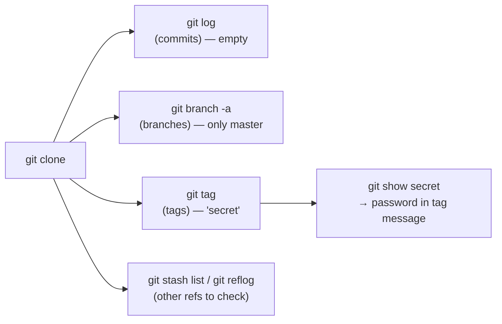

# OverTheWire Bandit Level 30 → Level 31

## Introduction

The previous level taught you to look past the default branch. This one takes the lesson further and yanks the rug out from under it: **the secret isn't on any branch at all.**

You clone the repo, run `git log`, run `git branch -a`, and find… nothing. One commit, one branch, an empty-looking README. It's tempting to conclude the level is broken. It isn't — you just haven't enumerated *every* kind of Git reference yet. Git stores more than branches. It stores **tags**, lightweight or annotated pointers that mark specific commits, and an annotated tag can carry its own message — a perfect, often-forgotten place to stash a secret.

The skill being taught is **complete repository enumeration**: branches, *tags*, stashes, and the reflog. Attackers check every ref. So should you.

## Official Challenge Objective

> **There is a git repository at `ssh://bandit30-git@localhost/home/bandit30-git/repo` via the port `2220`. The password for the user `bandit30-git` is the same as for the user `bandit30`. Clone the repository and find the password for the next level.**

**In plain English:** clone the repo as in the last level, but this time the commits and branches are barren. The password is hidden in a **Git tag**. Find the tag, read what it points at, and you have the credential.

## Skills Covered

- Cloning a Git repository over SSH
- Listing Git **tags** (`git tag` / `git tag -l`)
- Inspecting what a tag points to (`git show <tag>`)
- Understanding lightweight vs. annotated tags
- The full taxonomy of Git refs (branches, tags, stash, reflog)

## My Approach

I cloned the repo and ran my usual enumeration: `git log`, `git branch -a`. Both came up empty of anything useful — a single commit, only `master`, a README with nothing in it. That dead end is the actual puzzle: it's pushing you to remember that branches and commits aren't the only refs Git keeps. The next thing on my checklist is always *tags*. I listed them, found one called `secret`, and asked Git to show me what it was. The tag's content was the password.

## Step-by-Step Walkthrough

### Command

```bash
ssh bandit30@bandit.labs.overthewire.org -p 2220
mkdir -p /tmp/b30 && cd /tmp/b30
git clone ssh://bandit30-git@localhost/home/bandit30-git/repo
cd repo
```

### Explanation

Log in as `bandit30`, make a writable scratch directory, and clone the repo (the `bandit30-git` password equals the `bandit30` password). Move into the cloned `repo/`.

### Why It Matters

The clone, again, brings down the *entire* object database — including tags — so everything you need is already local before you start hunting.

---

### Command

```bash
ls -la
cat README.md
git log
git branch -a
```

### Explanation

This is the "rule out the obvious" pass:

- `cat README.md` shows something unhelpful like `just an epmty file... muahaha` (yes, with the typo).
- `git log` shows a single initial commit, nothing in the message.
- `git branch -a` shows only `master`.

Every normal hiding place is empty. Don't quit — escalate your enumeration.

### Why It Matters

Knowing *when you have exhausted one class of locations* is a real investigative skill. The emptiness is a signal to broaden the search to ref types you haven't checked.

---

### Command

```bash
git tag
```

### Explanation

`git tag` (equivalently `git tag -l`) lists all tags in the repository. The output is a single tag:

```
secret
```

A tag named `secret` is about as loud a hint as the game gets.

### Why It Matters

Tags are a first-class Git ref that the commit log and branch list **do not** show. If you only ever inspect commits and branches, tagged content is completely invisible to you. This is the entire trick of the level.

---

### Command

```bash
git show secret
```

### Explanation

`git show <tag>` displays the object the tag points to. Because `secret` is an **annotated** tag, `git show` prints the tag's metadata and message — and in this case the message *is* the password:

```
[REDACTED]
```

### Why It Matters

An annotated tag is a full Git object with its own author, date, and message body. That message field is a legitimate place to store text — which makes it an *illegitimately tempting* place to hide a secret. `git show` is how you crack it open.

---

### Command

```bash
ssh bandit31@bandit.labs.overthewire.org -p 2220
```

### Explanation

Log out and SSH in as `bandit31` with the password the tag revealed.

### Why It Matters

You've now seen secrets hide in commit history, on non-default branches, and in tags — three different corners of the same repository.

## Deep Dive: Cyber Security Concept

**Git refs are more than branches — enumerate all of them.**

Everything Git tracks is reachable through a *reference* (a "ref"): a named pointer to a commit (or, for annotated tags, to a tag object that points to a commit). The full ref namespace lives under `.git/refs/`:

- `refs/heads/` — local **branches**
- `refs/remotes/` — remote-tracking branches
- `refs/tags/` — **tags**
- `refs/stash` — the stash
- plus the **reflog** (`.git/logs/`), a journal of where every ref has pointed over time

There are two flavors of tag:

- **Lightweight tag** — just a name pointing directly at a commit. No extra data.
- **Annotated tag** — a real object stored in the database, with a tagger, date, and a free-text **message**. Created with `git tag -a -m "..."`. That message is exactly where this level's password lives.



> [!TIP]
> When a Git repo "has nothing in it," you have almost certainly only looked at branches and commits. Always also run `git tag -l`, `git stash list`, and `git reflog` — and `git log --all --oneline --graph` to see commits reachable from *every* ref at once.

The deeper lesson: **deleting a file, amending a commit, or rebasing does not necessarily erase data.** A dangling commit can survive in the reflog for weeks; content can be pinned alive by a tag long after it left the branch. Git is forgiving to its users and unforgiving to anyone trying to keep a secret.

## Offensive Security Perspective

When attackers dump a `.git` directory, automated secret scanners (**gitleaks**, **truffleHog**) walk *every* ref — branches, tags, and dangling objects from the reflog — precisely because secrets get parked in all of them. Manual operators do the same dance:

```bash
git tag -l                  # any tagged secrets?
git stash list              # forgotten stashed changes?
git reflog --all            # commits removed from branches but still reachable
git fsck --unreachable      # dangling objects nobody references anymore
git log --all -p | grep -i  # brute-force grep across all history
```

A commit "removed" by a force-push or rebase frequently lingers as an unreachable object that `git fsck` can resurrect. Bug bounty write-ups regularly feature credentials recovered from exactly these forgotten corners.

## Common Beginner Mistakes

- **Concluding the level is broken** when commits and branches look empty.
- **Never running `git tag`** — the single command the whole level hinges on.
- **Using `git show` on the commit instead of the tag** and missing the tag message.
- **Forgetting that `git log` and `git branch` do not list tags or the reflog.**
- **Cloning into a non-writable directory** instead of `/tmp`.

## Key Takeaways

- Git stores secrets in more places than commits and branches — **tags** are one of them.
- `git tag -l` lists tags; `git show <tag>` reveals an annotated tag's message.
- Complete enumeration also means stash, reflog, and dangling objects.
- "Empty" commits/branches is a prompt to widen the search, not to give up.
- Anything that ever entered any ref must be considered exposed and rotated.

## How This Helps Build Cyber Security Expertise

- **Git forensics & IR:** reconstructing what an attacker (or insider) did means walking every ref, not just the current HEAD.
- **Secret-leak hunting:** the methodical "check tags, stash, reflog, dangling objects" routine is exactly what professional scanners and reviewers do.
- **Secure development:** understanding that Git rarely truly forgets shapes how you handle accidental secret commits in real life.
- **Tool literacy:** `git show`, `git fsck`, `git reflog` are the same primitives the automated tools wrap — knowing them by hand makes you faster and harder to fool.

## Additional Reading

- [Pro Git — Tagging](https://git-scm.com/book/en/v2/Git-Basics-Tagging)
- [`git tag` documentation](https://git-scm.com/docs/git-tag)
- [`git reflog` documentation](https://git-scm.com/docs/git-reflog)
- [truffleHog — find secrets in Git history](https://github.com/trufflesecurity/trufflehog)

---

*Next up: [Level 31 → 32](./32-bandit-level-31-32.md) — you stop reading the repo and start pushing to it, where `.gitignore` and a server-side hook stand in your way.*


---

## Connect with the Author

Written by **Himangshu Pan** — offensive security researcher.

- **GitHub:** [@0xSh3ru](https://github.com/0xSh3ru)
- **LinkedIn:** [in/0xsh3ru](https://www.linkedin.com/in/0xsh3ru/)

*If this walkthrough helped, follow along on GitHub and connect on LinkedIn — questions and corrections are always welcome.*
