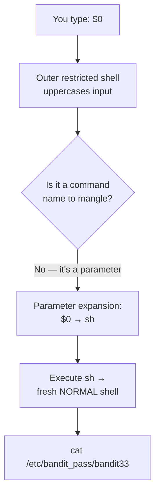

# OverTheWire Bandit Level 32 → Level 33

## Introduction

After a run of Git puzzles, Bandit changes the game entirely. You log in as `bandit32` and are greeted by a banner — **"WELCOME TO THE UPPERCASE SHELL"** — and a `>>` prompt. Try any command and it fails. Type `ls`, the shell runs `LS`. Type `cat`, it runs `CAT`. Every single thing you enter is converted to UPPERCASE before execution, and since Linux commands are lowercase, nothing works.

This is a **restricted shell**, and breaking out of one is a classic, high-value skill. The escape hinges on a beautiful detail: not everything you can type is an arbitrary command name. The shell *special parameter* `$0` expands to the name of the shell itself — and crucially, it is expanded by the shell **before** any uppercasing logic could matter to its meaning. Typing `$0` launches a brand-new, normal shell, and you walk right out of the cage.

The skill being taught: escaping restricted shells using shell metacharacters and special parameters.

## Official Challenge Objective

> **After all this git stuff, it's time for another escape. Good luck!**
>
> *On login you are dropped into a shell that prints "WELCOME TO THE UPPERCASE SHELL" and converts everything you type to uppercase.*

**In plain English:** logging in as `bandit32` traps you in a custom shell that uppercases every command, breaking them all. Find a way to spawn a normal shell from inside it, then read the password for `bandit33` from `/etc/bandit_pass/bandit33`.

## Skills Covered

- Recognizing and reasoning about restricted/custom shells
- Shell **special parameters** (`$0`, `$#`, `$@`, …)
- Understanding shell expansion vs. command execution order
- Escaping a constrained environment to a full shell
- Reading protected password files via `/etc/bandit_pass/`

## My Approach

The first thing I did was *characterize the cage*: what exactly is this shell allowed to run, and what is it doing to my input? Typing a few commands made it obvious — everything came back uppercased and "command not found." Whole-command names were a dead end because the filesystem has no `LS` or `CAT`. So I stopped thinking about commands and started thinking about what the shell *expands on my behalf*. `$0` is a special parameter that the shell substitutes with its own name; submitting just `$0` makes the restricted shell hand me a fresh shell process. From that normal `$` prompt I read the password file directly.

## Step-by-Step Walkthrough

### Command

```bash
ssh bandit32@bandit.labs.overthewire.org -p 2220
```

### Explanation

Log in as `bandit32`. Instead of a normal shell you're met with:

```
WELCOME TO THE UPPERCASE SHELL
>>
```

### Why It Matters

The very first sign of a restricted shell is an unusual prompt and/or a banner. Noticing "this is not a normal `$`/`#` prompt" is step zero of any escape.

---

### Command

```bash
>> ls
>> id
>> pwd
```

### Explanation

Probe the cage. Each command comes back as something like:

```
sh: 1: LS: not found
```

The shell uppercased `ls` to `LS`, then tried to execute `LS`, which doesn't exist. Same for everything else. This confirms the mechanism: **input is uppercased before execution.**

### Why It Matters

You cannot defeat a constraint you haven't characterized. A couple of probe commands reveal *exactly* what transformation is applied and where the boundary is — which tells you what kind of escape can work.

---

### Command

```bash
>> $0
```

### Explanation

This is the escape. `$0` is a **shell special parameter** that expands to the name of the shell or script currently running (e.g. `sh` or `/bin/bash`). When you type `$0` and press Enter:

1. The shell performs **parameter expansion**, replacing `$0` with its own name — say `sh`.
2. It then executes `sh`, spawning a brand-new shell process.

That new shell is a *normal* shell. The prompt changes to a plain `$`:

```
$
```

You are out. The uppercasing wrapper applied to the *outer* shell's command processing; the fresh inner shell has none of that restriction.

> [!TIP]
> Why does `$0` survive the uppercasing? The value it expands to (the shell's own program name, like `sh`) is correct *lowercase* — uppercasing the literal characters `$0` does nothing, and the expansion produces a valid executable name on its own. Whole words you type, by contrast, get uppercased into nonexistent commands. The escape works by smuggling intent through a *parameter expansion* rather than a *typed command name*.

### Why It Matters

This is the crux of restricted-shell escapes: find the one input the shell still interprets *its own way* rather than rejecting or mangling. Special parameters, variable expansions, here-strings, and other metacharacters are exactly those gaps.

---

### Command

```bash
$ cat /etc/bandit_pass/bandit33
```

### Explanation

From the normal shell, read the password file. Bandit stores each level's password under `/etc/bandit_pass/<user>`, readable only by that user — and you are now running as `bandit32`, who is permitted to read `bandit33`'s file in this level's setup:

```
[REDACTED]
```

### Why It Matters

`/etc/bandit_pass/` is the authoritative source of each level's password. Knowing it exists means that once you have a real shell as the right user, you can grab the next password directly without hunting through home directories.

---

### Command

```bash
ssh bandit33@bandit.labs.overthewire.org -p 2220
```

### Explanation

Log out and SSH in as `bandit33` with the password you just read.

### Why It Matters

You've completed an escape from a restricted shell — one of the most practically important moves in this entire game.

## Deep Dive: Cyber Security Concept

**Restricted shells, shell expansion, and escape via special parameters.**

A *restricted shell* is a deliberately limited command environment used to confine a user: think `rbash`, a custom menu shell on a network appliance, a kiosk, or — as here — a wrapper that mangles input. The intent is to let a user do a narrow set of things and nothing more. The recurring failure is that these restrictions are bolted on top of a powerful interpreter that has *many* ways to express intent, and the jailer rarely closes them all.

The uppercase shell here filters on the wrong abstraction. It assumes "if I uppercase the command, no real command will run." But a shell does far more than look up a command name — it performs a whole pipeline of **expansions** before execution:

1. Brace expansion → `{a,b}`
2. Tilde expansion → `~`
3. **Parameter / variable expansion → `$0`, `$VAR`, `${...}`**
4. Command substitution → `$(...)`, `` `...` ``
5. Arithmetic expansion → `$((...))`
6. Word splitting and pathname (glob) expansion → `*`, `?`

`$0` slips through because it isn't a command *name* the filter would catch — it's a parameter the shell resolves to its own executable, producing a fresh interactive shell as a side effect.



This generalizes. The standard restricted-shell escape toolkit (catalogued on **GTFOBins**) abuses the *features* of whatever you're allowed to run:

- Spawn a shell from inside an allowed program: `vi`/`vim` (`:!sh`, `:shell`), `less`/`man` (`!sh`), `awk 'BEGIN{system("/bin/sh")}'`, `find . -exec /bin/sh \;`, `python -c 'import os;os.system("sh")'`, `ed`, `nmap --interactive`.
- Use shell features the jail forgot to block: `$0`, `exec`, command substitution, `PATH`/`SHELL`/`LD_PRELOAD` manipulation.

> [!IMPORTANT]
> A restricted shell is only as strong as the *complete* set of expansions, builtins, and sub-programs it disables. Blacklisting command names while leaving expansion intact is security theater — the interpreter will happily reach the same outcome through a feature you didn't think to block.

## Offensive Security Perspective

Restricted-shell escape is a bread-and-butter step in real engagements:

- **Appliance & embedded pwnage:** routers, firewalls, IoT devices, and managed switches ship menu/CLI shells. Escaping them to a root Busybox shell is a staple of hardware and network-device hacking.
- **Privilege escalation:** landing on a box via a service account confined to `rbash` or a jailed SSH session, an attacker breaks out to run real tooling. GTFOBins is the go-to reference for "I can run *this* binary as a higher user — how do I get a shell?"
- **CTF/OSCP staple:** "you have a limited shell, get a full TTY" appears constantly — `python -c 'import pty;pty.spawn("/bin/bash")'` to upgrade a dumb reverse shell is the same family of trick.

The mindset is identical to this level: enumerate what the environment *lets* you do, then find the feature that turns a permitted action into arbitrary execution.

## Common Beginner Mistakes

- **Trying harder to type lowercase commands** — the shell uppercases regardless; brute force won't work.
- **Not characterizing the restriction first** and guessing blindly instead of probing what the shell does.
- **Forgetting special parameters exist** and assuming only command names can be entered.
- **Quoting or escaping `$0`** so it doesn't expand — just type `$0` and press Enter.
- **After escaping, hunting the home directory** instead of reading the authoritative `/etc/bandit_pass/bandit33`.

## Key Takeaways

- A restricted shell that filters command *names* often leaves shell *expansion* wide open.
- `$0` expands to the running shell's name; entering it spawns a fresh, unrestricted shell.
- Always characterize a constrained environment before attacking it.
- GTFOBins is the canonical reference for escaping via allowed binaries.
- Bandit passwords live authoritatively in `/etc/bandit_pass/<user>`.

## How This Helps Build Cyber Security Expertise

- **Privilege escalation & post-exploitation:** restricted-shell escape and dumb-shell upgrades are daily skills on the offensive side.
- **Network & hardware security:** breaking out of appliance CLIs is core to device assessments.
- **Red team & initial access:** a jailed SSH or kiosk shell is a common landing spot; escaping it is what turns a foothold into real execution.
- **Exploit dev & CTF/OSCP:** the "limited shell → full TTY" pattern (`python -c 'import pty;pty.spawn("/bin/bash")'`) recurs constantly in real engagements and exams.

## Additional Reading

- [GTFOBins — shell escapes from allowed binaries](https://gtfobins.github.io/)
- [Bash Manual — Special Parameters](https://www.gnu.org/software/bash/manual/html_node/Special-Parameters.html)
- [Bash Manual — Shell Expansions](https://www.gnu.org/software/bash/manual/html_node/Shell-Expansions.html)
- [The Restricted Shell (`rbash`)](https://www.gnu.org/software/bash/manual/html_node/The-Restricted-Shell.html)
- [MITRE ATT&CK — T1059: Command and Scripting Interpreter](https://attack.mitre.org/techniques/T1059/)

---

*Next up: [Level 33 — The Final Level](./34-bandit-level-33.md) — the end of the road, a congratulations, and where to take these skills next.*


---

## Connect with the Author

Written by **Himangshu Pan** — offensive security researcher.

- **GitHub:** [@0xSh3ru](https://github.com/0xSh3ru)
- **LinkedIn:** [in/0xsh3ru](https://www.linkedin.com/in/0xsh3ru/)

*If this walkthrough helped, follow along on GitHub and connect on LinkedIn — questions and corrections are always welcome.*
