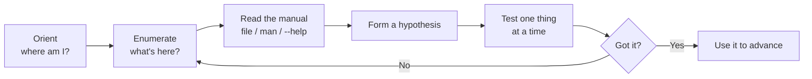

# OverTheWire Bandit Level 33 — The Final Level

## Introduction

You made it. Thirty-three levels, dozens of tools, and a steady accumulation of instinct later, you log in as `bandit33` and there is no puzzle waiting — only a `README.txt` that congratulates you and gently informs you that **Level 34 does not exist yet.** This is the end of the road, at least for now.

This article is deliberately different from the rest of the series. There is no password to find here, so instead of a walkthrough we'll do something more valuable: zoom out, look at the whole journey, name the meta-skill Bandit was quietly teaching the entire time, and chart where to go next. Treat this as a capstone — a moment to consolidate what you've built and aim it somewhere useful.

## Official Challenge Objective

> **At this moment, level 34 does not exist yet.**

Logging in as `bandit33` and reading the home directory shows a congratulatory note — something to the effect of:

> *Congratulations on solving the last level of this game! At this moment, there are no more levels to play in this game. However, we are constantly working on new levels and challenges. Keep an eye out for new releases…*

**In plain English:** there's no thirty-fourth challenge to solve. The game ends with a `README.txt` that congratulates you. OverTheWire may add more levels in the future, but for now, Bandit is complete.

## Skills Covered

Rather than a single skill, this level is a vantage point over everything the series taught. Across Bandit you built:

- **Linux command-line fluency** — `ls`, `cat`, `cd`, `file`, `find`, `grep`, `sort`, `uniq`, `diff`, `tr`, `cut`, pipes and redirection, and reading `man` pages instead of guessing.
- **Data wrangling & encoding** — base64, hex (`xxd`), ROT13, gzip/bzip2/tar layers, and the discipline to identify a format with `file` before decoding it.
- **SSH mastery** — non-standard ports, password and **key-based** auth, `ssh -i`, host/user syntax, and SSH as a transport for other protocols.
- **Networking & TLS** — `nc`/`ncat`, `telnet`, talking to services by hand, `openssl s_client` for TLS, and reasoning about ports and listeners.
- **Scanning & service discovery** — `nmap` to find which port hides the service you need.
- **Privilege & permissions** — file modes, ownership, **SUID** binaries, and `/etc/bandit_pass/` as the authoritative secret store.
- **Cron & scheduled-job abuse** — reading crontabs, exploiting writable scripts run by privileged users.
- **Restricted-shell escapes** — breaking out of constrained environments via shell features (`$0`, GTFOBins-style tricks).
- **Git forensics** — cloning over SSH, then mining history, **branches**, and **tags**, plus `.gitignore` bypass and server-side hooks.
- **Brute forcing & scripting** — looping over candidates, automating the tedious, and knowing when brute force is the right tool.

## My Approach

There's almost nothing to do here, and that's the point.

### Command

```bash
ssh bandit33@bandit.labs.overthewire.org -p 2220
ls -la
```

### Explanation

Log in as `bandit33` and list the home directory. Instead of the usual data file or binary, you find a single `README.txt`.

### Command

```bash
cat README.txt
```

### Explanation

Read the file. It's a congratulations note explaining that level 34 doesn't exist yet. No password, no next SSH hop — the loop you've run thirty-three times simply ends.

> [!NOTE]
> The very first level taught you `ls -la` then `cat`. The last level is *also* `ls -la` then `cat`. The bookend is intentional: the simplest workflow in the game is the one you never stopped needing.

## Deep Dive: Cyber Security Concept

**The real lesson of Bandit was never any single command — it was a method.**

Look back at how you solved every level and a single repeatable loop emerges:



This is **methodical enumeration plus reading the manual** — and it is the single most important habit in all of practical security. Every level rewarded the same behavior:

- **Look before you act.** `ls -la`, `file`, `pwd`, `id` before touching anything.
- **Read what's in front of you.** The README that said "no passwords in production." The `.gitignore` that named `*.txt`. The error message that told you a command was uppercased. The answer was usually *written down* if you read carefully.
- **Understand the tool, don't cargo-cult it.** Knowing *why* `git tag` matters is what let you find a secret a copied one-liner would have missed.
- **Iterate narrowly.** Change one variable, observe, repeat — the scientific method with a shell prompt.

Tools change constantly. This loop does not. A practitioner who internalizes it can sit down at an unfamiliar system — a new appliance, a new cloud, a new codebase — and make progress with zero prior knowledge of it, because the *process* of figuring things out is the durable skill.

> [!IMPORTANT]
> The goal was never to memorize 33 answers. It was to become someone who can solve the 34th level that doesn't exist yet — and the thousands of real-world problems that look nothing like Bandit but yield to the same method.

## Offensive Security Perspective

The Bandit loop *is* the early kill chain in miniature:

- **Recon → enumeration → foothold → loot → pivot.** Every level was "enumerate this account, find the credential, use it to become the next user" — i.e. discovery and **lateral movement**, the backbone of red-team operations.
- **Living off the land.** You solved everything with tools already on the box (`cat`, `nc`, `git`, `find`, `ssh`). Real operators prize exactly this — minimal footprint, no dropped malware, native binaries only.
- **The SUID/cron/restricted-shell levels** are textbook **local privilege escalation** — the same techniques `linpeas` automates and that GTFOBins catalogs.
- **The git levels** mirror modern **source-code and supply-chain recon**: dump a `.git`, walk every ref, find the leaked secret.

You now have the vocabulary and reflexes that make tools like `nmap`, `linpeas`, `gitleaks`, and Metasploit *make sense*, rather than being magic boxes.

## Defensive Perspective

Everything you exploited maps to a control a blue-teamer owns:

- **Plaintext secrets** → secrets managers, least-privilege file modes, `auditd` watches.
- **World-readable / SUID files** → permission hardening, SUID inventory and minimization.
- **Cron abuse** → no world-writable scripts in privileged jobs, integrity monitoring.
- **Restricted-shell escapes** → real isolation (containers, seccomp, `ForceCommand`) and process-ancestry alerting.
- **Git leaks** → pre-receive secret scanning, rotation on any exposure, `.git` exposure detection.

Having attacked these patterns, you can now *anticipate* them as a defender — which is precisely what threat modeling and detection engineering require.

## Common Beginner Mistakes

The habits that hurt people across Bandit — and that you should consciously leave behind:

- **Rushing.** Skipping enumeration to jump at a guess wastes more time than it saves.
- **Copying solutions without understanding.** A pasted command that "works" teaches you nothing and collapses the moment the next problem differs slightly. The redactions in this series are deliberate — the methodology is the prize.
- **Ignoring the obvious.** The hint was usually in the README, the error, or the `man` page.
- **Tool tunnel-vision.** Reaching for a fancy tool when `ls -la` and `cat` would do.
- **Not taking notes.** Real engagements demand documentation; build the habit now.

## Key Takeaways

- Bandit's true subject was **methodical enumeration + reading the manual**, not any single command.
- The same simple loop scales from a CTF prompt to an unfamiliar production system.
- Offensive technique and defensive control are two views of the same vulnerability — you now hold both.
- Understanding *why* beats memorizing *how* every single time.
- You are no longer a beginner at the Linux command line, and that foundation underlies almost all of security.

## How This Helps Build Cyber Security Expertise

Bandit is the foundation, not the finish line. Recommended next steps, roughly in order:

1. **Keep climbing OverTheWire.** [**Natas**](https://overthewire.org/wargames/natas/) for web security, [**Leviathan**](https://overthewire.org/wargames/leviathan/) and [**Narnia**](https://overthewire.org/wargames/narnia/) for binary/privesc fundamentals, then **Krypton** (crypto) and **Behemoth/Utumno** for exploitation.
2. **Broaden with guided platforms.** [**picoCTF**](https://picoctf.org/) for a huge beginner-friendly CTF library, and [**TryHackMe**](https://tryhackme.com/) for structured learning paths with guard rails.
3. **Go hands-on adversarial.** [**Hack The Box**](https://www.hackthebox.com/) for realistic machines once you're comfortable.
4. **Specialize in Linux privilege escalation.** Study [**GTFOBins**](https://gtfobins.github.io/) and the [**HackTricks**](https://book.hacktricks.xyz/) privesc methodology, and practice with `linpeas`.
5. **Build, then break.** Stand up your own vulnerable VM, exploit it, then defend it — the fastest way to fuse the offensive and defensive views.

Pick a direction (web, networks, binaries, cloud, detection) and go deep — your Bandit-honed method will carry over to all of them.

## Additional Reading

- [OverTheWire — Natas (web security)](https://overthewire.org/wargames/natas/)
- [OverTheWire — Leviathan](https://overthewire.org/wargames/leviathan/) and [Narnia](https://overthewire.org/wargames/narnia/)
- [picoCTF](https://picoctf.org/)
- [TryHackMe](https://tryhackme.com/) and [Hack The Box](https://www.hackthebox.com/)
- [GTFOBins](https://gtfobins.github.io/) and [HackTricks](https://book.hacktricks.xyz/)
- [MITRE ATT&CK](https://attack.mitre.org/) — map techniques you learned to the real-world matrix

## Personal Reflection

I'm genuinely proud of finishing this series — and if you're reading this having worked through Bandit yourself, you should be too. When I started, a blank terminal felt like a locked door. Thirty-three levels later, it feels like an invitation. That shift — from intimidation to curiosity — is the real reward, bigger than any password.

What I want you to carry forward is this: you didn't memorize your way here, you *reasoned* your way here. Every level you cleared, you cleared by looking carefully, reading what was in front of you, forming a guess, and testing it. That is exactly how real security work is done, on systems far messier than a wargame. The tools will keep changing; the method you built will not.

So don't stop at the congratulations screen. The most interesting "next level" is the one nobody has written yet — the real system, the real bug, the real defense you'll figure out because you learned *how* to figure things out. Go find it.

Congratulations. You finished Bandit. Now go break (and build) something bigger.

*Back to the start: [The Complete Bandit Learning Series](./README.md).*


---

## Connect with the Author

Written by **Himangshu Pan** — offensive security researcher.

- **GitHub:** [@0xSh3ru](https://github.com/0xSh3ru)
- **LinkedIn:** [in/0xsh3ru](https://www.linkedin.com/in/0xsh3ru/)

*If this walkthrough helped, follow along on GitHub and connect on LinkedIn — questions and corrections are always welcome.*
