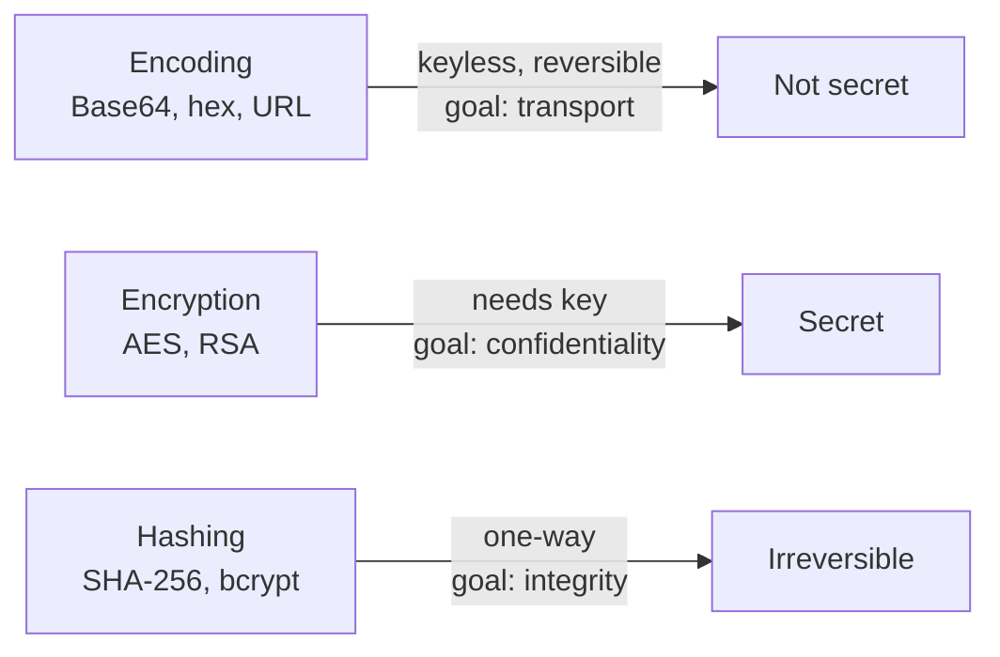

## Introduction

This level introduces one of the most misunderstood concepts in computing: **encoding versus encryption**. The password is stored in `data.txt` as Base64 — a wall of letters, digits, `+`, `/`, and trailing `=` that *looks* scrambled and secret. It is neither. Base64 is a fully reversible, keyless transformation anyone can undo in one command. The lesson: **Base64 hides nothing.**

You'll meet Base64 constantly — HTTP Basic auth headers, JSON Web Tokens, email attachments (MIME), `data:` URIs, TLS certificates (PEM), and malware payloads. Recognizing it on sight and decoding it instantly is a real working skill.

## Official Challenge Objective

> **The password for the next level is stored in the file `data.txt`, which contains base64 encoded data.**

**In plain English:** `data.txt` holds Base64-encoded text. Decode it back to its original form and read the password.

## Skills Covered

- Distinguishing **encoding** from **encryption**
- Recognizing Base64 by its character set and `=` padding
- Decoding with `base64 -d`
- Where Base64 appears in real protocols

## My Approach

The moment I saw a blob of mixed-case letters and digits ending in `=`, I recognized the Base64 fingerprint — and Base64 is *encoding*, not encryption, so there's no key to find and nothing to crack. It is meant to be decoded by design. The whole solution is feeding the file to `base64 -d`. The mental note: in a real engagement, finding Base64 isn't "I found something encrypted," it's "I found something the author *thought* was hidden."

## Step-by-Step Walkthrough

### Command

```bash
cat data.txt
```

### Explanation

Unlike the previous level, this file is safe to `cat` — it's plain text, just encoded:

```
VGhlIHBhc3N3b3JkIGlzIC4uLg==
```

The mixed-case alphanumerics and trailing `=` are the tell-tale signature of Base64.

### Why It Matters

Recognizing an encoding on sight is half the battle. The `=` padding is the most reliable visual giveaway — it pads output to a multiple of four characters.

---

### Command

```bash
base64 -d data.txt
```

### Explanation

`base64 -d` (`--decode`) reverses the encoding and prints the original bytes:

```
The password is [REDACTED]
```

No key, no cracking — just a reversal of a public, standardized transformation.

### Why It Matters

Base64 provides **zero confidentiality**. Anyone can run the same command. If a developer relies on it to "hide" a value, the value is effectively public.

> [!TIP]
> No file? Pipe a string: `echo 'SGVsbG8=' | base64 -d`. To encode, drop `-d`: `echo -n 'Hello' | base64` (`-n` avoids encoding a trailing newline).

## Deep Dive: Cyber Security Concept

**Encoding vs. Encryption (and why people confuse them).**

- **Encoding** (Base64, URL, hex) changes data's *representation* for safe transport. **Public, keyless, trivially reversible.** Goal: compatibility, never secrecy.
- **Encryption** (AES, RSA) transforms data recoverable only with a **secret key**. Goal: secrecy.
- **Hashing** (SHA-256, bcrypt) is one-way with **no inverse** — for integrity and password storage.

Base64 maps every 3 bytes onto 4 printable characters from `A–Z a–z 0–9 + /`, padding with `=` to a multiple of four. That 4-for-3 ratio makes output ~33% larger than input.



> [!IMPORTANT]
> Base64 is **encoding, not encryption** — no confidentiality whatsoever. Treating it as a security control is one of the most common and dangerous misconceptions in the field.

## Offensive Security Perspective

Base64 turns up everywhere:

- **HTTP Basic Auth** sends `username:password` as Base64 in the `Authorization` header — `base64 -d` it straight to plaintext creds.
- **JWTs** are Base64url segments; header and payload decode to readable JSON, often leaking roles and IDs.
- **Malware & C2** Base64-encode PowerShell (`-enc`), exfil data, and config blobs to slip past naïve filters.
- **Bug bounty:** "encrypted" tokens and cookies frequently turn out to be Base64 — always decode first.

## Common Beginner Mistakes

- Thinking Base64 is encryption and hunting for a non-existent key.
- Trying to "crack" it — there's nothing to crack.
- Forgetting `-d` and re-encoding instead of decoding.
- Stray whitespace or missing `=` padding causing decode errors.
- Confusing Base64 with Base64url (`-`/`_` instead of `+`/`/`).

## Key Takeaways

- Base64 is encoding, not encryption — keyless and reversible by anyone.
- The `=` padding and mixed alphanumeric set are its signature.
- `base64 -d` decodes; `base64` encodes.
- It lives in Basic Auth, JWTs, MIME, data URIs, PEM, and malware.
- Never rely on encoding to keep a secret.

## How This Helps Build Cyber Security Expertise

- **Web app security:** decoding tokens, cookies, and JWTs is everyday pentest/bug-bounty work.
- **Malware analysis:** de-obfuscating Base64 payloads and PowerShell is a core triage step.
- **Network forensics:** decoding Base64 from captured traffic reconstructs what crossed the wire.
- **Crypto literacy:** encoding ≠ encryption ≠ hashing prevents a whole class of errors.

## Additional Reading

- [`man base64`](https://man7.org/linux/man-pages/man1/base64.1.html)
- [RFC 4648 — Base16/32/64 Data Encodings](https://datatracker.ietf.org/doc/html/rfc4648)
- [OWASP — Cryptographic Storage Cheat Sheet](https://cheatsheetseries.owasp.org/cheatsheets/Cryptographic_Storage_Cheat_Sheet.html)
- [jwt.io — decode JSON Web Tokens](https://jwt.io/)


---

## Connect with the Author

Written by **Himangshu Pan** — offensive security researcher.

- **GitHub:** [@0xSh3ru](https://github.com/0xSh3ru)
- **LinkedIn:** [in/0xsh3ru](https://www.linkedin.com/in/0xsh3ru/)

*If this walkthrough helped, follow along on GitHub and connect on LinkedIn — questions and corrections are always welcome.*
