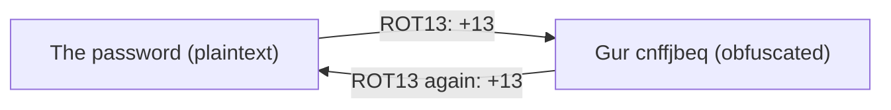

## Introduction

Having just learned that Base64 is encoding (not encryption), this level drives the point home with a different disguise: **ROT13**, a Caesar cipher rotating every letter 13 positions. It looks like ciphertext — `Gur cnffjbeq vf...` — but it's pure obfuscation with no key. The skill: **character-level translation** with `tr`, plus recognizing when "encrypted-looking" text is just a fixed, reversible substitution.

ROT13 is the canonical "security by obscurity" example. Its only real use is veiling spoilers from casual eyes. Knowing it on sight and undoing it in one line is the lesson.

## Official Challenge Objective

> **The password for the next level is stored in the file `data.txt`, where all lowercase (a-z) and uppercase (A-Z) letters have been rotated by 13 positions.**

**In plain English:** every letter in `data.txt` is shifted 13 places (A↔N, B↔O, … m↔z). Shift them back and read the password.

## Skills Covered

- Recognizing ROT13 / Caesar ciphers
- Obfuscation vs. encryption
- Character translation with `tr`
- Why ROT13 is its own inverse

## My Approach

Readable-looking words that aren't quite words screamed substitution cipher, and the objective's "13-position rotation" made it ROT13. ROT13 is symmetric — 13 is half of 26, so applying it twice returns the original; encoding and decoding are the same operation. `tr` translates one set of characters to another, character for character, so I built two ranges (upper and lower) rotated by 13: `A-Z` → `N-ZA-M`, `a-z` → `n-za-m`. One command, password recovered.

## Step-by-Step Walkthrough

### Command

```bash
cat data.txt
```

### Explanation

Safe to `cat` — plain text, just rotated:

```
Gur cnffjbeq vf ...
```

`Gur` is ROT13 for `The`; once you spot that, the rotation is obvious.

### Why It Matters

Recognizing a Caesar cipher by eye is a real CTF and malware-triage skill. Common fingerprints: `Gur` = `The`, `cnffjbeq` = `password`.

---

### Command

```bash
cat data.txt | tr 'A-Za-z' 'N-ZA-Mn-za-m'
```

### Explanation

`tr` replaces each character in the **first** set with the character at the same position in the **second** set. `A-Z` → `N-ZA-M` (A→N … M→Z, N→A … Z→M) and `a-z` → `n-za-m`. Every letter shifts back 13; non-letters are untouched:

```
The password is [REDACTED]
```

### Why It Matters

This shows how `tr` pairs two sets by position — the same technique remaps, deletes, or squeezes characters in any stream, a building block for log parsing.

> [!TIP]
> ROT13 is its own inverse, so the same command encodes too. No file needed: `echo 'Gur' | tr 'A-Za-z' 'N-ZA-Mn-za-m'`.

## Deep Dive: Cyber Security Concept

**Caesar ciphers, ROT13, and "security by obscurity."**

A Caesar cipher shifts each letter by a fixed amount; ROT13 shifts by 13. Because 13 is half of 26, ROT13 **is its own inverse** — rotating twice (26) returns the original, so one function both encodes and decodes. A Caesar cipher has **no meaningful key** — only 25 shifts, all breakable instantly. It is obfuscation, not confidentiality; ROT13 isn't even trying to be secret.



> [!NOTE]
> "Security by obscurity" relies on secrecy of the *method* rather than a *key*. It fails the moment the method is known — and methods always become known.

> [!IMPORTANT]
> ROT13 and Base64 are both reversible without a key. Neither protects data. If something "looks encrypted" but a public fixed rule decodes it, it was never encrypted.

## Offensive Security Perspective

ROT13 and simple substitution/XOR obfuscation appear in:

- **Lightweight malware obfuscation:** droppers ROT13 or XOR config strings and URLs to dodge string scanners; `tr` undoes it.
- **CTF crypto warm-ups:** ROT13/ROTn/Caesar are staple entry challenges; CyberChef brutes every rotation instantly.
- **Trivially "hidden" values** in cookies or parameters.

When text resists Base64 but still looks like shifted English, try ROT13 / Caesar brute force before assuming real crypto.

## Common Beginner Mistakes

- Trying to "crack" ROT13 as if it had a key.
- Getting `tr` ranges wrong or mistyping `N-ZA-M`.
- Confusing ROT13 with Base64 because both "look encoded."
- Including wrong characters so digits/punctuation get mangled.

## Key Takeaways

- ROT13 is a Caesar cipher with a 13-position shift — obfuscation, not encryption.
- It is its own inverse: one command encodes and decodes.
- `tr 'A-Za-z' 'N-ZA-Mn-za-m'` performs ROT13.
- `Gur` = `The` is the classic give-away.
- Reversible-without-a-key means no security.

## How This Helps Build Cyber Security Expertise

- **Cryptanalysis fundamentals:** classical ciphers are the on-ramp to real encryption.
- **Malware analysis:** de-obfuscating ROT13/XOR config is routine triage.
- **Text processing for IR:** `tr` with `sed`/`awk` munges logs and extracts indicators.
- **Secure design judgment:** obscurity ≠ security shapes every review you do.

## Additional Reading

- [`man tr`](https://man7.org/linux/man-pages/man1/tr.1.html)
- [Wikipedia — ROT13](https://en.wikipedia.org/wiki/ROT13), [Caesar cipher](https://en.wikipedia.org/wiki/Caesar_cipher)
- [CyberChef](https://gchq.github.io/CyberChef/) — "ROT13" and "ROT13 Brute Force"
- [OWASP — Security by Design Principles](https://owasp.org/www-community/Security_by_Design_Principles)


---

## Connect with the Author

Written by **Himangshu Pan** — offensive security researcher.

- **GitHub:** [@0xSh3ru](https://github.com/0xSh3ru)
- **LinkedIn:** [in/0xsh3ru](https://www.linkedin.com/in/0xsh3ru/)

*If this walkthrough helped, follow along on GitHub and connect on LinkedIn — questions and corrections are always welcome.*
