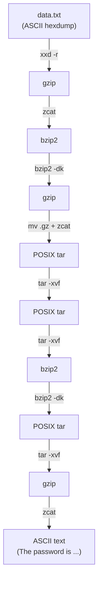

## Introduction

This is the level where Bandit stops holding your hand. The password is hidden inside a file **compressed over and over** in alternating formats, then turned into a **hexdump**. There's no single magic command — you peel the onion one layer at a time, identifying each layer's true type and choosing the right tool. It teaches the single most important habit in file analysis: **never trust a file's name or extension — always ask `file` what it actually is.**

This is what a malware analyst does with a packed dropper and a forensic examiner does with a nested archive. You'll also learn to work safely in a scratch directory under `/tmp`.

## Official Challenge Objective

> **The password for the next level is stored in the file `data.txt`, which is a hexdump of a file that has been repeatedly compressed. It may be useful to create a working directory under /tmp using `mktemp -d`. Then copy the datafile using `cp`, and rename it using `mv` (read the manpages!).**

**In plain English:** `data.txt` is a *hexdump* (text representation of raw bytes) of a file compressed many times. Convert the hexdump back to binary, then repeatedly identify and decompress each layer until you reach plain text.

## Skills Covered

- Reverting a hexdump with `xxd -r`
- Identifying types by **magic bytes** with `file`
- Decompressing gzip (`zcat`), bzip2 (`bzip2`), and tar (`tar`)
- Recognizing that extensions lie
- Working safely in a `/tmp` scratch dir (`mktemp -d`, `cp`, `mv`)

## My Approach

My discipline was a tight loop: **`file` it → decompress it → `file` it again.** I never assumed the next layer; I let `file`'s magic-byte reading tell me, then picked the matching tool. I set up a private scratch dir with `mktemp -d` and copied `data.txt` in so nothing could harm the original. Then `xxd -r` converted the hexdump to binary, and it was layer after layer: gzip, bzip2, tar, tar, bzip2, tar, gzip — formats alternate to force you to actually *check*. Two things tripped me up then became second nature: renaming files so decompressors accept them (gzip is picky about extensions), and `bzip2 -dk` to *keep* the input.

## Step-by-Step Walkthrough

### Command

```bash
TMPD=$(mktemp -d)
cp data.txt "$TMPD"
cd "$TMPD"
```

### Explanation

`mktemp -d` creates a fresh uniquely-named directory under `/tmp` and prints its path (captured in `TMPD`). We copy the data file in and `cd` there, so every intermediate lives in throwaway space.

### Why It Matters

Working in a disposable directory is professional hygiene — the original is untouched and cleanup is one `rm -rf`. The same pattern protects evidence integrity in forensics: analyze a *copy*.

---

### Command

```bash
xxd -r data.txt > data
file data
```

### Explanation

`data.txt` is a **hexdump** (offset, hex bytes, ASCII gutter). `xxd -r` ("reverse") converts it back to raw binary, saved as `data`. `file` reports the truth:

```
data: gzip compressed data, was "data2.bin", ...
```

### Why It Matters

A hexdump is how binary travels through text-only channels. Round-tripping it (`xxd` / `xxd -r`) is core forensics/CTF fluency — and `file` immediately proves the lesson: bytes, not names, define the type.

> [!NOTE]
> The first bytes `1f 8b` are the **gzip magic number**; `file` reads them regardless of extension.

---

### Command

```bash
zcat data > data2.bin
file data2.bin     # -> bzip2 compressed data
```

### Explanation

`zcat` decompresses gzip to stdout (like `cat` for gzip), redirected to `data2.bin`. Using `zcat >` sidesteps gzip's strict `.gz` extension requirement. Next layer: bzip2.

---

### Command

```bash
bzip2 -dk data2.bin
file data2.bin.out   # -> gzip compressed data, was "data4.bin"
```

### Explanation

`bzip2 -d` decompresses; `-k` **keeps** the input (bzip2 deletes the source by default). With no `.bz2` extension it writes `data2.bin.out`. Another gzip layer.

> [!IMPORTANT]
> Many compression tools **delete their input** on success. Pass a keep flag (`bzip2 -dk`, `gzip -k`) or work on copies — destroying an intermediate on real evidence is unrecoverable.

---

### Command

```bash
mv data2.bin.out data3.gz
zcat data3.gz > data4.bin
file data4.bin       # -> POSIX tar archive (GNU)
```

### Explanation

We rename to `data3.gz` so the tooling is happy, `zcat` into `data4.bin`, and find a tar archive. Renaming doesn't change the bytes — it just satisfies a naming convention; `file` reads the real type.

### Why It Matters

This is the heart of the level: **the extension is whatever you make it.** Tar is a *container*, not a compressor, so the next tool changes.

---

### Command

```bash
tar -xvf data4.bin   # -> data5.bin
file data5.bin       # -> POSIX tar archive
tar -xvf data5.bin   # -> data6.bin
file data6.bin       # -> bzip2 compressed data
```

### Explanation

`tar -xvf` e**x**tracts **v**erbosely from the **f**ile. `data4.bin` yields another tar (`data5.bin`), which extracts to `data6.bin` (bzip2). Tar bundles without compressing, which is why archives nest.

---

### Command

```bash
bzip2 -dk data6.bin
file data6.bin.out   # -> POSIX tar archive
tar -xvf data6.bin.out  # -> data8.bin
file data8.bin       # -> gzip compressed data, was "data9.bin"
```

### Explanation

Decompress the bzip2 (`-dk` to keep the source), find yet another tar, extract it to `data8.bin` (gzip). The identify-choose-peel rhythm is now muscle memory.

---

### Command

```bash
zcat data8.bin > data9.bin
file data9.bin       # -> ASCII text
cat data9.bin
```

### Explanation

Decompress the final gzip layer. `file` finally says `ASCII text` — safe to `cat`:

```
The password is [REDACTED]
```

### Why It Matters

Reaching ASCII text signals the bottom of the stack. Checking `file` after *every* step is what told you, unambiguously, when to stop.

## Deep Dive: Cyber Security Concept

**Magic bytes, nested archives, and why extensions are a lie.**

Every format begins with a **magic number** — a fixed signature in its first bytes:

| Format | Magic bytes (hex) | Extension |
|---|---|---|
| gzip | `1f 8b` | `.gz` |
| bzip2 | `42 5a 68` (`BZh`) | `.bz2` |
| tar | `ustar` at offset 257 | `.tar` |
| ZIP | `50 4b 03 04` (`PK..`) | `.zip` |
| ELF | `7f 45 4c 46` | (none) |

`file` reads these via its "magic" database and reports the *real* type, ignoring the name. This level strips extensions to force content-based identification.



> [!IMPORTANT]
> An extension is a hint to humans, not a fact about contents. Attackers rename `.exe` to `.jpg` and double-extension files (`invoice.pdf.exe`). Trust the bytes, never the name.

## Offensive Security Perspective

A near-perfect model of **unpacking layered malware**:

- **Packers and droppers** wrap a payload in many layers of compression/encoding to defeat signatures and frustrate analysts — peel, identify, strip, repeat.
- **Evasion via misnamed files:** malware ships as `.gif`, `.docx`, or extension-less; `file` cuts through the disguise.
- **Archive bombs / deep nesting** are also offensive (zip bombs) — unpack in a sandbox with limits.
- **CTF staple:** "decompress N times" tests methodical persistence.

## Common Beginner Mistakes

- Trusting `file`'s "was data2.bin" hint as the format instead of the type string.
- Forgetting `-k` and losing an intermediate.
- Fighting gzip's `.gz` requirement instead of `mv`-ing or using `zcat`.
- Skipping `file` between steps and using the wrong decompressor.
- Working in the home directory and drowning in clutter.
- `cat`-ing a binary intermediate and scrambling the terminal.

## Key Takeaways

- `xxd -r` reverses a hexdump to binary.
- `file` identifies type by magic bytes — run it after **every** step.
- Extensions are hints, not facts; rename freely to satisfy tools.
- gzip→`zcat`, bzip2→`bzip2 -dk`, tar→`tar -xvf`; archives nest.
- Keep your inputs (`-k`) and work in a disposable `/tmp` dir.

## How This Helps Build Cyber Security Expertise

- **Malware analysis:** unpacking multi-layer droppers is this loop, scaled up.
- **Digital forensics:** carving nested archives without altering originals is core practice.
- **File-format fluency:** magic bytes underpin carving, anti-evasion filtering, and exploit research.
- **Operational discipline:** scratch dirs, keeping inputs, step-by-step verification scale to every investigation.

## Additional Reading

- [`man xxd`](https://man7.org/linux/man-pages/man1/xxd.1.html), [`man file`](https://man7.org/linux/man-pages/man1/file.1.html), [`man tar`](https://man7.org/linux/man-pages/man1/tar.1.html), [`man gzip`](https://man7.org/linux/man-pages/man1/gzip.1.html), [`man bzip2`](https://man7.org/linux/man-pages/man1/bzip2.1.html)
- [`man mktemp`](https://man7.org/linux/man-pages/man1/mktemp.1.html)
- [Wikipedia — List of file signatures](https://en.wikipedia.org/wiki/List_of_file_signatures)
- [MITRE ATT&CK — T1027.002: Software Packing](https://attack.mitre.org/techniques/T1027/002/)


---

## Connect with the Author

Written by **Himangshu Pan** — offensive security researcher.

- **GitHub:** [@0xSh3ru](https://github.com/0xSh3ru)
- **LinkedIn:** [in/0xsh3ru](https://www.linkedin.com/in/0xsh3ru/)

*If this walkthrough helped, follow along on GitHub and connect on LinkedIn — questions and corrections are always welcome.*
