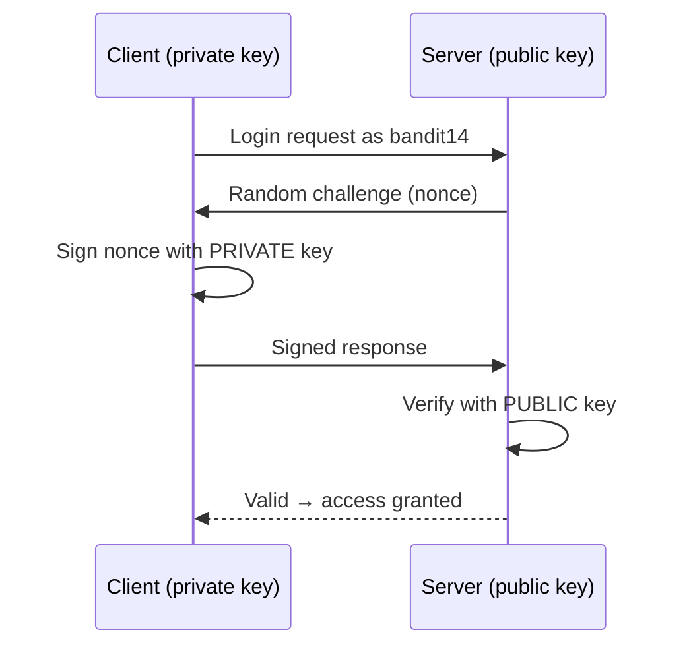

## Introduction

Up to this point every Bandit level handed you a *password*. Level 13 → 14 breaks that pattern: instead of a password, your home directory contains a **private SSH key**. The challenge is no longer "find the secret string" but "understand how the secret you already have is actually *used*."

That shift is the point. This level teaches **public-key (asymmetric) authentication** — the mechanism behind essentially every production Linux server — plus two operational gotchas: SSH **refuses keys with loose permissions**, and access can be **restricted by source host**, so the same valid key can be rejected depending on *where* you connect from.

## Official Challenge Objective

> **The password for the next level is stored in `/etc/bandit_pass/bandit14` and can only be read by user `bandit14`. For this level you don't get the next password, but you get a private SSH key to log into the next level. Look at how previous logins worked and find out how to use the key. A hint file is in the home directory. Read error messages carefully.**

**In plain English:** there is no password to copy this time. Your home directory holds a *private key* — the credential `bandit14` uses to log in. Use it to authenticate as `bandit14` over SSH. Once you are `bandit14`, you can read `/etc/bandit_pass/bandit14` yourself.

## Skills Covered

- SSH **public-key authentication** and the key *pair* concept
- Using a private key with `ssh -i`
- Why SSH enforces strict private-key permissions (`chmod 600`)
- Copying files off a host with `scp`
- **Host-based access restrictions** (`AllowUsers`/`Match`, `from=` in `authorized_keys`)
- Reading SSH error messages diagnostically

## My Approach

This level was genuinely interesting — the first where the obvious path failed and I had to think about the *infrastructure*, not just the file in front of me. I found `sshkey.private` and tried to SSH to `bandit14` from inside the Bandit box. SSH accepted the key but the connection was rejected: the key was correct, but logins as `bandit14` were not permitted **from localhost**. So I copied the key down to **my own machine** with `scp`, fixed its permissions, and connected from there. It worked immediately. The failure wasn't about me — it was about *where* I was connecting from.

## Step-by-Step Walkthrough

### Command

```bash
ssh bandit13@bandit.labs.overthewire.org -p 2220
ls -la
```

### Explanation

Log in as `bandit13`, then enumerate. You will find `sshkey.private` — an OpenSSH **private key**, not a password.

### Why It Matters

Recognizing a private key on sight is a core skill. A file beginning with `-----BEGIN ... PRIVATE KEY-----` is a credential at least as valuable as a password — keys are reused and rarely rotated. Finding one in post-exploitation is a direct ticket to lateral movement.

---

### Command

```bash
scp -P 2220 bandit13@bandit.labs.overthewire.org:/home/bandit13/sshkey.private .
```

### Explanation

`scp` (secure copy) transfers a file over SSH. Run it **from your own local machine**: it connects as `bandit13`, reads the key from the server, and writes it to your current directory (`.`).

> [!NOTE]
> With `scp` the port flag is **capital `-P`** (lowercase `-p` preserves timestamps). Bandit listens on `2220`, not `22`. The `bndt` alias you may see in notes is just an SSH config shortcut for the host on port 2220.

### Why It Matters

You copy the key off the box because of the host restriction below — and exfiltrating a discovered key to an attacker-controlled machine is exactly how operators use stolen credentials.

---

### Command

```bash
chmod 600 sshkey.private
```

### Explanation

Sets permissions to `rw-------` — readable/writable only by you. SSH **refuses** a private key readable by others, warning `Permissions ... are too open` / `UNPROTECTED PRIVATE KEY FILE!`.

### Why It Matters

A private key is the entire secret behind your identity; if other local users can read it, your identity is compromised. The `chmod 600` reflex saves you a confusing error every time you handle a key.

> [!TIP]
> Same rule for the `~/.ssh` directory (`700`) and `authorized_keys` (`600`). When key auth "silently fails," check permissions first.

---

### Command

```bash
ssh bandit14@bandit.labs.overthewire.org -i sshkey.private -p 2220
```

### Explanation

`-i sshkey.private` tells SSH to authenticate with this specific **identity file**. Run from your local machine, it logs you in as `bandit14` with no password prompt — the key *is* the credential. (Alias form: `ssh bandit14@bndt -i sshkey.private`.)

### Why It Matters

This is the canonical way to use a key file you control — the same `-i` flag used for any harvested key on an engagement, and for cloud logins (`ssh -i key.pem user@host`).

---

### Command (verification)

```bash
cat /etc/bandit_pass/bandit14
```

### Explanation

Now that you are `bandit14`, you can read your own password file:

```
[REDACTED]
```

### Why It Matters

It closes the loop: the file is readable *only by `bandit14`*, and now that you *are* `bandit14`, permission-based confidentiality grants the read exactly as designed.

## Deep Dive: Cyber Security Concept

**Asymmetric (public-key) authentication.** Passwords rely on a shared secret. Public-key auth uses a linked **key pair**: a **private key** (kept secret on the client) that signs, and a **public key** (in the server's `authorized_keys`) that can only *verify*.



The private key never crosses the network — the central advantage over passwords. But it is a bearer credential: whoever holds it (and satisfies any restrictions) *is* you. Hence `chmod 600`, and hence keys being as serious to lose as passwords.

The second lesson is **host-based access restriction**. A valid key is necessary but not always sufficient. Admins constrain *where* a key may be used — via `AllowUsers`/`Match Address` in `sshd_config`, or a `from="..."` option in `authorized_keys`. That is why login as `bandit14` failed from inside the box but succeeded from your machine.

> [!IMPORTANT]
> Authentication asks two questions: *"Is this credential valid?"* and *"Are you allowed to use it from here, now?"* A correct key can still be refused by policy. `Permission denied (publickey)` after the key was offered often means a server-side restriction, not a bad key.

## Offensive Security Perspective

Private keys are top-tier loot:

- **Lateral movement.** A key on host A often unlocks B, C, D — especially with reused deployment keys. MITRE ATT&CK: **T1552.004**.
- **Where operators look:** `~/.ssh/id_rsa`, `id_ed25519`, `*.pem`, backups, CI/CD runners, Terraform state. `find / -name id_rsa 2>/dev/null` and grepping for `BEGIN.*PRIVATE KEY` are standard.
- **Exfiltrate, then connect from your box** — exactly like this level.
- **Persistence:** dropping an attacker public key into a victim's `authorized_keys` gives durable password-less re-entry that survives password rotation.

## Common Beginner Mistakes

- Skipping `chmod 600` → "UNPROTECTED PRIVATE KEY FILE!", then blaming the key.
- Using `scp -p` instead of `-P 2220` for the port.
- Logging in as `bandit14` from inside the box and concluding the key is bad — it's a host restriction.
- Forgetting `-i` and getting a password prompt (fallback to password auth).
- Authenticating with the public key by mistake — use the *private* key.

## Key Takeaways

- A private SSH key is a credential — treat it like a password, only more so.
- `ssh -i <keyfile>` authenticates with a specific key.
- SSH refuses keys with loose permissions; `chmod 600` fixes it.
- A valid key can still be rejected by **host-based restrictions** — *where* you connect from matters.
- Read the error: a permissions warning and `Permission denied (publickey)` have different root causes.

## How This Helps Build Cyber Security Expertise

- **Pentest / red team:** harvesting and reusing SSH keys is primary lateral movement (T1552.004).
- **Cloud / DevOps:** every cloud VM uses `ssh -i key.pem`; key sprawl in CI/CD is a top real-world risk.
- **AD & lateral movement:** the same credential-reuse and source-restriction logic carries over to pivoting across hosts and abusing domain trust.
- **Exploit dev & persistence:** knowing how key auth and `authorized_keys` work shows exactly where to plant a backdoor key for durable re-entry.

## Additional Reading

- [`man ssh`](https://man7.org/linux/man-pages/man1/ssh.1.html), [`man scp`](https://man7.org/linux/man-pages/man1/scp.1.html), [`man sshd_config`](https://man7.org/linux/man-pages/man5/sshd_config.5.html)
- [MITRE ATT&CK — T1552.004: Private Keys](https://attack.mitre.org/techniques/T1552/004/)
- [SSH.com — Public Key Authentication](https://www.ssh.com/academy/ssh/public-key-authentication)

## Personal Reflection

This level was very interesting — the first that punished a too-literal reading. My key worked, my permissions were fine, and it *still* refused me, because I was connecting from the wrong place. The fix wasn't more technique; it was changing my vantage point: copy the key to my own machine and connect from there. That reframed how I think about authentication. A credential isn't a magic word that works everywhere — it works *under a policy* that includes context like source host. Internalizing that early made every later "why is this denied?" much faster to diagnose, because now I separate "is the credential valid?" from "am I allowed to use it from here?"


---

## Connect with the Author

Written by **Himangshu Pan** — offensive security researcher.

- **GitHub:** [@0xSh3ru](https://github.com/0xSh3ru)
- **LinkedIn:** [in/0xsh3ru](https://www.linkedin.com/in/0xsh3ru/)

*If this walkthrough helped, follow along on GitHub and connect on LinkedIn — questions and corrections are always welcome.*
