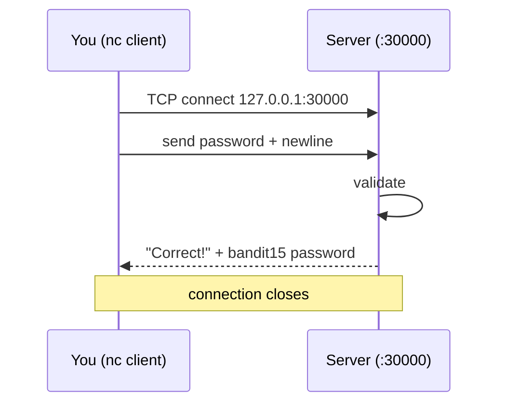

## Introduction

Every previous level lived inside the filesystem: find a file, read a file. Level 14 → 15 takes your first step onto the **network**. The password isn't in a file you can `cat` — you have to *speak to a service*. You submit the **current** level's password to a program listening on **TCP port 30000 on localhost**, and it answers with the next password.

This is where you meet **netcat (`nc`)**, the "TCP/IP Swiss Army knife." Opening a raw socket, sending bytes, and reading the reply is one of the most transferable skills in security: almost every protocol is, at bottom, "send text to a port and read text back."

## Official Challenge Objective

> **The password for the next level can be retrieved by submitting the password of the current level to port 30000 on localhost.**

**In plain English:** a small server runs on this machine, listening on port `30000`. Connect, send it the password you logged in with (the `bandit14` password), and it returns the `bandit15` password.

## Skills Covered

- Reading your *own* password from `/etc/bandit_pass/`
- Connecting to a raw TCP service with **netcat (`nc`)**
- The meaning of **localhost / 127.0.0.1** and TCP ports
- Sending data over a socket and reading the response
- The `nc -N` flag (half-close on EOF)

## My Approach

The objective wants "the password of the current level." Logged in as `bandit14`, that password is *my own*, and `bandit14` can read it from `/etc/bandit_pass/bandit14`. So: read my own password, then pipe it into a netcat connection to `127.0.0.1:30000`. The only subtlety was closing the write side cleanly so the server's reply came back — handled by `-N`.

## Step-by-Step Walkthrough

### Command

```bash
cat /etc/bandit_pass/bandit14
```

### Explanation

You are `bandit14`, permitted to read your own entry in the password store. This prints the value to submit:

```
[REDACTED]
```

### Why It Matters

`/etc/bandit_pass/` files are readable *only by the matching user* — mirroring how real systems protect per-account secrets with ownership and permissions.

---

### Command

```bash
nc -N 127.0.0.1 30000
```

### Explanation

`nc` opens a raw TCP connection to `127.0.0.1` on port `30000`. Whatever you type is sent to the server. **Paste the `bandit14` password and press Enter.** The server replies:

```
Correct!
[REDACTED]
```

That second line is the `bandit15` password.

> [!TIP]
> One-liner: `cat /etc/bandit_pass/bandit14 | nc -N 127.0.0.1 30000`

### Why It Matters

`nc` is the fundamental tool for hand-talking to services. "Connect to a port and send bytes" underlies banner grabbing, manual protocol testing, reverse shells, and quick transfers.

## Deep Dive: Cyber Security Concept

**Raw TCP sockets and netcat.** A server binds a port and waits; a client connects and they exchange bytes. `nc` lets *you* be the client.



The `-N` flag matters: by default, after netcat sends its input and hits EOF, it keeps the socket open. Some servers won't process/reply until the client signals it's done writing. `-N` **half-closes (shuts down the write side) on EOF**, prompting the server to respond, then tears down cleanly. Without it, piped one-liners can appear to hang.

> [!NOTE]
> Netcat implementations differ (traditional `nc`, OpenBSD `nc`, Nmap `ncat`). `-N` is OpenBSD-style; on `ncat` use `--send-only`. If `-N` is rejected, try `nc -q 1` or type interactively and wait.

## Offensive Security Perspective

- **Banner grabbing / manual probing:** `nc <host> <port>` then `HEAD / HTTP/1.0` reveals versions and behavior no scanner summary captures.
- **Reverse/bind shells:** the classic post-exploitation primitive.
- **Data transfer/exfil** between hosts.
- **Bespoke internal protocols:** `nc` is how you reverse and exploit them by hand.

This level is the gentlest intro: submit a value, read a value.

## Common Beginner Mistakes

- Submitting the wrong password — the service wants the *current* (`bandit14`) one.
- Connecting interactively and seeing it "hang" — use `-N` or the piped one-liner.
- Trailing whitespace when pasting the password.
- Targeting the public hostname instead of `127.0.0.1`.
- Assuming every `nc` build supports `-N`.

## Key Takeaways

- A network service is just "send bytes to a port, read bytes back"; `nc` does it by hand.
- `nc -N 127.0.0.1 30000` connects locally and half-closes on EOF so you get the reply.
- A user can read its own `/etc/bandit_pass/<user>` entry.
- `localhost`/`127.0.0.1` means "this same machine."
- Know your netcat flavor and its flags.

## How This Helps Build Cyber Security Expertise

- **Network pentesting:** manual service interaction is the base of enumeration/exploitation.
- **Protocol analysis:** speaking a protocol by hand teaches how it really works.
- **Red team:** netcat shells and transfers are baseline tooling.
- **Exploit development:** hand-talking to a service is how you trigger a bug before automating it.

## Additional Reading

- [`man ncat`](https://man7.org/linux/man-pages/man1/ncat.1.html) / [Nmap Ncat Guide](https://nmap.org/ncat/guide/index.html)
- [`man ss`](https://man7.org/linux/man-pages/man8/ss.8.html)
- [MITRE ATT&CK — T1095: Non-Application Layer Protocol](https://attack.mitre.org/techniques/T1095/)


---

## Connect with the Author

Written by **Himangshu Pan** — offensive security researcher.

- **GitHub:** [@0xSh3ru](https://github.com/0xSh3ru)
- **LinkedIn:** [in/0xsh3ru](https://www.linkedin.com/in/0xsh3ru/)

*If this walkthrough helped, follow along on GitHub and connect on LinkedIn — questions and corrections are always welcome.*
