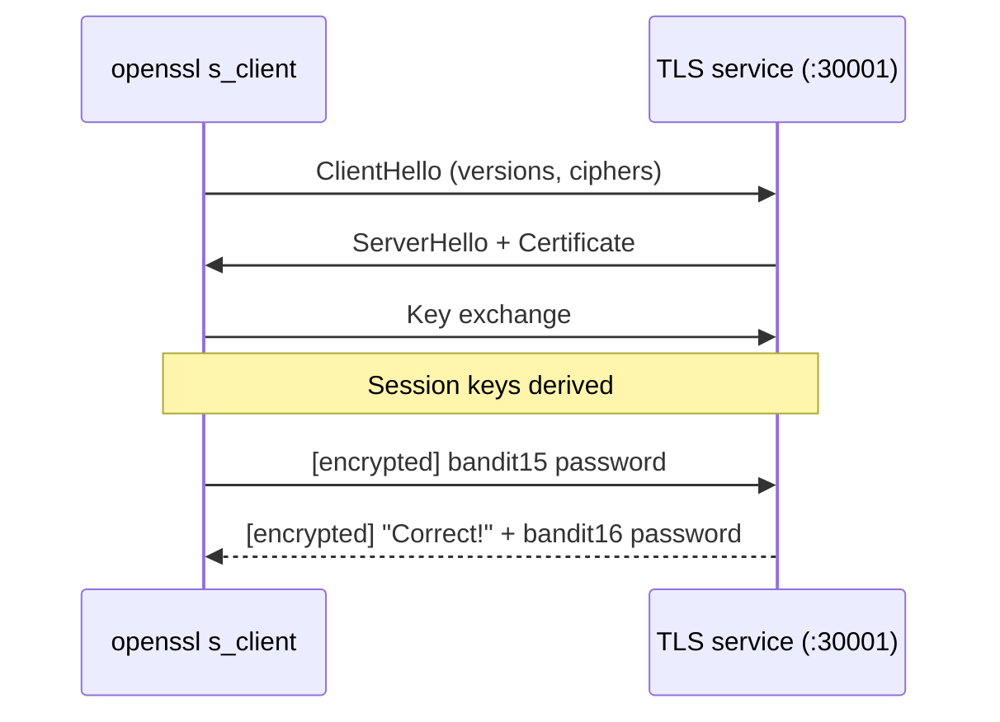

## Introduction

Level 14 → 15 taught you to talk to a plain TCP service with netcat. Level 15 → 16 is the same exercise with one twist: the service on **port 30001** is wrapped in **SSL/TLS**. Point plain `nc` at it and you connect at the TCP layer but never get a sensible reply — the server expects a **TLS handshake** netcat doesn't perform.

This level introduces `openssl s_client` and forces you to internalize the difference between a raw TCP byte stream and an *encrypted* one — a distinction behind HTTPS, secure SMTP, LDAPS, and more.

## Official Challenge Objective

> **The password for the next level can be retrieved by submitting the password of the current level to port 30001 on localhost using SSL/TLS encryption.**
>
> *Helpful note: getting "RENEGOTIATING"/"KEYUPDATE" or seeing it quit on EOF? Use `-ign_eof` (or `-quiet`) and read the "CONNECTED COMMANDS" section of the manpage. Besides `R` and `Q`, the `B` command also works in this version.*

**In plain English:** the same submit-and-receive service, now on port `30001` — but it only speaks **encrypted**. Establish a TLS connection, send the `bandit15` password through it, and receive the `bandit16` password.

## Skills Covered

- The difference between **plaintext TCP** and **TLS-encrypted** services
- Using **`openssl s_client`** to connect to a TLS port
- Reading certificate / handshake output
- Handling TLS **renegotiation / EOF** quirks (`-quiet`, `-ign_eof`)
- Recognizing "the connection works but the protocol doesn't"

## My Approach

I knew how to submit a password to a port — but the objective says *using SSL/TLS encryption*, a flashing sign that plain netcat fails. A raw `nc` to a TLS port hangs or returns garbage: the server waits for a `ClientHello` netcat never sends. The right tool is `openssl s_client`, which does the handshake and then gives an interactive channel like netcat — but encrypted. So I connected with `openssl s_client -connect localhost:30001`, sent my password, and read the reply.

## Step-by-Step Walkthrough

### Command (the wrong way, for the lesson)

```bash
nc 127.0.0.1 30001
```

### Explanation

Opens a *plain* TCP connection. The socket connects, but sent text is meaningless to a server expecting an encrypted handshake. No useful response.

### Why It Matters

**TCP connectivity is not protocol compatibility.** Reaching a port says nothing about what language the service speaks. "I can connect but it's gibberish → maybe it's encrypted" is a real diagnostic instinct.

---

### Command

```bash
openssl s_client -connect localhost:30001
```

### Explanation

`openssl s_client` is a generic TLS client. `-connect localhost:30001` performs the full handshake, prints the certificate/connection details, then drops you into an interactive session over the **encrypted** channel. **Paste the `bandit15` password and press Enter.** The server replies:

```
Correct!
[REDACTED]
```

That is the `bandit16` password.

> [!TIP]
> If the session spews `RENEGOTIATING`/`KEYUPDATE` or closes when your input ends:
> ```bash
> openssl s_client -connect localhost:30001 -quiet -ign_eof
> ```
> `-quiet` suppresses noisy output; `-ign_eof` keeps the connection open instead of sending `Q` (quit) on end-of-input — the "CONNECTED COMMANDS" behavior the hint points to.

### Why It Matters

`openssl s_client` is the de-facto tool for debugging and interacting with *any* TLS service: inspecting certs, testing ciphers, checking protocol versions, driving HTTPS/SMTPS by hand.

## Deep Dive: Cyber Security Concept

**TLS and the handshake.** TLS wraps an ordinary protocol in a tunnel providing **confidentiality**, **integrity**, and server **authentication** (via certificate). Before any application byte, both sides handshake to agree on version/cipher and derive session keys.



Plain `nc` fails because it sends cleartext into a socket waiting for a `ClientHello` — no handshake, no keys, nothing to decrypt.

The renegotiation/EOF quirks come from `s_client`'s interactive control characters: a lone capital **`R`** renegotiates, **`Q`** quits, **`B`** sends a heartbeat (this build). Piped input or a premature EOF can trigger them; `-ign_eof` and `-quiet` sidestep the noise.

> [!IMPORTANT]
> "It connected" and "it understood me" are different claims. A TCP connection to an encrypted port still requires you to *speak TLS*. When manual interaction returns garbage, suspect an encryption or binary layer before assuming the service is broken.

## Offensive Security Perspective

- **Service interrogation:** grab certs (internal hostnames, SANs, org info), enumerate TLS versions/ciphers, issue manual HTTPS requests.
- **Finding weak crypto:** spotting SSLv3/TLS1.0, weak ciphers, expired/self-signed certs (feeds `testssl.sh`, `sslscan`).
- **Pivoting through TLS** when automated tools choke on odd certificates.
- **Bypassing naive inspection:** encrypted payloads defeat plaintext IDS signatures — encryption cuts both ways.

## Common Beginner Mistakes

- Using plain `nc` on a TLS port and concluding the service is down.
- Panicking at the certificate dump — it's normal; your prompt is below it.
- The session closing on input — add `-ign_eof`/`-quiet`.
- A stray capital `R`/`Q`/`B` on its own line triggering control actions.
- Submitting the next-level password instead of the current one.

## Key Takeaways

- An encrypted service needs a TLS handshake first — plain netcat can't.
- `openssl s_client -connect host:port` hand-talks to TLS services.
- `-quiet` and `-ign_eof` tame handshake noise and EOF/renegotiation quirks.
- TCP reachability ≠ protocol understanding.
- The same skill inspects certs, tests ciphers, and drives HTTPS by hand.

## How This Helps Build Cyber Security Expertise

- **Web/app pentesting:** manual HTTPS and TLS config inspection is routine.
- **Crypto assessment:** weak TLS versions/ciphers and cert problems are standard findings.
- **Network defense:** knowing what TLS hides (and exposes) shapes monitoring.
- **Tooling literacy:** `openssl` is everywhere — keys, CSRs, cert debugging, endpoint testing.

## Additional Reading

- [`openssl-s_client` manpage](https://www.openssl.org/docs/man3.0/man1/openssl-s_client.html) — "CONNECTED COMMANDS"
- [Cloudflare — What happens in a TLS handshake?](https://www.cloudflare.com/learning/ssl/what-happens-in-a-tls-handshake/)
- [testssl.sh](https://testssl.sh/), [sslscan](https://github.com/rbsec/sslscan)
- [MITRE ATT&CK — T1573: Encrypted Channel](https://attack.mitre.org/techniques/T1573/)


---

## Connect with the Author

Written by **Himangshu Pan** — offensive security researcher.

- **GitHub:** [@0xSh3ru](https://github.com/0xSh3ru)
- **LinkedIn:** [in/0xsh3ru](https://www.linkedin.com/in/0xsh3ru/)

*If this walkthrough helped, follow along on GitHub and connect on LinkedIn — questions and corrections are always welcome.*
