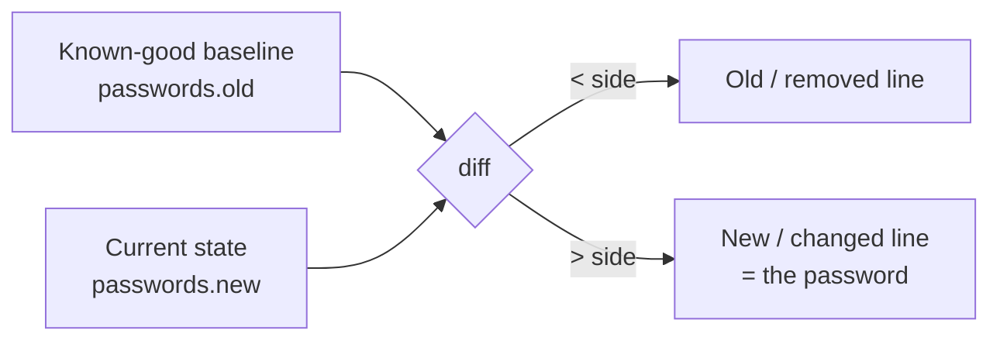

## Introduction

Most Bandit levels so far have been "find the file, read the file." This one introduces a different muscle: **comparing two things to find what changed.** You get two password files — an old one and a new one — and the password you want is the single line that differs. Both files are full of plausible 32-character strings, so reading them straight through is useless. The skill is to ask the machine to show you *only* the difference and let `diff` do it.

That instinct — *don't eyeball it, diff it* — is one of the most transferable habits in security work: configuration drift, tampered binaries, a malicious change in a pull request, a backup that no longer matches production are all "what changed between A and B?" problems.

## Official Challenge Objective

> **There are 2 files in the home directory: `passwords.old` and `passwords.new`. The password for the next level is in `passwords.new` and is the only line that has been changed between `passwords.old` and `passwords.new`.**

**In plain English:** two near-identical files differ by exactly one line. That changed line, as it appears in `passwords.new`, is the password for `bandit18`. Isolate it.

> [!NOTE]
> When you log in as `bandit18` you may see `Byebye!` and get kicked out immediately. That is the *next* level's puzzle (a booby-trapped `.bashrc`), not a mistake here.

## Skills Covered

- Comparing files with `diff`
- Reading `diff` output (the `<` and `>` markers)
- Change detection as a security primitive
- File integrity and configuration-drift thinking

## My Approach

`cat`-ing both files and eyeballing them is hopeless when every line is a random 32-character blob. So I went straight to `diff`, which compares the files line by line and prints only what doesn't match. The password was the changed line on the `passwords.new` side of the output.

## Step-by-Step Walkthrough

### Command

```bash
ssh bandit17@bandit.labs.overthewire.org -p 2220
```

### Explanation

Log in as `bandit17` on port `2220` with the previous level's password. You land in `/home/bandit17`.

### Why It Matters

Run `ls -la` on arrival to confirm both files exist and you can read them.

---

### Command

```bash
ls -la
diff passwords.old passwords.new
```

### Explanation

`ls -la` confirms `passwords.old` and `passwords.new` are present and nearly the same size. `diff` then compares them line by line and prints only the differing hunk:

```
42c42
< OldStringThatWasReplaced...
---
> [REDACTED]
```

Reading it: `42c42` = "line 42 **c**hanged." Lines marked `<` come from the **first** file (`passwords.old`); lines marked `>` come from the **second** (`passwords.new`). Since the password is in `passwords.new`, the answer is the line on the **`>` side**: `[REDACTED]`.

### Why It Matters

`diff` is the canonical Unix change-detection tool, and the `< = old / > = new` convention reappears in Git merge conflicts, code review, and patch files.

---

### Command (optional)

```bash
diff passwords.old passwords.new | grep '>' | cut -d' ' -f2
```

### Explanation

Pipes the diff through `grep '>'` (keep the new-file line) and `cut` (strip the `> ` prefix) to print just the raw password.

### Why It Matters

A tidy example of the Unix philosophy: small tools composed with pipes to extract exactly one value.

## Deep Dive: Cyber Security Concept

**Change detection and file integrity.**

This level is about answering *"Is this different from what it should be — and how?"* That question underpins:

- **File Integrity Monitoring (FIM):** AIDE, Tripwire, Samhain, and OSSEC baseline critical files and report the *diff* when an attacker drops a web shell, trojans `/bin/ls`, or edits `/etc/passwd`.
- **Configuration drift:** when running infrastructure no longer matches its version-controlled state (Terraform/Ansible/Kubernetes). Drift detection is `diff` applied to infrastructure; unexpected drift is often the first sign of an intrusion.
- **Patch-diffing:** researchers compare vulnerable and fixed binaries to find exactly which lines a security patch changed — the basis of 1-day exploit development.

> [!IMPORTANT]
> A single changed line can be the entire story — one password, one backdoored config directive, or one source line that introduces a vulnerability. The value is in the *difference*.



## Offensive Security Perspective

- **Patch-diffing for 1-days:** after Patch Tuesday, researchers diff patched binaries against the previous version; the changed functions point at the vulnerability, enabling exploits before defenders patch.
- **Confirming changes:** during red-team work, diff a captured config against a default template to spot weak settings, or diff snapshots to confirm a change took effect cleanly.
- **Secret hunting in repos:** `git diff` / `git log -p` reveal credentials committed and "removed" but still alive in history.

## Defensive Perspective

- **Deploy FIM** on `/etc`, `/bin`, `/usr/bin`, `/sbin`, web roots, and scheduled-task dirs; baseline plus re-checks turn "did anything change?" into an alertable signal.
- **Infrastructure as code + drift detection:** run scheduled `terraform plan`; unexpected diffs are investigative leads.
- **Version-control configs** so every change is a reviewable, attributable diff.
- **Detection idea:** alert when FIM reports changes to sensitive files *outside* a known maintenance window.

## Common Beginner Mistakes

- Trying to spot the difference by eye after `cat`-ing both files.
- Confusing the `<` and `>` sides — the side matches the order you typed the filenames (`diff old new` → `<` is old, `>` is new).
- Copying the `> ` prefix along with the password.
- Panicking at `Byebye!` on `bandit18` and assuming this level failed.

## Key Takeaways

- `diff A B` shows only the lines that differ.
- `<` is the first file, `>` is the second; `42c42` means line 42 **c**hanged.
- The password is in `passwords.new`, so it is on the `>` side.
- "What changed?" underlies FIM, drift detection, and patch-diffing.

## How This Helps Build Cyber Security Expertise

- **IR & forensics:** comparing a suspect system to a known-good baseline finds what an intruder altered.
- **Vulnerability research:** patch-diffing is core to finding bugs and writing 1-days.
- **DevSecOps:** drift detection and reviewable config diffs keep infrastructure secure over time.
- **Code review:** every pull request is a diff — read them critically to catch malicious or insecure changes.

## Additional Reading

- [`man diff`](https://man7.org/linux/man-pages/man1/diff.1.html), [`man cmp`](https://man7.org/linux/man-pages/man1/cmp.1.html)
- [GNU `diffutils` manual](https://www.gnu.org/software/diffutils/manual/)
- [AIDE — Advanced Intrusion Detection Environment](https://aide.github.io/)
- [MITRE ATT&CK — T1565: Data Manipulation](https://attack.mitre.org/techniques/T1565/)


---

## Connect with the Author

Written by **Himangshu Pan** — offensive security researcher.

- **GitHub:** [@0xSh3ru](https://github.com/0xSh3ru)
- **LinkedIn:** [in/0xsh3ru](https://www.linkedin.com/in/0xsh3ru/)

*If this walkthrough helped, follow along on GitHub and connect on LinkedIn — questions and corrections are always welcome.*
