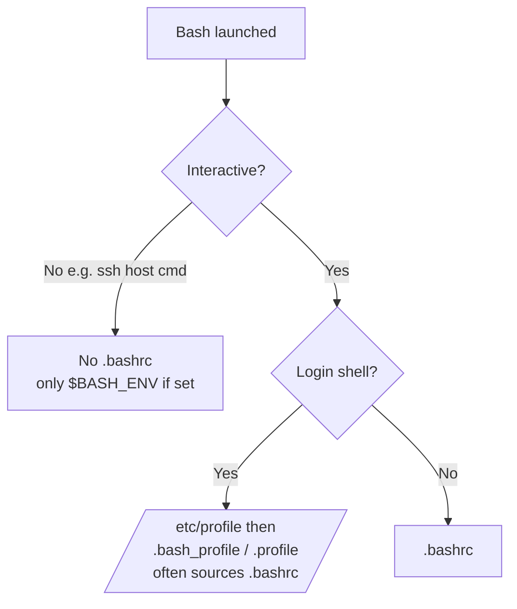

## Introduction

This is the level where the game seems to fight back. You have the `bandit18` password, you SSH in correctly — and you are instantly thrown out with a cheerful `Byebye!`. Nothing you type matters because you never get a usable prompt.

The trick is to stop thinking of SSH as "a thing that gives me a shell" and start thinking of it as "a thing that runs a command on a remote machine." Someone sabotaged `~/.bashrc` so any **interactive login shell** logs out immediately. The escape hatch: skip the interactive shell entirely — tell SSH to run one command (`cat readme`) and exit. The hostile startup logic never gets the chance to kick you.

Underneath is a genuinely important topic: **how shells choose startup files**, and the difference between *login vs non-login* and *interactive vs non-interactive* shells.

## Official Challenge Objective

> **The password for the next level is stored in a file `readme` in the home directory. Unfortunately, someone has modified `.bashrc` to log you out when you log in with SSH.**

**In plain English:** the password is in `~/readme`, easy to read *if* you could stay logged in. But `bandit18`'s `.bashrc` prints `Byebye!` and exits the moment an interactive shell starts. Read `readme` without entering that shell.

## Skills Covered

- Running a **non-interactive** command over SSH (`ssh user@host <command>`)
- Shell startup files (`.bashrc`, `.bash_profile`, `.profile`)
- Login/non-login vs interactive/non-interactive shells
- Startup scripts as a persistence/sabotage vector

## My Approach

Seeing `Byebye!`, I recognized the interactive shell — not my credentials — was the problem. Authentication was succeeding; the *shell* bailed during startup. So instead of fighting for a prompt I'd never get, I told SSH exactly what to do in one breath: connect, run `cat /home/bandit18/readme`, disconnect. A command supplied directly to SSH runs in a **non-interactive** shell, so the interactive-only sabotage never matters.

## Step-by-Step Walkthrough

### Command (the failing attempt)

```bash
ssh bandit18@bandit.labs.overthewire.org -p 2220
```

### Explanation

Authentication **succeeds** — but Bash then sources `~/.bashrc`, which has been edited to do something like `echo "Byebye!"; exit`. You see `Byebye!` and the connection closes.

### Why It Matters

This is *not* an authentication failure. Your password is correct; the hostile code runs **after** login, during shell startup. Diagnosing "is it auth, or is it the shell?" is the whole insight.

---

### Command (the solution)

```bash
ssh bandit18@bandit.labs.overthewire.org -p 2220 cat /home/bandit18/readme
```

### Explanation

Appending `cat /home/bandit18/readme` tells SSH: *run this one command and exit — no interactive shell.* SSH runs it in a **non-interactive** shell, so the interactive-only logout logic in `.bashrc` doesn't fire. You'll see the OverTheWire banner (printed by the SSH server, independent of `.bashrc`) followed by:

```
The password you are looking for is: [REDACTED]
```

> [!TIP]
> `ssh ... cat readme` works too, but the absolute path `/home/bandit18/readme` removes all doubt about the working directory.

### Why It Matters

This is the canonical demonstration that `ssh user@host <command>` runs a command remotely and returns its output — the foundation of cron, deployment scripts, Ansible, and `scp`/`rsync` over SSH, and a clean way to sidestep a hostile interactive shell.

---

### Command (alternative)

```bash
ssh bandit18@bandit.labs.overthewire.org -p 2220 -t "/bin/sh"
```

### Explanation

Request a different shell (`/bin/sh`) that doesn't source Bash's `~/.bashrc`; `-t` forces a pseudo-terminal so you get a usable prompt, from which you can `cat readme`.

### Why It Matters

Same lesson from another angle: the sabotage targets *Bash's interactive startup* specifically. Narrowly-scoped controls usually have more than one bypass.

## Deep Dive: Cyber Security Concept

**Shell startup files and the interactive/non-interactive, login/non-login matrix.**

Bash chooses startup files by *how* it was launched:

- A **login shell** reads `/etc/profile`, then the first of `~/.bash_profile`, `~/.bash_login`, `~/.profile` (which often sources `~/.bashrc`).
- A **non-login interactive shell** (new terminal tab) reads `~/.bashrc`.
- A **non-interactive shell** (`ssh host "cmd"`, scripts) reads *neither* by default — only `$BASH_ENV` if set.



The attacker's `Byebye!; exit` lives in `.bashrc` and fires for interactive shells. A non-interactive command takes the left branch — no `.bashrc`, no trap.

> [!IMPORTANT]
> Knowing which startup file runs when governs where environment variables live, where persistence hides, and why "it works in my terminal but not in cron."

## Offensive Security Perspective

- **Persistence via dotfiles:** appending a payload to `~/.bashrc`/`~/.profile` re-executes it every shell open — low-privilege persistence (MITRE T1546.004).
- **Trojaned aliases/functions:** aliasing `sudo`, `ssh`, or `ls` to a credential-harvesting wrapper from a startup file.
- **Sabotage / anti-analysis:** startup files can deny access or disrupt an investigator — and non-interactive execution is the offensive counter for working on a host with a hostile interactive shell.

## Common Beginner Mistakes

- Assuming the password is wrong because of `Byebye!` (auth succeeded; the shell logged you out).
- Repeatedly retrying the interactive login.
- Trying to edit `.bashrc` before logging in (you can't stay logged in — and don't need to).
- Forgetting to quote multi-word remote commands: `ssh ... "grep -i pass readme"`.
- Being surprised by the banner — it's printed by the SSH server, before your output.

## Key Takeaways

- `ssh user@host <command>` runs one command non-interactively and prints its output.
- A sabotaged `.bashrc` only affects interactive shells; non-interactive execution sidesteps it.
- Bash picks startup files by login/non-login and interactive/non-interactive status.
- Authentication success ≠ usable shell.
- Shell startup files are a real persistence and sabotage vector.

## How This Helps Build Cyber Security Expertise

- **Automation & ops:** non-interactive SSH is the backbone of deployment and config management.
- **Persistence hunting:** dotfile modification is a top IR check.
- **Linux internals:** the startup matrix demystifies "works here, not there" bugs.
- **Red teaming:** planting and bypassing startup sabotage are both useful techniques.

## Additional Reading

- [`man ssh`](https://man7.org/linux/man-pages/man1/ssh.1.html) — executing a command on the remote host
- [Bash manual — Startup Files](https://www.gnu.org/software/bash/manual/html_node/Bash-Startup-Files.html)
- [MITRE ATT&CK — T1546.004: Unix Shell Configuration Modification](https://attack.mitre.org/techniques/T1546/004/)
- [MITRE ATT&CK — T1059.004: Unix Shell](https://attack.mitre.org/techniques/T1059/004/)


---

## Connect with the Author

Written by **Himangshu Pan** — offensive security researcher.

- **GitHub:** [@0xSh3ru](https://github.com/0xSh3ru)
- **LinkedIn:** [in/0xsh3ru](https://www.linkedin.com/in/0xsh3ru/)

*If this walkthrough helped, follow along on GitHub and connect on LinkedIn — questions and corrections are always welcome.*
