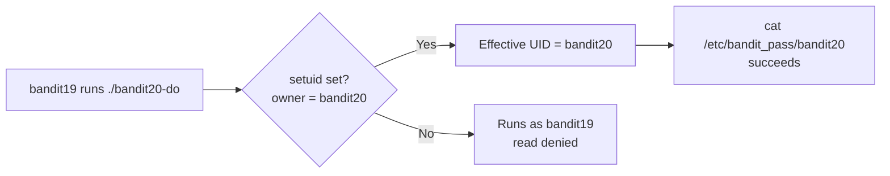

## Introduction

This level introduces one of the most important — and most dangerous — features of the Unix permission model: the **setuid bit**. You log in as `bandit19`, but the password lives in `/etc/bandit_pass/bandit20`, readable only by `bandit20`. The level hands you a small program, `bandit20-do`, that *can* read it — because it is owned by `bandit20` and carries the setuid bit, so it runs with `bandit20`'s privileges no matter who launches it.

That idea — *a program can run as a user other than the one who executed it* — is how `sudo`, `passwd`, and `ping` work, and it is also a top Linux privilege-escalation avenue. This level shows the well-behaved version of setuid.

## Official Challenge Objective

> **To gain access to the next level, you should use the setuid binary in the home directory. Execute it without arguments to find out how to use it. The password for this level can be found in the usual place (`/etc/bandit_pass`), after you have used the setuid binary.**

**In plain English:** run `bandit20-do` with no arguments to see its usage. It executes a command *as `bandit20`*. Use it to read `/etc/bandit_pass/bandit20` — which only `bandit20` may read.

## Skills Covered

- Recognizing the setuid (`s`) bit in `ls -l`
- Real vs effective UID and borrowed privileges
- Using a deliberately-scoped privileged helper
- The Bandit password location (`/etc/bandit_pass/<user>`)
- The principle of least privilege for setuid programs

## My Approach

The objective narrates itself: there's a setuid binary, run it bare to learn its usage, then use it. I listed the home directory and ran `ls -l` on `bandit20-do` specifically to *see* the setuid bit — an `s` in the owner's execute slot, ownership by `bandit20`. Running it bare showed it runs a command of my choosing as `bandit20`. From there: have it `cat` the protected password file.

## Step-by-Step Walkthrough

### Command

```bash
ls -l
```

### Explanation

You'll see the helper and its permission string:

```
-rwsr-x--- 1 bandit20 bandit19 ... bandit20-do
```

Note the **`s`** in the owner's execute position (`rws`) and that the file is **owned by `bandit20`**. That `s` is the setuid bit.

### Why It Matters

Spotting setuid in `ls -l` is core enumeration: `x` = normal; `s` = setuid (runs as owner); `S` = setuid set but not executable. The owner column tells you *whose* privileges you'd borrow.

> [!TIP]
> Hunt for all setuid binaries — a standard privesc step:
> ```bash
> find / -perm -4000 -type f 2>/dev/null
> ```

---

### Command

```bash
./bandit20-do
./bandit20-do id
```

### Explanation

Run bare, it prints its usage: it runs a command you supply, but as `bandit20`. `./bandit20-do id` proves it — your *real* UID stays `bandit19` while the *effective* UID becomes `bandit20` (`euid=...(bandit20)`).

### Why It Matters

Seeing `euid=bandit20` makes it concrete: the setuid bit changed *who the process is allowed to act as*, which is what lets the next command succeed.

---

### Command

```bash
./bandit20-do cat /etc/bandit_pass/bandit20
```

### Explanation

The helper runs `cat` as `bandit20`, so the read of the `bandit20`-only file succeeds:

```
[REDACTED]
```

### Why It Matters

This is the intended use of setuid: a narrow, owner-defined action performed with elevated privilege for a less-privileged user — exactly how `sudo` (itself setuid root) delegates specific commands.

## Deep Dive: Cyber Security Concept

**The setuid bit, real vs effective UID, and least privilege.**

Every process has a **real UID** (who launched it) and an **effective UID** (whose privileges it acts with). Normally equal. The **setuid bit** sets the effective UID to the **file owner's** UID on execution — so `bandit19` running a `bandit20`-owned setuid binary gets `euid=bandit20`.

This is legitimate: `passwd` (writes root-only `/etc/shadow`), `ping` (raw sockets), and `sudo`/`su` are all setuid root for good reasons.



> [!IMPORTANT]
> Setuid is a scoped grant of the owner's privileges. Safe only when the program does one well-defined thing and never lets the caller redirect that privilege elsewhere.

## Offensive Security Perspective

- **Find them all:** `find / -perm -4000 -type f 2>/dev/null`; `linpeas` and GTFOBins automate this.
- **Abuse over-powerful binaries:** a setuid-root binary that spawns a shell or reads arbitrary files is instant root. `bandit20-do` is benign, but a setuid binary vulnerable to command/argument injection becomes full compromise.
- **GTFOBins** lists how `vim`, `find`, `awk`, `less`, `cp` and others can be abused *when setuid* to read/write files or pop a shell as the owner.

## Common Beginner Mistakes

- `cat`-ing `/etc/bandit_pass/bandit20` directly as `bandit19` (permission denied) instead of going through the helper.
- Missing the `s` in `ls -l`.
- Running the binary without reading its usage first.
- Confusing real and effective UID — plain `id` still shows `bandit19`; run `./bandit20-do id`.
- Forgetting `./` (current dir usually isn't in `$PATH`).

## Key Takeaways

- The setuid bit (`s` in the owner-execute slot) runs a program with its **owner's** privileges.
- Real UID = who launched it; effective UID = whose privileges it acts with.
- `./bandit20-do cat /etc/bandit_pass/bandit20` borrows `bandit20`'s rights.
- `find / -perm -4000 -type f 2>/dev/null` enumerates setuid binaries.
- Setuid is legitimate but over-broad/input-trusting setuid programs are a classic root path.

## How This Helps Build Cyber Security Expertise

- **Privilege escalation:** setuid enumeration and GTFOBins abuse is a top user-to-root path.
- **Red team operations:** setuid abuse is a quiet, dependable local privesc primitive in post-exploitation.
- **Exploit development:** many local privesc exploits target setuid program bugs.
- **Cloud/host pentest:** misconfigured setuid binaries on Linux instances are a fast route to root.

## Additional Reading

- [`man chmod`](https://man7.org/linux/man-pages/man1/chmod.1.html), [`man find`](https://man7.org/linux/man-pages/man1/find.1.html)
- [Linux `credentials(7)` — real vs effective UID](https://man7.org/linux/man-pages/man7/credentials.7.html)
- [GTFOBins](https://gtfobins.github.io/)
- [MITRE ATT&CK — T1548.001: Setuid and Setgid](https://attack.mitre.org/techniques/T1548/001/)


---

## Connect with the Author

Written by **Himangshu Pan** — offensive security researcher.

- **GitHub:** [@0xSh3ru](https://github.com/0xSh3ru)
- **LinkedIn:** [in/0xsh3ru](https://www.linkedin.com/in/0xsh3ru/)

*If this walkthrough helped, follow along on GitHub and connect on LinkedIn — questions and corrections are always welcome.*
