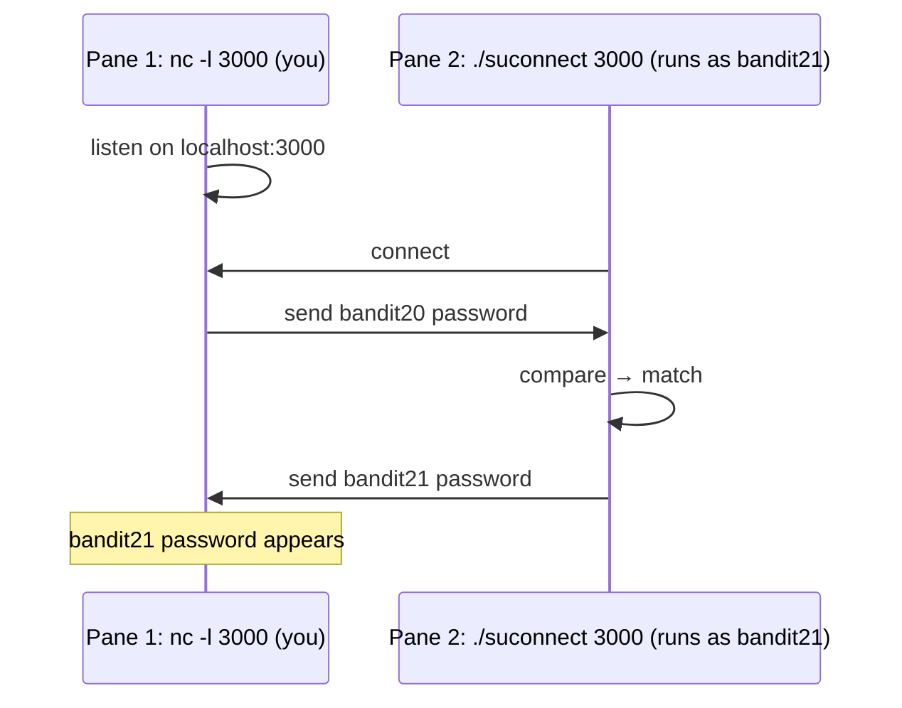

## Introduction

This is the level that turns beginners' brains inside out — in the best way. Until now every challenge was one command at a time. Here you genuinely need **two programs running simultaneously**, talking over the network: a server you set up and a client the level gives you. The setuid binary `suconnect` connects to a port *you choose* on `localhost`, reads one line, and checks whether it equals the **bandit20** password. If it matches, it returns the **bandit21** password. But `suconnect` is a *client* — it needs something on the other end. So you must *become the server*.

The leap is the **client–server model**; the practical skill is **running two things at once**. I used **tmux**, splitting one terminal into two panes so I could watch both halves of the conversation live.

## Official Challenge Objective

> **There is a setuid binary in the home directory that does the following: it makes a connection to localhost on the port you specify as a command-line argument. It then reads a line of text from the connection and compares it to the password in the previous level (bandit20). If the password is correct, it will transmit the password for the next level (bandit21).**
>
> **NOTE: Try connecting to your own network daemon to see if it works as you think.**

**In plain English:** `suconnect <port>` dials `localhost:<port>`, reads one line, and if it's the **bandit20** password it sends back the **bandit21** password. Run your own server that hands over the bandit20 password, then run `suconnect` against that port.

## Skills Covered

- The **client–server / network daemon** model
- Ad-hoc listeners with `nc` (netcat)
- Running two interdependent processes at once
- **Job control** (`&`, `Ctrl-Z`, `bg`, `fg`) and **tmux**
- Loopback (`localhost`) connections and ports
- Reusing a known credential as data fed to a service

## My Approach

The key realization: `suconnect` is the *client*, so the burden is on me to *be* the server. I stand up a listener that sends the bandit20 password when `suconnect` connects; validation happens inside `suconnect`, which replies with the bandit21 password. The timing problem — listener must be live before/during the client — is why I used tmux. `Ctrl-b %` split my terminal: left pane ran `nc -l 3000` with the bandit20 password ready; right pane ran `./suconnect 3000`. Watching both at once is what made it click.

## Step-by-Step Walkthrough

### Command (recover the password to serve)

```bash
cat /etc/bandit_pass/bandit20
```

### Explanation

Logged in as `bandit20`, you can read your own password file — the value your listener must serve. It is `[REDACTED]`.

### Why It Matters

The level hinges on feeding `suconnect` the correct previous-level password; reading it from the authoritative source avoids a slightly-wrong-string failure.

---

### Command (inspect the binary)

```bash
ls -l suconnect
./suconnect
```

### Explanation

`suconnect` is a setuid binary owned by `bandit21` (the `s` bit). Run bare, it prints usage: it takes a port, connects to `localhost` on it, reads a line, and compares it to the bandit20 password.

### Why It Matters

Setuid-`bandit21` is *why* it can hand back the bandit21 password — it runs with `bandit21`'s rights.

---

### Command (split with tmux)

```bash
tmux
# inside tmux:
#   Ctrl-b  %        vertical split
#   Ctrl-b  <arrow>  move between panes
```

### Explanation

`tmux` starts a multiplexer; the prefix is `Ctrl-b`. `Ctrl-b %` splits into two side-by-side panes; `Ctrl-b` + arrow moves focus. Now two independent shells share the screen.

> [!TIP]
> No tmux? Use job control: `nc -l 3000 &` (or start it, `Ctrl-Z`, then `bg`), then `./suconnect 3000` in the foreground. Or open a second SSH session.

### Why It Matters

Running concurrent processes — servers, monitors, captures, exploits — alongside the command that triggers them is a fundamental operational skill, especially on remote hosts.

---

### Command (Pane 1 — listen and serve)

```bash
nc -l 3000
```

### Explanation

netcat with `-l` **listens** on port 3000, becoming a tiny server. It blocks until `suconnect` connects; then paste the bandit20 password `[REDACTED]` and press Enter to send a full line. After validation, the **bandit21 password appears right here**.

### Why It Matters

This is you *being the server*. netcat is the classic ad-hoc networking tool; a listener simply waits and exchanges bytes on the socket.

---

### Command (Pane 2 — run the client)

```bash
./suconnect 3000
```

### Explanation

Point `suconnect` at the same port. It connects to `localhost:3000`, reads the line your netcat sent, compares, and on a match transmits the bandit21 password back:

```
Read: [REDACTED]
Password matches, sending next password
```

### Why It Matters

This completes the handshake — a minimal request/response protocol. Validation lives in `suconnect` (running as `bandit21`); you only had to feed it the right input.

---

### Result (Pane 1)

The netcat pane now displays the bandit21 password:

```
[REDACTED]
```

> [!NOTE]
> Start the listener **before** `./suconnect`, or the client connects to nothing and fails.

## Deep Dive: Cyber Security Concept

**The client–server model, network daemons, and concurrency.**

Networking is a conversation between a **server** (binds a port, waits) and a **client** (initiates a connection). A *port* is a numbered endpoint; `localhost` (`127.0.0.1`) is the host talking to itself. Here you played **both roles**: `nc` was the server, `suconnect` the client.



The second concept is **concurrency**: server and client must be alive at once, which is why you need job control, multiple sessions, or a multiplexer.

> [!IMPORTANT]
> A "service" is just a program listening on a port, exchanging bytes by some protocol. Once you can stand up your own listener, network services stop being magic.

## Offensive Security Perspective

- **Reverse/bind shells:** the listen-then-connect pattern here *is* how reverse shells work (`nc -lvnp 4444`). This level is that primitive, sanitized.
- **Emulating a service:** standing up a fake listener to capture exfil/credentials or satisfy a client (as with `suconnect`).
- **Recon:** `nc <host> <port>` for port testing and banner grabbing.
- **Pivoting:** netcat/`socat` build relays and tunnels.

## Defensive Perspective

- **Don't trust "localhost-only."** Any local user can reach loopback services — this level relies on that.
- **Egress filtering & monitoring** catches reverse shells (outbound connections).
- **Flag suspicious tooling:** `nc`/`ncat`/`socat` listeners on odd ports, especially from service accounts.
- **Least privilege on local daemons:** a secret-dispensing service like `suconnect` should have only the rights it needs.
- **Detection idea:** alert when a process opens a listening socket, another local process connects within seconds, and the listener emits a credential-shaped string.

## Common Beginner Mistakes

- Starting `suconnect` before the listener (connects to a closed port).
- Pasting a whitespace-mangled or wrong password — re-read from `/etc/bandit_pass/bandit20`.
- Forgetting to press Enter (the password needs a newline to be sent).
- Mismatched ports between `nc -l` and `./suconnect`.
- Trying to do it in one pane while the listener blocks the shell.
- Picking a privileged port (<1024) you can't bind — use a high port like 3000.

## Key Takeaways

- `suconnect` is a **client**; you must run the **server** (`nc -l <port>`).
- A service = a program listening on a port exchanging bytes; `localhost` is the host talking to itself.
- The bandit20 password is the input you serve; `suconnect` returns the bandit21 password.
- Two processes must be alive at once — tmux (`Ctrl-b %`), job control, or two sessions.
- Listener first, matching ports, send a full line.

## How This Helps Build Cyber Security Expertise

- **Networking fundamentals:** the handshake here underlies every protocol, scan, and exploit.
- **Offensive tooling:** netcat listeners are the basis of reverse/bind shells and exfil channels.
- **Operational fluency:** tmux and job control let you run captures and exploits concurrently on remote hosts.
- **Detection engineering:** knowing how listeners and reverse shells behave tells you what to hunt for.

## Additional Reading

- [`man nc` / `man ncat`](https://man.openbsd.org/nc.1)
- [`man tmux`](https://man7.org/linux/man-pages/man1/tmux.1.html) and the [tmux wiki](https://github.com/tmux/tmux/wiki)
- [Bash manual — Job Control](https://www.gnu.org/software/bash/manual/html_node/Job-Control.html)
- [MITRE ATT&CK — T1571: Non-Standard Port](https://attack.mitre.org/techniques/T1571/)

## Personal Reflection

This is the level where Bandit stopped feeling like "type the command, get the flag" and started feeling like real work. My note to myself at the time was blunt: *this is really the next challenging one where we need to use tmux — read the tmux docs and split the terminal in two.* That was the unlock. The moment I stopped cramming everything into one shell and split the terminal with `Ctrl-b %`, the problem rearranged itself: one pane is the server, one is the client, and I get to watch them talk.

Reading the tmux docs felt like a detour but paid off immediately, and it's a tool I now reach for constantly. More than the password, the lasting takeaway was *seeing* the client–server handshake happen live, side by side. Networking concepts I'd only read about suddenly had a shape — that's when it clicked that I wasn't just solving puzzles, I was learning to operate.


---

## Connect with the Author

Written by **Himangshu Pan** — offensive security researcher.

- **GitHub:** [@0xSh3ru](https://github.com/0xSh3ru)
- **LinkedIn:** [in/0xsh3ru](https://www.linkedin.com/in/0xsh3ru/)

*If this walkthrough helped, follow along on GitHub and connect on LinkedIn — questions and corrections are always welcome.*
