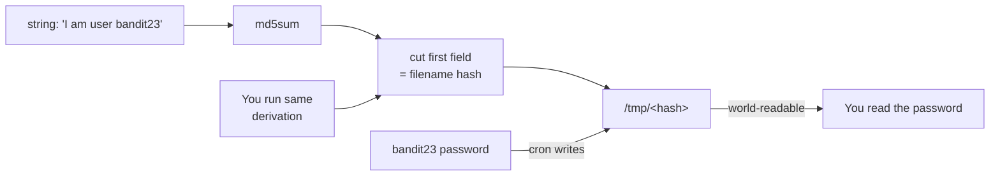

## Introduction

This level is the sequel to the last one. The same machinery is in play — a `cron` job running as a more privileged user, dumping a password into `/tmp` — but the designers added a thin layer of "obfuscation": the temp file no longer has a fixed name. Instead it is **derived** by hashing a fixed string. The point of the level is that a secret you can *recompute* is not a secret at all. This is **security through obscurity**, one of the most persistently misunderstood ideas in the field.

The skill being taught is reading a shell script carefully enough to *reproduce its logic by hand*. The lesson is that hiding something behind a derivation provides no real protection when an attacker can run the same derivation.

## Official Challenge Objective

> **A program is running automatically at regular intervals from `cron`. Look in `/etc/cron.d/` for the configuration and see what command is being executed.**
>
> *NOTE: Looking at shell scripts written by other people is a very useful skill. The script for this level is intentionally made easy to read. If you are having problems understanding what it does, try executing it to see the debug information it prints.*

**In plain English:** read the cron config, then the script. It computes the temp-file name by hashing `"I am user <name>"`. To find `bandit23`'s password, run that same hash for `bandit23` and read the resulting file.

## Skills Covered

- Reading and reasoning about an unfamiliar shell script
- Command substitution (`$(...)`) and pipelines
- Using `md5sum` and `cut` to derive a value
- Recognizing **security through obscurity** as a non-control
- Re-deriving a "hidden" filename to read another user's file

## My Approach

Read the cron file, then the script. It sets `myname=$(whoami)` and builds the target filename as the md5sum of `I am user $myname`, then copies that user's password into `/tmp/<hash>`. The beginner trap is running the script as yourself — it would dump *your* password. The insight: the filename is a pure function of the username, so I computed the hash for `bandit23` myself and read that file. No privilege needed.

## Step-by-Step Walkthrough

### Command

```bash
cat /etc/cron.d/cronjob_bandit23
```

### Explanation

The job runs as `bandit23` and executes `/usr/bin/cronjob_bandit23.sh` every minute:

```
* * * * * bandit23 /usr/bin/cronjob_bandit23.sh &> /dev/null
```

### Why It Matters

The run-as user (`bandit23`) is whose password the script can read from `/etc/bandit_pass/bandit23`.

---

### Command

```bash
cat /usr/bin/cronjob_bandit23.sh
```

### Explanation

The script is, in essence:

```bash
#!/bin/bash
myname=$(whoami)
mytarget=$(echo I am user $myname | md5sum | cut -d ' ' -f 1)
echo "Copying passwordfile /etc/bandit_pass/$myname to /tmp/$mytarget"
cat /etc/bandit_pass/$myname > /tmp/$mytarget
```

Line by line: `whoami` returns `bandit23` when cron runs it; `echo I am user $myname` makes `I am user bandit23`; the pipe hashes it and `cut -d ' ' -f 1` keeps only the hash (dropping the `  -` md5sum appends); the final line copies `bandit23`'s password into `/tmp/<hash>`.

### Why It Matters

The "secret" filename is **entirely determined by the username** — no randomness, nothing you can't reproduce.

> [!TIP]
> The official hint to *execute* the script is good practice: a script you can't follow by reading, you can often understand by running and watching its `echo "Copying ..."` debug line.

---

### Command

```bash
mytarget=$(echo I am user bandit23 | md5sum | cut -d ' ' -f 1)
echo "$mytarget"
```

### Explanation

Reproduce the derivation for `bandit23` explicitly. Store the hash in `mytarget`; the `echo` shows the path you're about to read.

### Why It Matters

You're replaying the privileged process's logic as an unprivileged user to predict where it put its output. The obscurity collapses the instant you run the same algorithm.

---

### Command

```bash
cat /tmp/$mytarget
```

### Explanation

Read the derived path. It contains the `bandit23` password:

```
[REDACTED]
```

### Why It Matters

The hashed filename bought the system nothing — one line recomputed it.

## Deep Dive: Cyber Security Concept

**Security through obscurity.**

Relying on *secrecy of design* — a hidden URL, an encoded parameter, a "random-looking" filename — rather than a real access control is security through obscurity. As a *layer* it can add friction; as your *only* control it is catastrophic.

Here the protection is "the temp file has a non-obvious name." But the name is `md5sum("I am user bandit23")` — a deterministic function of public information. Anyone who reads the (intentionally readable) script can compute it.



Kerckhoffs's principle — a system should be secure even if everything except the key is public — is the formal statement of why obscurity-as-sole-defence fails. Here there is no key, only a public derivation.

> [!IMPORTANT]
> If an attacker can recompute, guess, or enumerate the thing you rely on, it isn't protecting you. A hash of a *known* input is a *known* output — a hash is not a secret unless its input is.

## Offensive Security Perspective

Re-deriving "hidden" values is everyday offensive work: predictable backup/S3 names, reset tokens that are really `md5(email)` or a timestamp, JWT fields. During post-exploitation, attackers read every script a privileged cron/systemd unit invokes, because those scripts reveal where credentials and outputs live. The move is always the same: *find the derivation, then run it yourself.* Predictable-token and IDOR bugs are common bug-bounty findings of exactly this shape.

## Common Beginner Mistakes

- Running the script as yourself (hashes for `bandit22`, dumps your own password).
- Changing whitespace/newline in the hashed string — it must be exactly `I am user bandit23`; using `echo -n` produces a *different*, wrong hash.
- Forgetting `cut -d ' ' -f 1` and using the whole `md5sum` output as the filename.
- Assuming you must escalate to `bandit23` — you only read a file cron already wrote.

## Key Takeaways

- A filename, token, or path *derived from known inputs* is not a secret — recompute it.
- Read scripts closely enough to reproduce their behaviour by hand.
- `$(...)`, `md5sum`, and `cut` replay a derivation in one line.
- Security through obscurity is a speed bump, never a wall.

## How This Helps Build Cyber Security Expertise

- **Web/app security:** predictable-token and IDOR bugs are "the secret is derivable."
- **Cryptography literacy:** understanding why `hash(known)` isn't secret leads to nonces, salts, CSPRNGs.
- **Code review & reversing:** reading code to predict runtime behaviour underpins source review and malware analysis.
- **Privilege escalation:** privileged scripts that reveal their output paths are recurring privesc leads.

## Additional Reading

- [`man md5sum`](https://man7.org/linux/man-pages/man1/md5sum.1.html), [`man cut`](https://man7.org/linux/man-pages/man1/cut.1.html)
- [Kerckhoffs's principle (Wikipedia)](https://en.wikipedia.org/wiki/Kerckhoffs%27s_principle)
- [CWE-656: Reliance on Security Through Obscurity](https://cwe.mitre.org/data/definitions/656.html)
- [CWE-330: Use of Insufficiently Random Values](https://cwe.mitre.org/data/definitions/330.html)


---

## Connect with the Author

Written by **Himangshu Pan** — offensive security researcher.

- **GitHub:** [@0xSh3ru](https://github.com/0xSh3ru)
- **LinkedIn:** [in/0xsh3ru](https://www.linkedin.com/in/0xsh3ru/)

*If this walkthrough helped, follow along on GitHub and connect on LinkedIn — questions and corrections are always welcome.*
