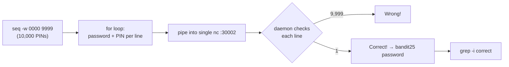

## Introduction

After three cron levels, this one swings back to the network and to a technique everyone has heard of but few have *implemented* by hand: **brute forcing**. A daemon on port 30002 trades you the `bandit25` password, but only if you send the `bandit24` password *plus* a secret 4-digit PIN. No leak, no derivation — the challenge tells you outright the only way is to try all 10,000 PINs. The art is doing it *efficiently*: generating every candidate and feeding them all down a **single** connection.

The skill is constructing and delivering a brute-force attack against a network service. The lesson is **keyspace and the absence of throttling** — why a small keyspace with no rate limiting is trivially defeated, and how to exploit that gap.

## Official Challenge Objective

> **A daemon is listening on port 30002 and will give you the password for `bandit25` if given the password for `bandit24` and a secret numeric 4-digit pincode. There is no way to retrieve the pincode except by going through all 10000 combinations, called brute-forcing. You do not need to create new connections each time.**

**In plain English:** connect to port 30002 and send lines of `<bandit24-password> <pin>`. The PIN is unguessable by reasoning, so try `0000` through `9999`. The service accepts many guesses over one connection — so pipe all 10,000 lines in at once.

## Skills Covered

- Connecting to a TCP service with `netcat` (`nc`)
- Generating a numeric sequence with `seq` (zero-padding via `-w`)
- Building input with a shell `for` loop / pipeline
- Brute-forcing a small keyspace over a single connection
- Filtering output with `grep`
- Understanding keyspace size and how the absence of rate limiting opens the door to brute force

## My Approach

Brute force is the intended path and the daemon doesn't require a fresh connection per attempt, so I generate all 10,000 lines (`<bandit24-password> <pin>`) and stream them into one `nc` session. The key correctness detail is **zero-padding** — the PIN is four digits, so I send `0000`, `0001`, …, which `seq -w` does automatically. Then I sift the output for the one line that isn't "Wrong!".

## Step-by-Step Walkthrough

### Command

```bash
cat /etc/bandit_pass/bandit24
```

### Explanation

You need your own `bandit24` password to authenticate, since each guess is `<password> <pin>`. As `bandit24` you can read it directly (shown as `[REDACTED]`).

### Why It Matters

The daemon authenticates the *known* half (your password) and brute-forces only the *unknown* half (the PIN). Knowing which part you hold is the first step of any credential attack.

---

### Command

```bash
for i in $(seq -w 0000 9999); do echo "[REDACTED] $i"; done | nc 127.0.0.1 30002
```

### Explanation

The whole attack in one line:

- `seq -w 0000 9999` emits every integer 0–9999, **width-padded** to four digits (`-w` = equal width, leading zeros). Essential because the PIN is exactly four digits.
- The `for` loop wraps each PIN with your password and a space, producing 10,000 `<password> <pin>` lines.
- The pipe feeds them all into **one** `nc` connection to the local daemon, which replies "Wrong!" to each bad guess and the success line to the correct one.

### Why It Matters

This is the practical mechanics of brute force: enumerate the keyspace, format each candidate exactly, deliver as fast as the protocol allows. One connection (as the level permits) is far faster than a handshake per attempt.

> [!TIP]
> Cut the noise with `grep`: `... | nc 127.0.0.1 30002 | grep -i correct`, or save to a file and `grep -iv wrong out.txt`.

---

### Command

```bash
for i in $(seq -w 0000 9999); do echo "[REDACTED] $i"; done | nc 127.0.0.1 30002 | grep -i correct
```

### Explanation

Same attack, filtered to the success line. The daemon answers a correct guess with:

```
Correct!
The password of user bandit25 is [REDACTED]
```

### Why It Matters

Isolating the signal from thousands of lines (`grep`) is as important as launching the attack. Success-vs-failure response differences are what you key on in any brute-force or fuzzing campaign.

---

### Command

```bash
ssh bandit25@bandit.labs.overthewire.org -p 2220
```

### Explanation

Log out and reconnect as `bandit25` with the recovered password.

### Why It Matters

You obtained a credential by exhaustively searching a small keyspace — brute force applied where it's the optimal choice.

## Deep Dive: Cyber Security Concept

**Brute forcing, keyspace, and the absence of rate limiting.**

Brute forcing tries every possible value. Feasibility depends on the **keyspace**. A 4-digit decimal PIN is:

```
10 × 10 × 10 × 10 = 10^4 = 10,000 possibilities
```

That's tiny — checkable in seconds. Compare an 8-char password from 95 ASCII chars: 95^8 ≈ 6.6 × 10^15, fifteen orders larger and infeasible to exhaust naïvely. **Keyspace size is the biggest factor in whether brute force works.**

The second factor is whether the target lets you try fast — and this one does. The daemon has **no rate limiting, no lockout, and invites single-connection reuse**, so every obstacle to brute force is absent. That is the attacker's opening: with no cap on attempts per second or guesses per connection, a 10,000-value keyspace collapses in seconds. Any one of those barriers — throttling, lockout, per-attempt cost, or one-guess-per-connection — would have forced you to slow down; here none of them stand in the way.



> [!IMPORTANT]
> Resistance to brute force = *keyspace* × *the rate the target allows*. A 4-digit PIN is weak on the first; an unthrottled service on the second. This level fails both — solvable in seconds.

## Offensive Security Perspective

The mechanics scale to real tooling: `hydra`/`medusa`/`ncrack` brute-force SSH/FTP/RDP/HTTP with the same "enumerate, format, fire" loop. PINs and OTPs are prime targets — real breaches came from brute-forcing 2FA codes on endpoints lacking rate limiting. Against human passwords, dictionary attacks (`rockyou.txt`) plus rules beat pure brute force. `ffuf`/`gobuster`/Burp Intruder apply the concept over HTTP. Efficiency — reusing connections, parallelizing, tuning just under rate limits — is a real operator skill; this level's single-connection batch is the simplest version.

## Common Beginner Mistakes

- **Forgetting `-w`** — `seq 0 9999` drops leading zeros, so guesses don't match a 4-digit PIN.
- **A new connection per guess** — 10,000 handshakes is needlessly slow; the level says you don't need to.
- **Wrong line format** — must be `<password><space><pin>`; a missing space breaks every guess.
- **Drowning in output** — pipe through `grep` to surface `Correct!`.
- **`localhost` quirks** — `127.0.0.1` is reliable.

## Key Takeaways

- Brute force is viable with a small keyspace and no throttling — a 4-digit PIN (10,000) is the textbook case.
- Generate the full set, format exactly, deliver efficiently (one connection here).
- `seq -w` zero-pads to equal width — essential for fixed-length numeric secrets.
- `grep` turns a flood of failures into the one success line.
- The barriers that would stop brute force (rate limiting, lockout, cost-per-attempt, a large keyspace) are exactly what this target lacks — which is the whole opening.

## How This Helps Build Cyber Security Expertise

- **Password attacks:** you understand from the ground up what `hydra`/Burp Intruder automate.
- **Target assessment:** "what's the keyspace and is there throttling?" becomes reflex when sizing up auth for brute force.
- **Web/API pentesting:** the same enumerate-format-fire loop drives credential stuffing, OTP/2FA brute forcing, and parameter fuzzing.
- **Tooling fluency:** hand-rolling the attack first makes you sharper at tuning threads, connection reuse, and request rates in `hydra`/`ffuf`.

## Additional Reading

- [`man seq`](https://man7.org/linux/man-pages/man1/seq.1.html), [`man nc`](https://man.openbsd.org/nc.1), [`man grep`](https://man7.org/linux/man-pages/man1/grep.1.html)
- [MITRE ATT&CK — T1110: Brute Force](https://attack.mitre.org/techniques/T1110/)
- [Hydra — network logon cracker](https://github.com/vanhauser-thc/thc-hydra)
- [ffuf — fast web fuzzer](https://github.com/ffuf/ffuf)
- [SecLists — wordlists for brute forcing](https://github.com/danielmiessler/SecLists)


---

## Connect with the Author

Written by **Himangshu Pan** — offensive security researcher.

- **GitHub:** [@0xSh3ru](https://github.com/0xSh3ru)
- **LinkedIn:** [in/0xsh3ru](https://www.linkedin.com/in/0xsh3ru/)

*If this walkthrough helped, follow along on GitHub and connect on LinkedIn — questions and corrections are always welcome.*
