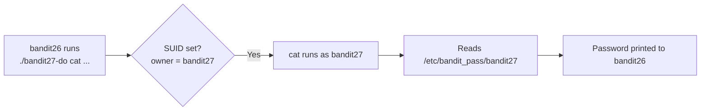

## Introduction

After the hard-won shell escape of Level 25 → 26, this level is a breather and a deliberate callback. Sitting in `bandit26`'s home directory is a `bandit27-do` binary — the same **SUID-helper** pattern you met in Level 19 → 20 with `bandit20-do`. The lesson is reinforcement: a setuid program runs a single command *as another user*, which is exactly enough to read the next password.

The concept under the hood — **SUID (Set User ID) binaries** — is one of the most important privilege primitives in Linux, so it is worth seeing twice.

## Official Challenge Objective

> **Good job getting a shell! Now grab the password for bandit27.**

**In plain English:** you escaped the restricted shell and now have a real bash prompt as `bandit26`. Find and read the password for `bandit27` — the tool to do it is in your home directory.

## Skills Covered

- Recognising a SUID helper binary (`*-do`)
- Running a command *as another user* via a setuid program
- Reading a permission-protected password file through that helper
- Connecting back to the SUID lesson from Level 19 → 20

## My Approach

The hard part was the previous level — getting a shell as `bandit26`. Once I had that bash prompt (via the `more → vi → :shell` escape), I listed the home directory and spotted `bandit27-do`. I'd seen this exact pattern with `bandit20-do`: a setuid binary that runs whatever command you give it *as the next user*. So I pointed it at `bandit27`'s password file and let its elevated privileges do the reading.

> [!NOTE]
> If you logged out after escaping, you'll have to redo the Level 25 → 26 breakout — the SSH login alone still drops you into `showtext`. Stay in the shell you escaped to.

## Step-by-Step Walkthrough

### Command

```bash
ls -la
file ./bandit27-do
```

### Explanation

List the home directory; you'll see `bandit27-do`. The long listing shows an `s` in the owner's execute slot — the **SUID bit**:

```
-rwsr-x--- 1 bandit27 bandit26 ... bandit27-do
```

`file` confirms a `setuid ELF executable`. Owner is `bandit27`, so the SUID bit makes it run *as bandit27* even though *you* (bandit26) launch it.

### Why It Matters

That `s` in `-rwsr-x---` is the whole game. SUID lets an unprivileged user perform a privileged action through a scoped program — and is also a top Linux privesc vector when the program is too generous.

---

### Command

```bash
./bandit27-do cat /etc/bandit_pass/bandit27
```

### Explanation

`bandit27-do` executes its arguments as user `bandit27`. We tell it to `cat` `bandit27`'s password file — unreadable by you directly, but readable by `bandit27`. The binary runs `cat` with `bandit27`'s effective UID and prints:

```
[REDACTED]
```

### Why It Matters

This is the *intended* use of a SUID helper — and what makes overly-permissive ones dangerous. `bandit27-do` will run **any** command as `bandit27`. A real-world `*-do` running arbitrary commands as root would be a complete privesc hole.

## Deep Dive: Cyber Security Concept

**SUID (Set User ID) binaries — revisited.**

A normal program runs with the caller's privileges. A **SUID** program's *effective* UID becomes the file's **owner**. That `s` bit (`chmod u+s`, octal `4000`) lets ordinary users perform actions requiring someone else's privileges — e.g. `/usr/bin/passwd` is SUID-root so users can update root-owned `/etc/shadow`.

Here `bandit27-do` is SUID-`bandit27`, so the `cat` it spawns reads `bandit27`'s protected file. The danger is generality: a SUID program should do *one* scoped privileged thing. The moment it runs an *arbitrary* command, it becomes a privilege handoff — whoever can execute it inherits the owner's access.

> [!IMPORTANT]
> SUID elevates to the file's **owner**. A SUID-root binary that runs arbitrary commands is an instant root shell. `find / -perm -4000` is a first-line privesc check.



## Offensive Security Perspective

SUID enumeration is a reflex on every Linux engagement:

```bash
find / -perm -4000 -type f 2>/dev/null
```

Each hit is a candidate: *is it on [GTFOBins](https://gtfobins.github.io/)?* *can I make it run my command?* A SUID-root `find`, `vim`, `bash`, `cp`, or custom `*-do` wrapper is a fast path to root. `linpeas`/`linenum` automate the hunt. `bandit27-do` is the scoped, friendly version of a root-ending vulnerability.

## Common Beginner Mistakes

- Logging out after the Level 25 → 26 escape, then landing in `showtext` again.
- Trying to `cat` the password file directly (permission denied) instead of via the helper.
- Forgetting `./` when running a binary in the current directory.
- Over-quoting the command — `./bandit27-do cat /etc/bandit_pass/bandit27` is all you need.

## Key Takeaways

- A `*-do` binary is a SUID helper that runs commands as another user.
- The `s` in `-rwsr-x---` is the SUID bit; effective UID becomes the owner.
- SUID is the same primitive from Level 19 → 20 — learn it once.
- A SUID program that runs arbitrary commands is a privilege handoff.
- `find / -perm -4000` is a first-line privesc enumeration command.

## How This Helps Build Cyber Security Expertise

- **Privilege escalation:** SUID abuse is a core Linux privesc technique.
- **Red-team craft:** chaining a SUID GTFOBins binary into a shell as its owner (often root) is a fast, reliable escalation on real engagements.
- **Exploit development:** how the effective UID transitions on `execve` underpins crafting and abusing setuid-based privilege handoffs.

## Additional Reading

- [GTFOBins — SUID](https://gtfobins.github.io/#+suid)
- [`man chmod`](https://man7.org/linux/man-pages/man1/chmod.1.html), [`setuid(2)`](https://man7.org/linux/man-pages/man2/setuid.2.html)
- [`man capabilities`](https://man7.org/linux/man-pages/man7/capabilities.7.html)
- [MITRE ATT&CK — T1548.001: Setuid and Setgid](https://attack.mitre.org/techniques/T1548/001/)


---

## Connect with the Author

Written by **Himangshu Pan** — offensive security researcher.

- **GitHub:** [@0xSh3ru](https://github.com/0xSh3ru)
- **LinkedIn:** [in/0xsh3ru](https://www.linkedin.com/in/0xsh3ru/)

*If this walkthrough helped, follow along on GitHub and connect on LinkedIn — questions and corrections are always welcome.*
