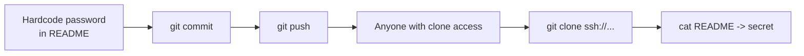

## Introduction

Bandit now pivots from filesystem and shell tricks to **version control** — specifically Git. The next four levels tour how secrets leak through Git, and this is the on-ramp: clone a repository over SSH and read a password someone committed straight into the repo's files.

It sounds too easy, by design. The point is a sobering real-world truth: **source-control repositories are full of secrets**, because developers commit credentials, keys, and tokens all the time. Cloning and reading a repo is the first move in a discipline red teamers and bug-bounty hunters practise constantly.

## Official Challenge Objective

> **There is a git repository at `ssh://bandit27-git@bandit.labs.overthewire.org/home/bandit27-git/repo` via port 2220. The password for `bandit27-git` is the same as for `bandit27`. Clone the repository and find the password for the next level.**

**In plain English:** clone a Git repo reachable over SSH (using the `bandit27` password). The `bandit28` password is in the cloned files. Note: clone it **from your local machine**, not from inside the Bandit server.

## Skills Covered

- Cloning a Git repository over SSH (`git clone ssh://...`)
- Specifying a non-default SSH port for Git (`:2220` in the URL)
- Working in a temporary directory
- Inspecting a repository's working tree
- Recognising secrets committed into source control

## My Approach

The objective says clone from my *local* machine, so I didn't try it inside the Bandit session — I opened a terminal on my own box, made a throwaway directory, and ran `git clone` against the SSH URL. Git prompted for a password — just the `bandit27` password again (shared by `bandit27-git`). The working tree had a single `README` with the password in plaintext. No history spelunking needed — that's the *next* level.

> [!TIP]
> Make a scratch directory first (`mktemp -d` or `cd /tmp && mkdir myrepo`). A clean folder prevents collisions and makes cleanup trivial.

## Step-by-Step Walkthrough

### Command

```bash
mkdir -p /tmp/bandit27 && cd /tmp/bandit27
```

### Explanation

Create and enter a temporary directory **on your local machine** for the clone. Using `/tmp` keeps your home clean and lets you wipe everything in one `rm -rf`.

### Why It Matters

Cloning repos into a disposable directory isolates the files and simplifies cleanup — the same hygiene keeps loot from different targets organized during an engagement.

---

### Command

```bash
git clone ssh://bandit27-git@bandit.labs.overthewire.org:2220/home/bandit27-git/repo
```

### Explanation

`git clone` copies a remote repo (files *and* full history). `ssh://` transports over SSH; `:2220` is Bandit's non-standard port; `bandit27-git@...` is the user; `/home/bandit27-git/repo` is the path. Enter the **`bandit27`** password when prompted.

```
Cloning into 'repo'...
bandit27-git@...'s password:
Receiving objects: 100% ...
```

### Why It Matters

Cloning over SSH on a non-default port is a practical real-world skill. The port-in-URL syntax trips people up, so memorise it.

> [!NOTE]
> For SSH login on Bandit you use `-p 2220`. For Git `ssh://` URLs the port goes *inside* the URL as `:2220`. Same idea, different syntax.

---

### Command

```bash
cd repo
ls -la
cat README
```

### Explanation

Enter the repo, list contents, read the `README`. The secret is in plaintext:

```
The password to the next level is: [REDACTED]
```

### Why It Matters

A credential committed directly into a tracked file — no history needed. In the real world this is an exposed `.env`, a `config.yml` with a DB password, or an AWS key pushed in a script.

## Deep Dive: Cyber Security Concept

**Secrets in source control.**

Git repos are one of the richest sources of leaked credentials. Every hardcoded password, key, or token committed becomes part of the repo, readable by anyone who can clone it — a set far larger than intended (teammates, CI, contractors, attackers if public or the host is compromised).

Two flavours, taught in sequence:

1. **Secret in the working tree** (this level): in a tracked file *now*. Clone, `cat`, done.
2. **Secret in history only** (next level): committed, then "removed" later — but Git never forgets.



> [!IMPORTANT]
> A secret in a repo is exposed to everyone with clone access. Treat any credential that has ever touched a repo as compromised.

## Offensive Security Perspective

Hunting secrets in repos is high-yield:

- **Bug bounty & recon:** `trufflehog`, `gitleaks`, `git-secrets` scan repos and history for high-entropy strings and known key formats. One leaked AWS key can be critical.
- **Public exposure:** GitHub/GitLab are scraped constantly; leaked keys are abused within *minutes*.
- **Internal pivoting:** cloning internal Git servers and CI configs yields DB passwords, service tokens, and deploy keys.

The instinct: *if there's a repo, clone it and read it.*

## Common Beginner Mistakes

- Cloning from inside the Bandit server instead of locally.
- Putting the port as `-p 2220` instead of `:2220` inside the `ssh://` URL.
- Expecting a new password instead of reusing `bandit27`'s.
- Missing that `README` (no extension) holds the secret.
- Cloning into a cluttered directory and losing track of it.

## Key Takeaways

- `git clone ssh://user@host:port/path` clones over SSH on a non-default port.
- Repos commonly contain secrets in tracked files.
- Clone untrusted repos into a disposable directory.
- A secret in a repo is exposed to everyone with clone access.
- This level: secrets in the working tree; next level: secrets in history.

## How This Helps Build Cyber Security Expertise

- **Recon & bug bounty:** secret-scanning repos is core, high-impact recon.
- **Red team & internal pivoting:** cloning internal Git servers and CI configs after a foothold yields DB passwords, service tokens, and deploy keys.
- **Cloud pentest:** a leaked AWS/GCP key in a repo is an instant pivot into the target's cloud.

## Additional Reading

- [Pro Git — `git clone`](https://git-scm.com/docs/git-clone)
- [gitleaks](https://github.com/gitleaks/gitleaks), [trufflehog](https://github.com/trufflesecurity/trufflehog)
- [GitHub — Removing sensitive data from a repository](https://docs.github.com/en/authentication/keeping-your-account-and-data-secure/removing-sensitive-data-from-a-repository)
- [MITRE ATT&CK — T1552.001: Credentials In Files](https://attack.mitre.org/techniques/T1552/001/)


---

## Connect with the Author

Written by **Himangshu Pan** — offensive security researcher.

- **GitHub:** [@0xSh3ru](https://github.com/0xSh3ru)
- **LinkedIn:** [in/0xsh3ru](https://www.linkedin.com/in/0xsh3ru/)

*If this walkthrough helped, follow along on GitHub and connect on LinkedIn — questions and corrections are always welcome.*
