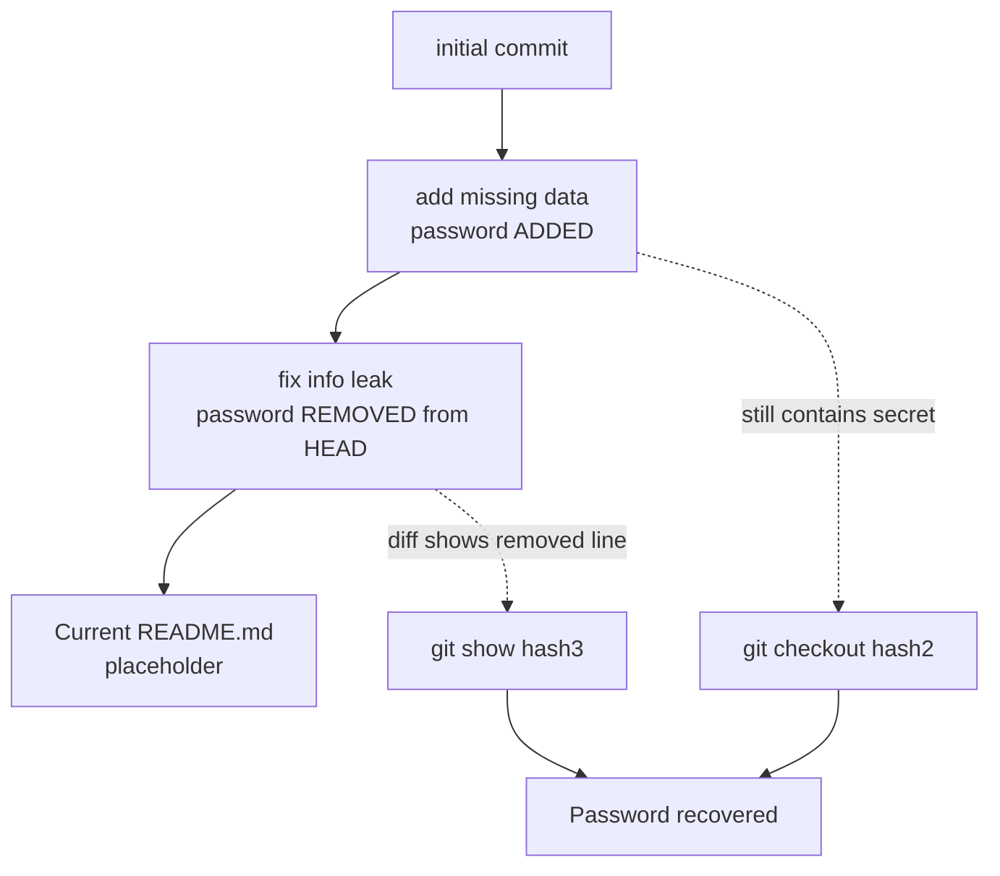

## Introduction

The previous level put a password in plain sight inside a repo's `README`. This level patches that mistake — and teaches why the patch *doesn't work*. You clone the repo, open the `README`, and the password is redacted. Frustrating, until you remember the most important fact about Git: **it never forgets.** Every version of every file lives in history. A secret "removed" in a later commit still sits intact in an earlier one.

This is one of the series' most important real-world lessons. Countless breaches trace to a developer committing a key, committing a "fix" that deletes it, and assuming the problem is solved. It isn't — the key lives forever in history until the secret is *rotated*.

## Official Challenge Objective

> **There is a git repository at `ssh://bandit28-git@bandit.labs.overthewire.org/home/bandit28-git/repo` via port 2220. The password for `bandit28-git` is the same as for `bandit28`. Clone the repository and find the password for the next level.**

**In plain English:** clone another Git repo over SSH from your local machine (password = `bandit28`'s). The current `README.md` won't hand you the password — it's changed. Dig through the commit *history* to find the version that still contains it.

## Skills Covered

- Cloning a Git repo over SSH (recap)
- Reading commit history (`git log`)
- Inspecting historical file versions (`git show`, `git checkout`)
- Understanding that deleting a secret in a new commit does **not** remove it
- Real-world git-history secret recovery

## My Approach

I cloned the repo as before, expecting a freebie — but `README.md` showed the password blanked out with a placeholder. That's the tell: the secret *was* there and got "cleaned up." So I ran `git log` and found a telling sequence — `initial commit`, `add missing data`, and a final `fix info leak`. "fix info leak" *removed* the password; "add missing data" *added* it. I checked out the `add missing data` commit and read `README.md` there — the full credential was intact.

> [!TIP]
> Commit *messages* are a roadmap. "fix leak", "remove secret", "oops", "revert" are signposts that the *previous* file state holds something interesting.

## Step-by-Step Walkthrough

### Command

```bash
mkdir -p /tmp/bandit28 && cd /tmp/bandit28
git clone ssh://bandit28-git@bandit.labs.overthewire.org:2220/home/bandit28-git/repo
cd repo
cat README.md
```

### Explanation

Same clone as the last level, run **locally** (password is `bandit28`'s). Reading the current `README.md` is a dead end — the password is redacted:

```
## credentials
- username: bandit29
- password: xxxxxxxxxx
```

The placeholder signals a *history* problem, not a working-tree one.

### Why It Matters

Recognising a "scrubbed" file is a skill. A placeholder/blank/`REDACTED` where a value belongs prompts an attacker to ask "what was here before?" — and in Git that always has an answer.

---

### Command

```bash
git log
```

### Explanation

`git log` prints history newest-first with hash, author, date, and message:

```
commit <hash3>  fix info leak
commit <hash2>  add missing data
commit <hash1>  initial commit
```

The password was *added* in "add missing data" and *removed* in "fix info leak". The version you want is at "add missing data".

### Why It Matters

`git log` is the entry to the time machine. Reading messages to locate when a secret entered and left is exactly how scanners and IR teams reconstruct an exposure timeline.

---

### Command

```bash
git show <hash3>   # the "fix info leak" commit
```

### Explanation

`git show` on the leak-fix commit displays its diff. Because the commit *removed* the password, the diff shows the deleted line (prefixed `-`) containing the real credential — often the fastest route:

```diff
-- password: [REDACTED]
+- password: xxxxxxxxxx
```

### Why It Matters

A diff that *deletes* a secret displays it in full. "Removing" a secret in Git is the act that most cleanly *documents* it.

---

### Command

```bash
git checkout <hash2>   # the "add missing data" commit
cat README.md
```

### Explanation

`git checkout <commit>` rewinds the working tree (a harmless "detached HEAD"). At "add missing data", `README.md` still holds the live credential:

```
## credentials
- username: bandit29
- password: [REDACTED]
```

`git checkout main` (or `master`) returns you to the latest commit.

### Why It Matters

`git show` and `git checkout` are two routes to the same buried data — diff-reading and time-travel. Fluency in both lets you extract whatever a repo's history holds.

## Deep Dive: Cyber Security Concept

**You cannot un-leak a secret by deleting it in a new commit.**

Git is content-addressed and append-only. "Deleting" a line and committing doesn't erase old content — it adds a new commit lacking it, while the old commit and the blob holding the secret remain fully retrievable by anyone who can clone the repo (via `git log`, `git show`, `git checkout`, `git reflog`, `git cat-file`).

The only correct response to a committed secret:

1. **Rotate it** — change the value so the exposed one is worthless.
2. *Then* optionally scrub history (`git filter-repo`, BFG) — cleanup, not remediation; clones/forks may already hold it.



> [!IMPORTANT]
> Deleting a secret in a follow-up commit does **not** remediate it. The instant a secret is pushed, assume it's compromised and **rotate it**. History scrubbing is secondary.

## Offensive Security Perspective

- **Automated history scanning:** `trufflehog`, `gitleaks`, and `git log -S<string>` (the pickaxe) sweep *all* history, surfacing keys "removed" months ago.
- **Forks and mirrors:** scrubbed history survives in forks, clones, CI caches — an attacker needs one copy.
- **Reflog and dangling commits:** `git reflog` resurrects "deleted" branches and rebased-away commits.

This level's `git show <leak-fix>` trick — reading the secret from the commit that "removed" it — is used constantly in source-code review.

## Defensive Perspective

- **Rotate first, always.** Changing the secret is the only thing that makes the exposed value safe.
- **Scan history, not just HEAD.** A clean working tree means nothing if history is dirty.
- **Pre-commit hooks** (`gitleaks protect`, `git-secrets`) to block secrets before they're committed.
- **Purge with `git filter-repo`/BFG** when needed, but coordinate with everyone holding clones/forks and rotate regardless.
- **Treat "secret committed" as an incident:** rotate, audit usage, check access logs for the exposure window.

## Common Beginner Mistakes

- Giving up at the redacted `README.md`.
- Ignoring commit messages — "fix info leak" is the loudest hint.
- Only checking the latest commit, never running `git log`.
- Panicking over "detached HEAD" (harmless; `git checkout main` returns you).
- Assuming a deleted secret is gone — the whole point is that it isn't.

## Key Takeaways

- Git history is permanent; deleting a secret in a new commit doesn't remove it.
- `git log` reads history; commit messages map where secrets entered and left.
- `git show <commit>` reveals a removed secret from its deletion diff.
- `git checkout <commit>` time-travels to read old file versions.
- The only real fix for a leaked secret is to **rotate it**.

## How This Helps Build Cyber Security Expertise

- **Source-code review & bug bounty:** history mining finds credentials surface scans miss.
- **Incident response:** reconstructing when and how long a secret was exposed is a Git-history skill.
- **DevSecOps:** knowing deletion isn't remediation drives rotate-then-scrub playbooks and pre-commit scanning.

## Additional Reading

- [Pro Git — Viewing Commit History (`git log`)](https://git-scm.com/book/en/v2/Git-Basics-Viewing-the-Commit-History)
- [`git log -S` (the pickaxe)](https://git-scm.com/docs/git-log#Documentation/git-log.txt--Sltstringgt)
- [BFG Repo-Cleaner](https://rtyley.github.io/bfg-repo-cleaner/), [`git filter-repo`](https://github.com/newren/git-filter-repo)
- [GitHub — Removing sensitive data from a repository](https://docs.github.com/en/authentication/keeping-your-account-and-data-secure/removing-sensitive-data-from-a-repository)
- [MITRE ATT&CK — T1552.001: Credentials In Files](https://attack.mitre.org/techniques/T1552/001/)


---

## Connect with the Author

Written by **Himangshu Pan** — offensive security researcher.

- **GitHub:** [@0xSh3ru](https://github.com/0xSh3ru)
- **LinkedIn:** [in/0xsh3ru](https://www.linkedin.com/in/0xsh3ru/)

*If this walkthrough helped, follow along on GitHub and connect on LinkedIn — questions and corrections are always welcome.*
