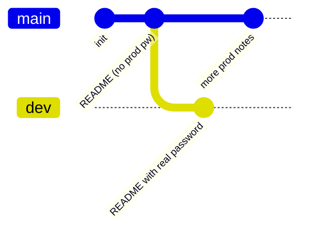

## Introduction

By now you have cloned a Git repository and dug through its commit history. Level 29 → 30 sharpens that lesson with one easy-to-miss detail: **the thing you are looking for is not on the branch you cloned.**

When you `git clone`, the working tree shows you exactly one branch — usually `master` or `main`, the "production" view. But a repository is not one timeline; it is a *tree* of timelines. Feature work, experiments, and — very often — secrets someone "didn't want in production" live on other branches that are invisible until you go looking. The skill here is **branch enumeration**: listing *every* ref a repository carries, not just the checked-out one.

## Official Challenge Objective

> **There is a git repository at `ssh://bandit29-git@localhost/home/bandit29-git/repo` via the port `2220`. The password for the user `bandit29-git` is the same as for the user `bandit29`. Clone the repository and find the password for the next level.**

**In plain English:** SSH in as `bandit29`, clone the repo over SSH from a writable directory, and notice the `master` branch is a dead end ("no passwords in production"). Find the *other* branch where a developer stashed the credentials.

## Skills Covered

- Cloning a Git repository over SSH
- Listing **all** branches, local and remote (`git branch -a`)
- Switching branches (`git checkout` / `git switch`)
- Reading per-branch commit history (`git log`)
- The difference between "default branch" and "the repository"

## My Approach

Clone first, *then* enumerate before assuming the obvious file holds the answer. I cloned into `/tmp` (the reliably writable spot for a Bandit user), read the default-branch README, and saw the "no passwords in production!" note. That note is a hint, not a wall — the password exists *somewhere else in the repo*. So I asked the repository what branches it actually has, switched to the dev branch, and read its README.

## Step-by-Step Walkthrough

### Command

```bash
ssh bandit29@bandit.labs.overthewire.org -p 2220
```

### Explanation

Log in as `bandit29` with the Level 29 password — you need a real shell to run `git`.

### Why It Matters

Cloning over SSH means Git's transport rides on an SSH session. Recognizing that `ssh://...` is just SSH under the hood demystifies the operation.

---

### Command

```bash
mkdir -p /tmp/b29 && cd /tmp/b29
git clone ssh://bandit29-git@localhost/home/bandit29-git/repo
cd repo
```

### Explanation

Make a writable scratch dir, then clone. The password for `bandit29-git` is the **same** as `bandit29`'s. Git copies the full repository — all branches and history — into `repo/`.

### Why It Matters

A clone is a *complete* copy of the object database, not just visible files. Everything you need is already on disk after the clone.

---

### Command

```bash
cat README.md
```

### Explanation

The checked-out `master` branch README says something like:

```
- username: bandit30
- password: <no passwords in production!>
```

No usable secret — that's the point.

### Why It Matters

A negative result is still information. "No passwords in production!" is the developer admitting the real value lives on a non-production branch.

---

### Command

```bash
git branch -a
```

### Explanation

`-a` lists **all** branches including remote-tracking ones, revealing `remotes/origin/dev`:

```
* master
  remotes/origin/HEAD -> origin/master
  remotes/origin/dev
  remotes/origin/master
```

### Why It Matters

This is the heart of the level. The default checkout hid `dev` entirely. When mining a repo for secrets, `git branch -a` (with `git tag` and `git log --all`) makes the *entire* repository visible.

---

### Command

```bash
git checkout dev
cat README.md
```

### Explanation

Switching to `dev` shows a different README containing the real credentials:

```
- username: bandit30
- password: [REDACTED]
```

### Why It Matters

The same filename holds different content per branch. Files in Git are branch-relative; one branch is one version of reality.

---

### Command

```bash
ssh bandit30@bandit.labs.overthewire.org -p 2220
```

### Explanation

Log out and log in as `bandit30` with the recovered password.

### Why It Matters

Same core loop: find a credential on one branch, use it to advance.

## Deep Dive: Cyber Security Concept

**Git branches as parallel timelines — and as hiding places.**

A repository is a directed acyclic graph of commits. A *branch* is just a movable pointer (a "ref") to one commit. `HEAD` points to the branch you have checked out. On clone, Git builds your working tree from one branch and stores the rest as remote-tracking refs under `refs/remotes/origin/`.

The security insight: **the default branch is a curated view, not the whole repository.** Developers branch off to experiment and treat non-default branches as scratch space where hygiene rules slip — committing real credentials they "intend to remove before merging." Those branches outlive the intention.



> [!IMPORTANT]
> "It's only on a feature branch" means nothing to an attacker. As long as a commit exists on *any* branch (or in the reflog, or behind a tag), the secret is in the repository — and unless it was rotated, it's still valid loot. Always enumerate every ref.

## Offensive Security Perspective

When an attacker grabs a `.git` directory — via an exposed web root (`https://target/.git/`), a backup, or a public mirror — they enumerate *all* refs: `git branch -a`, `git log --all --oneline`, `git tag`. Tools like **truffleHog**, **gitleaks**, and **git-dumper** automate downloading an exposed `.git` and scanning every commit on every branch for keys and high-entropy strings. Real breaches trace to exactly this: a feature branch with hardcoded keys, "deleted" from the UI but still in history.

## Common Beginner Mistakes

- Stopping at the `master` README and assuming the level is broken.
- Running `git branch` without `-a`, hiding `origin/dev`.
- Cloning into a directory you can't write to (use `/tmp`).
- Forgetting to `cd` into the cloned `repo/` folder.
- Ignoring the literal "no passwords in production!" hint.

## Key Takeaways

- A `git clone` gives the *whole* repository but checks out only *one* branch.
- `git branch -a` reveals every branch, including hidden remote-tracking ones.
- The same file can hold different content on different branches.
- Secrets routinely live on dev/feature branches never meant to ship.
- Deleting a secret from one branch does not remove it — and unless it was rotated, it still works.

## How This Helps Build Cyber Security Expertise

- **Source-code review & bug bounty:** branch and history enumeration is core to finding leaked secrets.
- **OSINT & recon:** exposed `.git` directories turn into footholds once you can walk every ref.
- **Red team & lateral movement:** credentials on forgotten branches of an internal repo pivot you to the next host.
- **Cloud pentest:** keys and deploy tokens on non-default branches open the target's cloud and CI.

## Additional Reading

- [Pro Git — Branches in a Nutshell](https://git-scm.com/book/en/v2/Git-Branching-Branches-in-a-Nutshell)
- [`git branch` documentation](https://git-scm.com/docs/git-branch)
- [gitleaks](https://github.com/gitleaks/gitleaks)
- [MITRE ATT&CK — T1552.001: Credentials In Files](https://attack.mitre.org/techniques/T1552/001/)


---

## Connect with the Author

Written by **Himangshu Pan** — offensive security researcher.

- **GitHub:** [@0xSh3ru](https://github.com/0xSh3ru)
- **LinkedIn:** [in/0xsh3ru](https://www.linkedin.com/in/0xsh3ru/)

*If this walkthrough helped, follow along on GitHub and connect on LinkedIn — questions and corrections are always welcome.*
