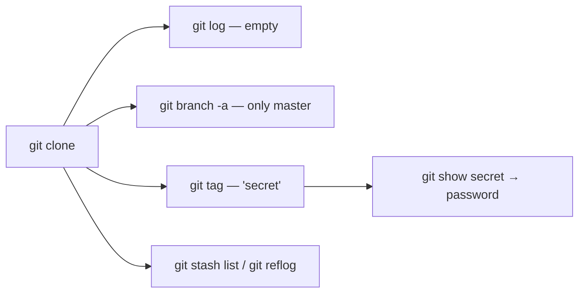

## Introduction

The previous level taught you to look past the default branch. This one goes further: **the secret isn't on any branch at all.**

You clone, run `git log`, run `git branch -a`, and find nothing. It's tempting to think the level is broken. It isn't — you just haven't enumerated *every* kind of Git reference. Git stores more than branches; it stores **tags**, and an annotated tag carries its own message — a perfect, forgotten place to hide a secret. The skill is **complete repository enumeration**: branches, *tags*, stash, and reflog.

## Official Challenge Objective

> **There is a git repository at `ssh://bandit30-git@localhost/home/bandit30-git/repo` via the port `2220`. The password for the user `bandit30-git` is the same as for the user `bandit30`. Clone the repository and find the password for the next level.**

**In plain English:** clone the repo, but this time commits and branches are barren. The password is hidden in a **Git tag** — find it, read what it points at, done.

## Skills Covered

- Cloning a Git repository over SSH
- Listing Git **tags** (`git tag -l`)
- Inspecting a tag's target (`git show <tag>`)
- Lightweight vs. annotated tags
- The full taxonomy of Git refs (branches, tags, stash, reflog)

## My Approach

I cloned and ran my usual `git log` / `git branch -a`. Both came up empty — one commit, only `master`, a junk README. That dead end *is* the puzzle: it pushes you to remember branches and commits aren't the only refs Git keeps. Next on my checklist is always tags. I listed them, found one called `secret`, and asked Git to show it.

## Step-by-Step Walkthrough

### Command

```bash
ssh bandit30@bandit.labs.overthewire.org -p 2220
mkdir -p /tmp/b30 && cd /tmp/b30
git clone ssh://bandit30-git@localhost/home/bandit30-git/repo
cd repo
```

### Explanation

Log in, make a writable scratch dir, clone (the `bandit30-git` password equals `bandit30`'s), and `cd` in.

### Why It Matters

The clone brings down the *entire* object database — including tags — so everything you need is local.

---

### Command

```bash
cat README.md
git log
git branch -a
```

### Explanation

The "rule out the obvious" pass: the README is junk (`just an epmty file... muahaha`), `git log` shows one initial commit, `git branch -a` shows only `master`. Every normal hiding place is empty.

### Why It Matters

Knowing when you've exhausted one class of locations is a real investigative skill — the emptiness signals you to broaden the search.

---

### Command

```bash
git tag
```

### Explanation

`git tag` lists all tags. Output:

```
secret
```

A tag literally named `secret` is as loud a hint as it gets.

### Why It Matters

Tags are a first-class ref that `git log` and `git branch` **do not** show. If you only inspect commits and branches, tagged content is invisible. This is the whole trick.

---

### Command

```bash
git show secret
```

### Explanation

`git show <tag>` displays the object the tag points to. Because `secret` is an **annotated** tag, `git show` prints its message — which is the password:

```
[REDACTED]
```

### Why It Matters

An annotated tag is a full Git object with its own author, date, and message body — a legitimate text field that makes a tempting hiding place. `git show` cracks it open.

---

### Command

```bash
ssh bandit31@bandit.labs.overthewire.org -p 2220
```

### Explanation

Log out and SSH in as `bandit31` with the recovered password.

### Why It Matters

You've now seen secrets hide in history, on branches, and in tags — three corners of one repository.

## Deep Dive: Cyber Security Concept

**Git refs are more than branches — enumerate all of them.**

Everything Git tracks is reachable through a *ref*: a named pointer to a commit (or, for annotated tags, a tag object). The ref namespace under `.git/refs/`:

- `refs/heads/` — local **branches**
- `refs/remotes/` — remote-tracking branches
- `refs/tags/` — **tags**
- `refs/stash` — the stash
- plus the **reflog** — a journal of where every ref has pointed

Two tag flavors:

- **Lightweight** — just a name pointing at a commit.
- **Annotated** — a stored object with tagger, date, and a free-text **message** (`git tag -a -m "..."`). That message is where this password lives.



> [!TIP]
> When a repo "has nothing in it," you've usually only checked branches and commits. Also run `git tag -l`, `git stash list`, `git reflog`, and `git log --all --oneline --graph`.

The deeper lesson: deleting a file, amending, or rebasing does not necessarily erase data. A dangling commit survives in the reflog; a tag pins content alive long after it leaves a branch.

## Offensive Security Perspective

When attackers dump a `.git`, scanners (**gitleaks**, **truffleHog**) walk *every* ref — branches, tags, dangling objects — because secrets get parked in all of them. Manual operators run:

```bash
git tag -l
git stash list
git reflog --all
git fsck --unreachable
git log --all -p
```

A commit "removed" by a force-push frequently lingers as an unreachable object `git fsck` can resurrect. Bug bounty write-ups regularly recover credentials from exactly these corners.

## Common Beginner Mistakes

- Concluding the level is broken when commits/branches look empty.
- Never running `git tag` — the command the level hinges on.
- Using `git show` on the commit instead of the tag.
- Forgetting `git log`/`git branch` don't list tags or the reflog.
- Cloning into a non-writable directory instead of `/tmp`.

## Key Takeaways

- Git stores secrets in more places than commits and branches — **tags** included.
- `git tag -l` lists tags; `git show <tag>` reveals an annotated tag's message.
- Complete enumeration also covers stash, reflog, and dangling objects.
- "Empty" commits/branches is a prompt to widen the search, not give up.
- Anything that ever entered any ref must be considered exposed and rotated.

## How This Helps Build Cyber Security Expertise

- **Git forensics & IR:** reconstructing attacker activity means walking every ref.
- **Secret-leak hunting:** the "check tags, stash, reflog, dangling objects" routine is what pros do.
- **Secure development:** knowing Git rarely truly forgets shapes how you handle accidental commits.
- **Tool literacy:** `git show`/`git fsck`/`git reflog` are the primitives scanners wrap.

## Additional Reading

- [Pro Git — Tagging](https://git-scm.com/book/en/v2/Git-Basics-Tagging)
- [`git tag` documentation](https://git-scm.com/docs/git-tag)
- [`git reflog` documentation](https://git-scm.com/docs/git-reflog)
- [truffleHog](https://github.com/trufflesecurity/trufflehog)


---

## Connect with the Author

Written by **Himangshu Pan** — offensive security researcher.

- **GitHub:** [@0xSh3ru](https://github.com/0xSh3ru)
- **LinkedIn:** [in/0xsh3ru](https://www.linkedin.com/in/0xsh3ru/)

*If this walkthrough helped, follow along on GitHub and connect on LinkedIn — questions and corrections are always welcome.*
