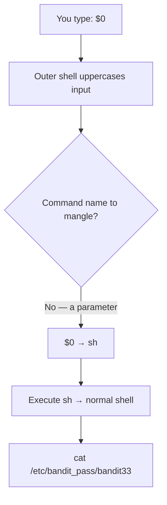

## Introduction

After a run of Git puzzles, Bandit changes the game. You log in as `bandit32` and get a banner — **"WELCOME TO THE UPPERCASE SHELL"** — and a `>>` prompt. Type `ls`, it runs `LS`; type `cat`, it runs `CAT`. Every input is uppercased before execution, and since Linux commands are lowercase, nothing works.

This is a **restricted shell**, and escaping one is a classic, high-value skill. The escape hinges on the shell *special parameter* `$0`, which expands to the shell's own name. Typing `$0` launches a brand-new normal shell, and you walk out of the cage.

## Official Challenge Objective

> **After all this git stuff, it's time for another escape. Good luck!**
>
> *On login you are dropped into a shell that prints "WELCOME TO THE UPPERCASE SHELL" and converts everything you type to uppercase.*

**In plain English:** `bandit32` traps you in a shell that uppercases every command. Spawn a normal shell from inside it, then read the password from `/etc/bandit_pass/bandit33`.

## Skills Covered

- Recognizing and reasoning about restricted/custom shells
- Shell **special parameters** (`$0`, `$#`, `$@`)
- Shell expansion vs. command execution order
- Escaping a constrained environment to a full shell
- Reading protected passwords via `/etc/bandit_pass/`

## My Approach

First I *characterized the cage*: what does it run, what does it do to input? A few commands showed everything came back uppercased and "not found." Whole-command names were dead — there's no `LS` or `CAT`. So I stopped thinking about commands and thought about what the shell *expands* for me. `$0` is a special parameter the shell substitutes with its own name; entering it handed me a fresh shell, from which I read the password file.

## Step-by-Step Walkthrough

### Command

```bash
ssh bandit32@bandit.labs.overthewire.org -p 2220
```

### Explanation

Logging in greets you with:

```
WELCOME TO THE UPPERCASE SHELL
>>
```

### Why It Matters

The first sign of a restricted shell is an unusual prompt/banner. Noticing "this is not a normal `$`" is step zero of any escape.

---

### Command

```bash
>> ls
>> id
```

### Explanation

Probe the cage. Each returns:

```
sh: 1: LS: not found
```

It uppercased `ls` to `LS` and tried to run it. Confirmed: **input is uppercased before execution.**

### Why It Matters

You can't defeat a constraint you haven't characterized. A couple of probes reveal exactly what transform is applied and what escape can work.

---

### Command

```bash
>> $0
```

### Explanation

The escape. `$0` is a **shell special parameter** that expands to the running shell's name (e.g. `sh`). On Enter:

1. The shell does **parameter expansion**, replacing `$0` with `sh`.
2. It executes `sh`, spawning a fresh shell.

The prompt becomes a plain `$` — you're out.

> [!TIP]
> Why does `$0` survive uppercasing? It expands to the shell's own program name (`sh`), which is correct lowercase; uppercasing the literal `$0` does nothing. You smuggle intent through a *parameter expansion* instead of a *typed command name*.

### Why It Matters

The crux of restricted-shell escapes: find the one input the shell still interprets its own way. Special parameters, variable expansions, and metacharacters are those gaps.

---

### Command

```bash
$ cat /etc/bandit_pass/bandit33
```

### Explanation

Bandit stores each password under `/etc/bandit_pass/<user>`. From the normal shell as `bandit32`, read it:

```
[REDACTED]
```

### Why It Matters

`/etc/bandit_pass/` is the authoritative source — once you have a real shell as the right user, grab the next password directly.

---

### Command

```bash
ssh bandit33@bandit.labs.overthewire.org -p 2220
```

### Explanation

Log out and SSH in as `bandit33`.

### Why It Matters

You've completed a restricted-shell escape — one of the most practically important moves in the game.

## Deep Dive: Cyber Security Concept

**Restricted shells, shell expansion, and escape via special parameters.**

A *restricted shell* confines a user: `rbash`, an appliance menu shell, a kiosk, or — here — an input-mangling wrapper. The recurring failure is that the restriction is bolted onto a powerful interpreter with many ways to express intent, and the jailer rarely closes them all.

The uppercase shell filters the wrong abstraction. A shell does far more than look up a command name — it runs a pipeline of **expansions** first:

1. Brace expansion `{a,b}`
2. Tilde expansion `~`
3. **Parameter/variable expansion `$0`, `$VAR`, `${...}`**
4. Command substitution `$(...)`
5. Arithmetic `$((...))`
6. Word splitting and glob `*`

`$0` slips through because it's not a command *name* — it's a parameter resolving to the shell's own executable, spawning a fresh shell as a side effect.



This generalizes — the **GTFOBins** escape toolkit abuses features of whatever you can run: `vi` (`:!sh`), `less` (`!sh`), `awk 'BEGIN{system("/bin/sh")}'`, `find . -exec /bin/sh \;`, `python -c 'import os;os.system("sh")'`.

> [!IMPORTANT]
> A restricted shell is only as strong as the *complete* set of expansions, builtins, and sub-programs it disables. Blacklisting command names while leaving expansion intact is security theater.

## Offensive Security Perspective

Restricted-shell escape is bread-and-butter:

- **Appliance/embedded pwnage:** routers, firewalls, IoT, switches ship menu/CLI shells; escaping to a root Busybox shell is a staple.
- **Privilege escalation:** breaking out of `rbash` or a jailed SSH session to run real tooling — GTFOBins is the reference.
- **CTF/OSCP staple:** "limited shell → full TTY," e.g. `python -c 'import pty;pty.spawn("/bin/bash")'`.

The mindset matches this level: enumerate what's allowed, find the feature that turns it into arbitrary execution.

## Common Beginner Mistakes

- Trying harder to type lowercase — it uppercases regardless.
- Not characterizing the restriction before attacking.
- Forgetting special parameters exist.
- Quoting/escaping `$0` so it doesn't expand — just type `$0`.
- After escaping, hunting the home dir instead of `/etc/bandit_pass/bandit33`.

## Key Takeaways

- A shell that filters command *names* often leaves *expansion* wide open.
- `$0` expands to the shell's name; entering it spawns an unrestricted shell.
- Always characterize a constrained environment first.
- GTFOBins is the canonical escape reference.
- Bandit passwords live in `/etc/bandit_pass/<user>`.

## How This Helps Build Cyber Security Expertise

- **Privilege escalation & post-exploitation:** escapes and dumb-shell upgrades are daily skills.
- **Network/hardware security:** breaking out of appliance CLIs is core to device assessments.
- **Red team & initial access:** a jailed SSH or kiosk shell is a common landing spot; escaping it turns a foothold into real execution.
- **Exploit dev & CTF/OSCP:** the "limited shell → full TTY" pattern (`python -c 'import pty;pty.spawn("/bin/bash")'`) recurs constantly.

## Additional Reading

- [GTFOBins](https://gtfobins.github.io/)
- [Bash Manual — Special Parameters](https://www.gnu.org/software/bash/manual/html_node/Special-Parameters.html)
- [Bash Manual — Shell Expansions](https://www.gnu.org/software/bash/manual/html_node/Shell-Expansions.html)
- [MITRE ATT&CK — T1059: Command and Scripting Interpreter](https://attack.mitre.org/techniques/T1059/)


---

## Connect with the Author

Written by **Himangshu Pan** — offensive security researcher.

- **GitHub:** [@0xSh3ru](https://github.com/0xSh3ru)
- **LinkedIn:** [in/0xsh3ru](https://www.linkedin.com/in/0xsh3ru/)

*If this walkthrough helped, follow along on GitHub and connect on LinkedIn — questions and corrections are always welcome.*
