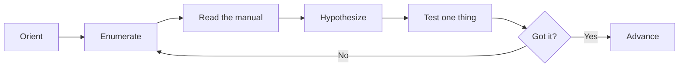

## Introduction

You made it. Thirty-three levels later, you log in as `bandit33` and there's no puzzle — only a `README.txt` that congratulates you and notes that **level 34 does not exist yet.** This is the end of the road, for now.

This article is deliberately different. There's no password to find, so instead of a walkthrough we'll zoom out: look at the whole journey, name the meta-skill Bandit was quietly teaching, and chart where to go next. Treat it as a capstone.

## Official Challenge Objective

> **At this moment, level 34 does not exist yet.**

Reading `bandit33`'s home directory shows a congratulatory `README.txt`:

> *Congratulations on solving the last level of this game! At this moment, there are no more levels to play in this game. However, we are constantly working on new levels and challenges…*

**In plain English:** there's no thirty-fourth challenge. The game ends with a congratulations note. OverTheWire may add more later, but Bandit is complete.

## Skills Covered

This level is a vantage point over everything the series taught. Across Bandit you built:

- **Linux CLI fluency** — `ls`, `cat`, `find`, `grep`, `sort`, `uniq`, `diff`, `tr`, `cut`, pipes, redirection, and reading `man` pages.
- **Data wrangling & encoding** — base64, hex, ROT13, gzip/bzip2/tar layers, `file` before decoding.
- **SSH mastery** — non-standard ports, password and **key-based** auth, `ssh -i`, SSH as transport.
- **Networking & TLS** — `nc`/`ncat`, `telnet`, `openssl s_client`, talking to services by hand.
- **Scanning** — `nmap` for service discovery.
- **Permissions & privilege** — file modes, ownership, **SUID** binaries, `/etc/bandit_pass/`.
- **Cron abuse** — exploiting writable scripts run by privileged users.
- **Restricted-shell escapes** — breaking out via shell features (`$0`, GTFOBins tricks).
- **Git forensics** — history, **branches**, **tags**, `.gitignore` bypass, server-side hooks.
- **Brute forcing & scripting** — looping over candidates, automating the tedious.

## My Approach

There's almost nothing to do — and that's the point.

### Command

```bash
ssh bandit33@bandit.labs.overthewire.org -p 2220
ls -la
```

### Explanation

Log in and list the home directory. Instead of a data file, you find a single `README.txt`.

### Command

```bash
cat README.txt
```

### Explanation

Read it — a congratulations note explaining level 34 doesn't exist yet. No password, no next hop.

> [!NOTE]
> Level 0 taught you `ls -la` then `cat`. The final level is *also* `ls -la` then `cat`. The bookend is intentional: the simplest workflow is the one you never stopped needing.

## Deep Dive: Cyber Security Concept

**The real lesson of Bandit was never any single command — it was a method.**

Every level you solved followed one repeatable loop:



This is **methodical enumeration plus reading the manual** — the most important habit in practical security. Every level rewarded it: look before you act; read what's in front of you (the "no passwords in production" README, the `*.txt` `.gitignore`, the uppercase error); understand the tool instead of cargo-culting it; iterate narrowly.

Tools change constantly; this loop does not. Someone who internalizes it can sit at any unfamiliar system and make progress, because the *process* is the durable skill.

> [!IMPORTANT]
> The goal was never to memorize 33 answers — it was to become someone who can solve the 34th level that doesn't exist yet, and the real-world problems that yield to the same method.

## Offensive Security Perspective

The Bandit loop is the early kill chain in miniature:

- **Recon → enumeration → foothold → loot → pivot** — every level was discovery and **lateral movement**.
- **Living off the land** — you used only native tools (`cat`, `nc`, `git`, `find`, `ssh`), exactly what real operators prize.
- **SUID/cron/restricted-shell levels** are textbook **local privilege escalation** (what `linpeas`/GTFOBins automate).
- **Git levels** mirror modern **source-code/supply-chain recon**.

You now have the reflexes that make `nmap`, `linpeas`, `gitleaks`, and Metasploit make sense.

## Defensive Perspective

Everything you exploited maps to a control:

- **Plaintext secrets** → secrets managers, least privilege, `auditd`.
- **World-readable/SUID files** → permission hardening, SUID minimization.
- **Cron abuse** → no world-writable privileged scripts, integrity monitoring.
- **Restricted-shell escapes** → real isolation, process-ancestry alerting.
- **Git leaks** → pre-receive scanning, rotation, `.git` exposure detection.

Having attacked these, you can now anticipate them as a defender.

## Common Beginner Mistakes

- **Rushing** past enumeration to a guess.
- **Copying solutions without understanding** — collapses on the next problem; the methodology is the prize.
- **Ignoring the obvious** hint in the README, error, or `man` page.
- **Tool tunnel-vision** when `ls -la` and `cat` would do.
- **Not taking notes** — real engagements demand documentation.

## Key Takeaways

- Bandit's true subject was **methodical enumeration + reading the manual**.
- The same loop scales from a CTF prompt to an unfamiliar production system.
- Offense and defense are two views of one vulnerability — you hold both.
- Understanding *why* beats memorizing *how*.
- You're no longer a beginner at the Linux command line.

## How This Helps Build Cyber Security Expertise

Bandit is the foundation, not the finish line. Next steps, roughly in order:

1. **Keep climbing OverTheWire** — [Natas](https://overthewire.org/wargames/natas/) (web), [Leviathan](https://overthewire.org/wargames/leviathan/) and [Narnia](https://overthewire.org/wargames/narnia/) (binary/privesc).
2. **Broaden** — [picoCTF](https://picoctf.org/) and [TryHackMe](https://tryhackme.com/).
3. **Go adversarial** — [Hack The Box](https://www.hackthebox.com/).
4. **Specialize in privesc** — [GTFOBins](https://gtfobins.github.io/), [HackTricks](https://book.hacktricks.xyz/), `linpeas`.
5. **Build, then break** — stand up a vulnerable VM, exploit it, defend it.

## Additional Reading

- [OverTheWire — Natas](https://overthewire.org/wargames/natas/), [Leviathan](https://overthewire.org/wargames/leviathan/), [Narnia](https://overthewire.org/wargames/narnia/)
- [picoCTF](https://picoctf.org/), [TryHackMe](https://tryhackme.com/), [Hack The Box](https://www.hackthebox.com/)
- [GTFOBins](https://gtfobins.github.io/), [HackTricks](https://book.hacktricks.xyz/)
- [MITRE ATT&CK](https://attack.mitre.org/)

## Personal Reflection

I'm genuinely proud of finishing this series — and if you worked through Bandit yourself, you should be too. When I started, a blank terminal felt like a locked door. Thirty-three levels later, it feels like an invitation. That shift — from intimidation to curiosity — is the real reward, bigger than any password.

Carry this forward: you didn't memorize your way here, you *reasoned* your way here. You looked carefully, read what was in front of you, formed a guess, and tested it. That is exactly how real security work is done. The tools will change; the method you built will not.

So don't stop at the congratulations screen. The most interesting "next level" is the one nobody has written yet. Go find it. Congratulations — you finished Bandit. Now go break (and build) something bigger.


---

## Connect with the Author

Written by **Himangshu Pan** — offensive security researcher.

- **GitHub:** [@0xSh3ru](https://github.com/0xSh3ru)
- **LinkedIn:** [in/0xsh3ru](https://www.linkedin.com/in/0xsh3ru/)

*If this walkthrough helped, follow along on GitHub and connect on LinkedIn — questions and corrections are always welcome.*
