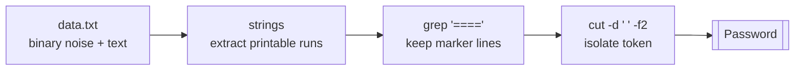

## Introduction

Up to now the passwords have lived in plain text files you could simply `cat`. This level changes the game: the password is buried inside a **binary file** stuffed with non-printable garbage, and a flat `cat` will spray your terminal with control characters. The skill you build here — pulling **human-readable strings out of binary data** — is one of the most-used reflexes in malware triage, memory forensics, and reverse engineering.

The lesson underneath: **binary does not mean unreadable**. Compiled programs, memory dumps, and packet captures are full of embedded text — paths, error messages, URLs, and secrets — and a single tool surfaces all of it.

## Official Challenge Objective

> **The password for the next level is stored in the file `data.txt` in one of the few human-readable strings, preceded by several '=' characters.**

**In plain English:** `data.txt` is mostly unreadable binary noise. Somewhere inside is a short run of readable text, and the password sits right after a cluster of `=` signs. Filter the readable text out of the noise and find the line marked with `====`.

## Skills Covered

- Recognizing binary vs. text files (`file`)
- Extracting printable ASCII with `strings`
- Filtering output with `grep`
- Trimming fields with `cut`
- Piping tools into a triage pipeline

## My Approach

My first instinct on any file I don't recognize is to *identify it* before opening it — `cat`-ing a binary blindly garbles your terminal. Once `file` confirmed binary data, I reached for `strings`, which walks the bytes and prints any run of printable characters long enough to look like real text, shrinking thousands of junk bytes to a handful of candidate lines. The objective hands you the marker — "several `=` characters" — so I filtered for that. I tightened my filter with a regex (`^={2,}\s.{32}`) matching a line of two-or-more equals signs, whitespace, then a 32-char token (Bandit passwords are 32 chars), and used `cut` to peel off just the password. The simpler `grep '===='` works fine too.

## Step-by-Step Walkthrough

### Command

```bash
file data.txt
```

### Explanation

`file` inspects the *contents* of `data.txt` by its **magic bytes**, not its extension, and reports it is not clean text — a signal not to `cat` it directly.

### Why It Matters

`file` is your seatbelt. It tells you whether a file is text, an executable, an archive, an image, or raw binary, preventing the classic mistake of dumping binary to the terminal and corrupting your session.

---

### Command

```bash
strings data.txt | grep '===='
```

### Explanation

`strings` scans byte by byte and prints every printable run at least 4 characters long, discarding the noise. `grep '===='` keeps only lines with four-or-more equals signs — the marker from the objective. The password is the 32-character token after the `=` run:

```
========== The password is [REDACTED]
```

### Why It Matters

*Extract readable text, then filter for what you want* is the canonical triage move — almost the exact command you run against a suspicious executable to fish out hard-coded URLs, IPs, or credentials.

---

### Command (tighter variant)

```bash
strings data.txt | grep -E '^={2,}\s.{32}' | cut -d " " -f2
```

### Explanation

`^={2,}` anchors to a line starting with two or more `=`, `\s` matches whitespace, `.{32}` requires a 32-char token (a Bandit password). `cut -d " " -f2` prints only the second space-delimited field — the password, cleanly.

### Why It Matters

Writing a filter tight enough to return *only* the answer is a real skill; in automation you want the value extracted, not "the line that contains it."

> [!TIP]
> `strings -n 8 data.txt` raises the minimum match length to 8, cutting short junk like `is` and `the`. Tuning `-n` separates signal from noise.

## Deep Dive: Cyber Security Concept

**String extraction and the "embedded text" property of binaries.**

Every compiled binary, memory image, and on-disk artifact is a sea of bytes — mostly machine code and structured data. But scattered throughout are runs of printable ASCII (0x20–0x7E) that are almost always *meaningful*: function names, paths, format strings, error messages, domains, and config values. `strings` reports any consecutive printable run over a threshold without parsing the format — that naïveté is its strength: it works on *any* file type.



> [!IMPORTANT]
> `strings` shows what text *exists* in a file, not what the program *does* with it. It is the first 30 seconds of analysis — leads to investigate, never proof.

## Offensive Security Perspective

`strings` is one of the first commands a malware analyst runs against an unknown sample. From a single binary it can reveal hard-coded credentials and API keys, C2 domains and IPs, mutex/registry-key names that become signatures, compiler/PDB paths that leak the developer's machine, and crypto constants or ransom notes that fingerprint a family. In CTFs, `strings <binary> | grep -i flag` is a reflexive first try that solves many easy challenges.

## Defensive Perspective

- **Don't embed secrets in binaries.** Anything compiled in is one `strings` away from disclosure; pull secrets at runtime.
- **Triage workflow:** on an unknown executable alert, `file` then `strings` (with `-n` tuning) is the fastest first look before sandbox detonation.
- **Detection engineering:** unique strings a family carries — C2 domains, mutex names, ransom text — become YARA and Sigma signatures.
- **Memory forensics:** `strings` over a RAM capture surfaces plaintext passwords and commands that never touched disk.

## Common Beginner Mistakes

- `cat`-ing the binary directly and breaking the terminal (fix with `reset`).
- Running `strings` alone and hunting by eye instead of `grep`-ing.
- Using too loose a `grep` (e.g. `grep =`) and matching noise.
- Assuming `strings` decrypts or decodes — it only filters printable bytes.
- Copying the `=` signs or trailing spaces with the password.

## Key Takeaways

- Identify a file with `file` before opening it.
- `strings` extracts human-readable text from any binary blob.
- Pipe `strings | grep` to filter for the marker you expect.
- Tune `strings -n` to suppress short junk.
- `file → strings → grep` is the foundation of malware triage.

## How This Helps Build Cyber Security Expertise

- **Malware analysis:** `strings` is lesson one of static analysis.
- **DFIR:** carving readable text from disk images and memory dumps is daily work.
- **Threat intelligence:** distinctive strings feed YARA rules and family attribution.
- **CTF / bug bounty:** `strings | grep` is a high-yield first probe against any binary.

## Additional Reading

- [`man strings`](https://man7.org/linux/man-pages/man1/strings.1.html), [`man grep`](https://man7.org/linux/man-pages/man1/grep.1.html), [`man file`](https://man7.org/linux/man-pages/man1/file.1.html)
- [Practical Malware Analysis — static analysis & strings](https://nostarch.com/malware)
- [MITRE ATT&CK — T1027: Obfuscated Files or Information](https://attack.mitre.org/techniques/T1027/)


---

## Connect with the Author

Written by **Himangshu Pan** — offensive security researcher.

- **GitHub:** [@0xSh3ru](https://github.com/0xSh3ru)
- **LinkedIn:** [in/0xsh3ru](https://www.linkedin.com/in/0xsh3ru/)

*If this walkthrough helped, follow along on GitHub and connect on LinkedIn — questions and corrections are always welcome.*
